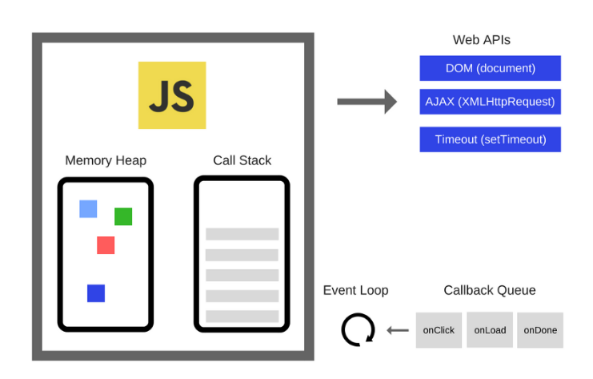
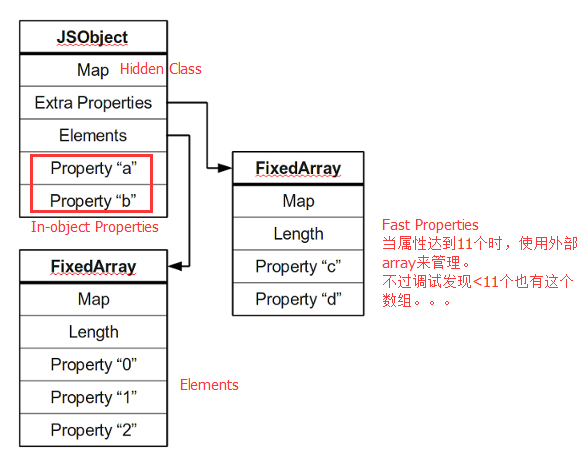
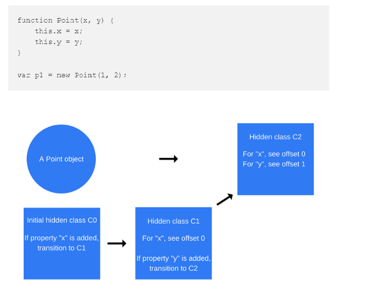
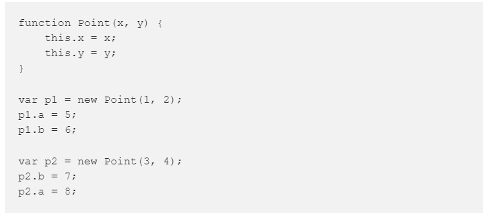
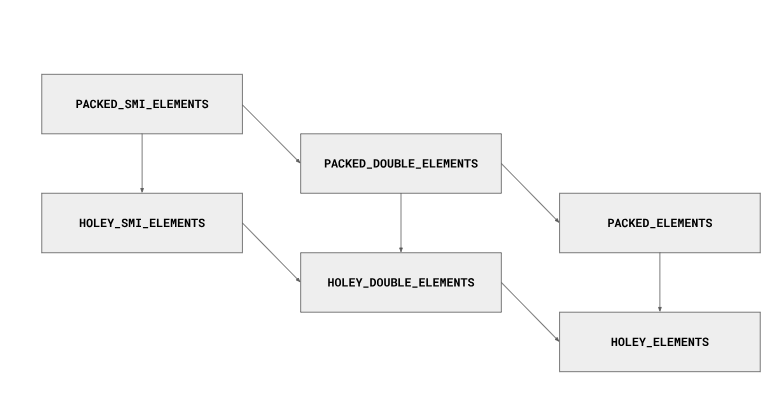
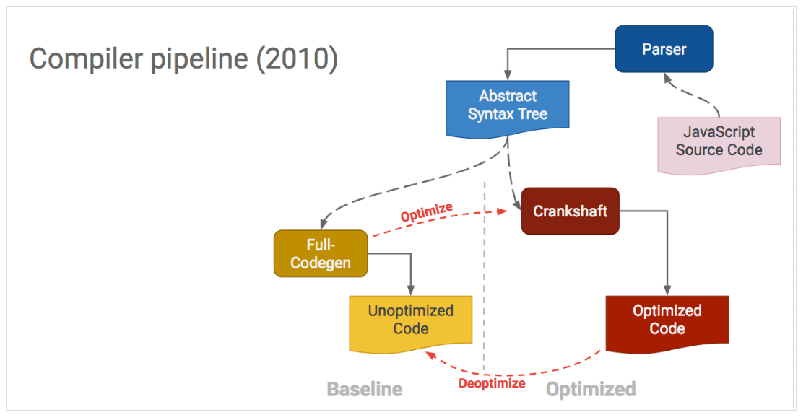
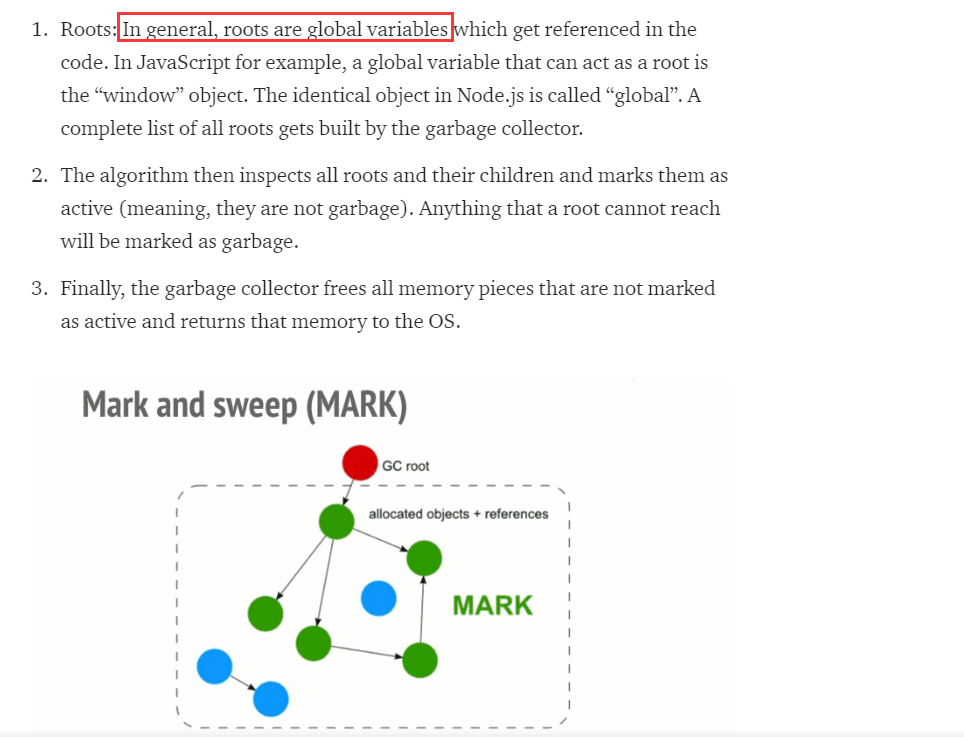

# Learning V8
## Workflow

1. https://speakerdeck.com/brn/source-to-binary-journey-of-v8-javascript-engine-english-version 
2. http://eternalsakura13.com/2018/06/16/nodefest_v8/
3. [How JavaScript works系列@zlatkov](https://blog.sessionstack.com/@zlatkov)

```
The Engine consists of two main components:
* Memory Heap — this is where the memory allocation happens
* Call Stack — this is where your stack frames are as your code executes
```



V8内部是多线程的:

1. 主线程
    编译执行JavaScript

2. 一个单独的线程用于编译，当优化代码时，主线程也能继续执行

3. 分析线程
    
    分析哪个函数耗时，需要被优化

4. 垃圾回收线程


## Object Representation
1. https://v8.dev/blog/fast-properties
2. http://www.jayconrod.com/posts/52/a-tour-of-v8--object-representation

### Object表示
对象内存结构一般如下图所示



对应下图


当有过多增加、删除属性的操作时，维护Hidden Class的成本很高；对象属性的存储方式退化到字典模式


### Hidden Class
当增加一个新的属性时，Old Hidden Class会增加一个到New Hidden Class的transition path，New Hidden Class会增加一个FIELD描述，描述新增加属性的相对偏移。transition 描述符使得那些以相同方式创建的object能够共享hidden class。



不同的创建顺序，意味着不同的transition path, 从而p1,p2的hidden class不同。 建议以相同顺序初始化object，使得它们能共用hidden class；也能做inline caching，提供性能。



### Elements
https://v8.dev/blog/elements-kinds

我们将属性名为非负整数（0、1、2……）的属性称为Element。V8中，Element的存放和其他属性是分开的。每个对象都有一个指向Element数组的指针，对象Map中的Element Field将反映出Element是如何存储的, 常见的Elements Kind及其变化如下所示：

变化过程是不可逆的，且越往下/后变化，操作耗费越大

如果你在远远超过当前数组大小的下标赋值，V8会将数组转换为字典模式，将值以哈希表的形式存储。

```
const array = [1, 2, 3];
// elements kind: PACKED_SMI_ELEMENTS
array.push(4.56);
// elements kind: PACKED_DOUBLE_ELEMENTS
array.push('x');
// elements kind: PACKED_ELEMENTS

array.length; // 5
array[9] = 1; // array[5] until array[8] are now holes
// elements kind: HOLEY_ELEMENTS
```



## Optimization
1. https://juejin.im/post/59f95af951882574d1723e70#heading-8 

在V8 5.9之前，V8有两个编译器：

1. baseline编译器， full-codegen
   将解析过的JavaScript(AST)直接翻译成机器码（machine code）, 此时的machine code还有很多冗余，执行速度相对较慢

2. 优化编译器，Crankshaft
   优化是一个单独的线程，AST -> Hydrogen graph -> optimize Hydrogen graph -> Lithium -> optimized machine code





V8优化机制

1. Inlining

预先内联尽可能多的代码，用函数主题替换函数调用

2. Hidden class

以字典模式(hash 模式)存储、访问对象非常耗时，V8使用hidden class
每个property的值都以数组的形式进行管理, 通过偏移值访问数组里的property值

3. Inline caching

基于假设：对同一个函数的多次调用发生在同一类object上

当同一个hidden class上发生两次相同函数调用时，V8略去了hidden class的查找，而是使用上次查找到的偏移

4. Compilation to machine code

这段可能理解地不太对。。。。

对于耗时的函数，Crankshaft会生成优化机器码。优化是在独立的线程做的，V8会转换当前执行的上下文，在执行慢代码的过程中切换到优化后版本，这个过程称之为OSR: on-stack replacement。

5. Garbage collection

标记清除方法

标记过程会终止JavaScript执行，为了控制GC成本和JavaScript的执行稳定，V8使用增量标记清除。

它不会遍历整个堆，而是遍历一部分后恢复执行，下次从上次遍历终止处继续开始。



** Ignition and TurboFan **

引入生成中间语言(bytecode)的Ignition和优化编译器TurboFan，显著地提升了性能、节省了内存使用


How to write better JavaScript？

1. 对象属性初始化顺序一致

2. 在构造函数时初始化好对象，避免属性的动态添加，增加维护hidden class的成本

3. 多次重复调用一个函数

4. 避免稀疏数组，稀疏数组其实是一个hash表，获取元素代价较高

5. 多使用SMI数值，非SMI数值，V8需要将它转成double表示，并生成一个新的object来存储它。   


