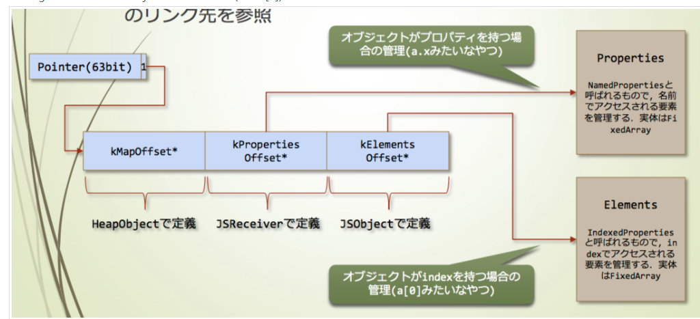
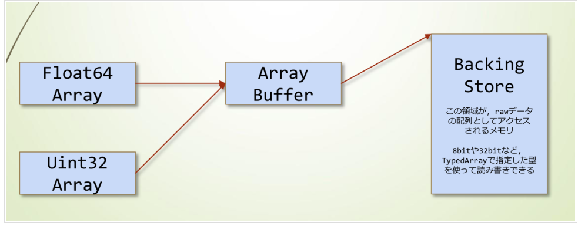

# Object 结构
参考：
http://eternalsakura13.com/2018/05/06/v8/

```
<html>
<script>
    var a = [0xdeadbee, 0xdeadbeef, 4.231256, "testtesttestcy", true, false, null, undefined]
    alert("1111");
</script>
</html>

```
1. Small Int


2. HeapNumber (超过Small Int范围的Int、Double)
首先，数组中存放的是HeapObject指针


HeapNumber结构


调试如下：


3. PropertyCell
不知道是啥，先记着


4. String


5. Oddball, 没调出来。。。
表示特殊值的对象，例如true，false，undefined, null


6. JSObject, 没调出来


可参考：

均有中文翻译

https://v8.dev/blog/fast-properties

http://www.jayconrod.com/posts/52/a-tour-of-v8--object-representation

7. JSFunction, 没调出来


8. JSArray


9. JSArrayBuffer



