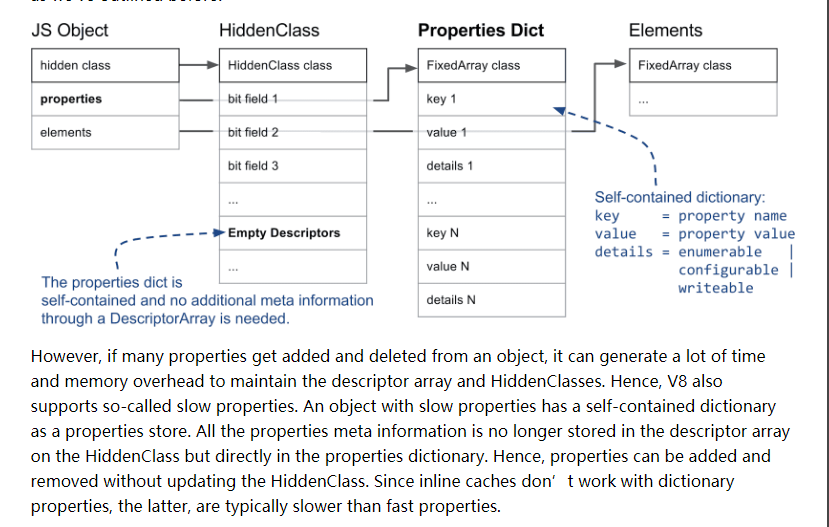
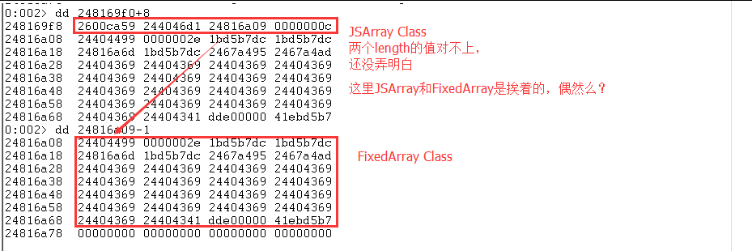
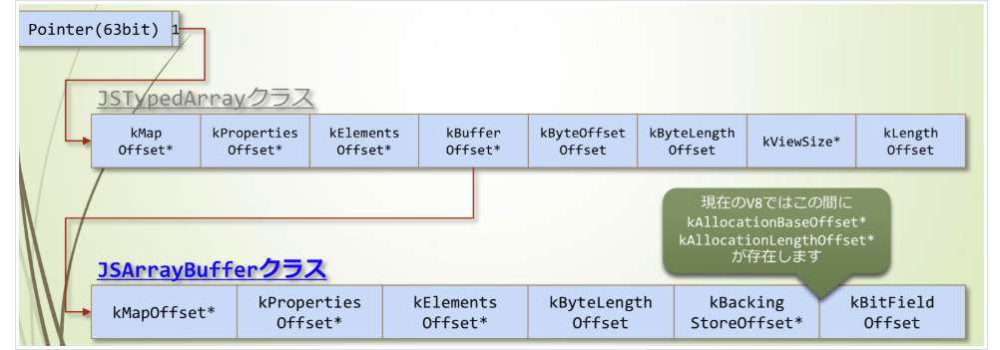

# Learning V8
## Workflow
1. https://speakerdeck.com/brn/source-to-binary-journey-of-v8-javascript-engine-english-version 
2. http://eternalsakura13.com/2018/06/16/nodefest_v8/

## Object Representation
1. https://v8.dev/blog/fast-properties
2. http://www.jayconrod.com/posts/52/a-tour-of-v8--object-representation

### Object表示
对象内存结构一般如下图所示


对应下图


当有过多增加、删除属性的操作时，维护Hidden Class的成本很高；对象属性的存储方式退化到字典模式



### Hidden Class
当增加一个新的属性时，除非迫不得已，我们不会创建新的Map，而是尽可能使用一个现存符合结构的Map。Transition描述符就是用来指向这些Map的，从而形成transitions chain or transitions tree。

如果新增的属性之前没有，则我们会通过复制M2创建一个新的Map，M3，然后将一个新的FIELD描述符增加在M3上。同时我们要在M2上增加一个TRANSITION描述符。注意，新增TRANSITION是修改Map为数不多的情况之一，通常Map是不可变的。

```
function Point(x, y) {
  this.x = x;
  this.y = y;
}

 Map M0
    "x": TRANSITION to M1 at offset 12

this.x = x;

  Map M1
    "x": FIELD at offset 12
    "y": TRANSITION to M2 at offset 16

this.y = y;

  Map M2
    "x": FIELD at offset 12
    "y": FIELD at offset 16

What if a new property is assigned later, to an object with map M2?

 Map M2
   "x": FIELD at offset 12
   "y": FIELD at offset 16
   "z": TRANSITION at offset 20

this.z = z;

  Map M3
    "x": FIELD at offset 12
    "y": FIELD at offset 16
    "z": FIELD at offset 20    
```

## Optimization and de-optimization
1. https://juejin.im/post/59f95af951882574d1723e70#heading-8 

## Build V8
1. https://medium.com/dailyjs/how-to-build-v8-on-windows-and-not-go-mad-6347c69aacd4
2. http://eternalsakura13.com/2018/06/26/v8_environment/
3. http://blog.gclxry.com/use-depot_tools-to-manage-chromium-source/ (介绍depot_tools)

```
cd ~/v8/v8
git reset --hard a7a350012c05f644f3f373fb48d7ac72f7f60542
gclient sync
tools/dev/v8gen.py x64.debug 
ninja -C out.gn/x64.debug 
```


# 调试

## 速查

### D8 参数
```
--trace-opt 
--trace-deopt
--trace-opt-verbose
--allow-natives-syntax
--code-comments
--print-opt-code
--trace-elements-transitions

%DebugPrint 
%OptimizeFunctionOnNextCall

```

### 断点
```
// %DebugPrint 可以打印出变量信息，包括地址、结构； 
// bu v8_libbase!v8::base::ieee754::atan    下断点，可以停下来
var a = [0xdeadbee, 0xdeadbee, 0xdeadbee];
%DebugPrint(a);
Math.atan(1);

```


### Metasploit 生成payload
```
msfvenom -p windows/exec cmd=calc.exe  -fc
msfvenom -p windows/x64/exec cmd=calc.exe  -fc

var shellcode_dict = {
"x86":"\xfc\xe8\x82\x00\x00\x00\x60\x89\xe5\x31\xc0\x64\x8b\x50\x30"
+"\x8b\x52\x0c\x8b\x52\x14\x8b\x72\x28\x0f\xb7\x4a\x26\x31\xff"
+"\xac\x3c\x61\x7c\x02\x2c\x20\xc1\xcf\x0d\x01\xc7\xe2\xf2\x52"
+"\x57\x8b\x52\x10\x8b\x4a\x3c\x8b\x4c\x11\x78\xe3\x48\x01\xd1"
+"\x51\x8b\x59\x20\x01\xd3\x8b\x49\x18\xe3\x3a\x49\x8b\x34\x8b"
+"\x01\xd6\x31\xff\xac\xc1\xcf\x0d\x01\xc7\x38\xe0\x75\xf6\x03"
+"\x7d\xf8\x3b\x7d\x24\x75\xe4\x58\x8b\x58\x24\x01\xd3\x66\x8b"
+"\x0c\x4b\x8b\x58\x1c\x01\xd3\x8b\x04\x8b\x01\xd0\x89\x44\x24"
+"\x24\x5b\x5b\x61\x59\x5a\x51\xff\xe0\x5f\x5f\x5a\x8b\x12\xeb"
+"\x8d\x5d\x6a\x01\x8d\x85\xb2\x00\x00\x00\x50\x68\x31\x8b\x6f"
+"\x87\xff\xd5\xbb\xf0\xb5\xa2\x56\x68\xa6\x95\xbd\x9d\xff\xd5"
+"\x3c\x06\x7c\x0a\x80\xfb\xe0\x75\x05\xbb\x47\x13\x72\x6f\x6a"
+"\x00\x53\xff\xd5\x63\x61\x6c\x63\x2e\x65\x78\x65\x00", 
"x64": "\xfc\x48\x83\xe4\xf0\xe8\xc0\x00\x00\x00\x41\x51\x41\x50\x52"
+"\x51\x56\x48\x31\xd2\x65\x48\x8b\x52\x60\x48\x8b\x52\x18\x48"
+"\x8b\x52\x20\x48\x8b\x72\x50\x48\x0f\xb7\x4a\x4a\x4d\x31\xc9"
+"\x48\x31\xc0\xac\x3c\x61\x7c\x02\x2c\x20\x41\xc1\xc9\x0d\x41"
+"\x01\xc1\xe2\xed\x52\x41\x51\x48\x8b\x52\x20\x8b\x42\x3c\x48"
+"\x01\xd0\x8b\x80\x88\x00\x00\x00\x48\x85\xc0\x74\x67\x48\x01"
+"\xd0\x50\x8b\x48\x18\x44\x8b\x40\x20\x49\x01\xd0\xe3\x56\x48"
+"\xff\xc9\x41\x8b\x34\x88\x48\x01\xd6\x4d\x31\xc9\x48\x31\xc0"
+"\xac\x41\xc1\xc9\x0d\x41\x01\xc1\x38\xe0\x75\xf1\x4c\x03\x4c"
+"\x24\x08\x45\x39\xd1\x75\xd8\x58\x44\x8b\x40\x24\x49\x01\xd0"
+"\x66\x41\x8b\x0c\x48\x44\x8b\x40\x1c\x49\x01\xd0\x41\x8b\x04"
+"\x88\x48\x01\xd0\x41\x58\x41\x58\x5e\x59\x5a\x41\x58\x41\x59"
+"\x41\x5a\x48\x83\xec\x20\x41\x52\xff\xe0\x58\x41\x59\x5a\x48"
+"\x8b\x12\xe9\x57\xff\xff\xff\x5d\x48\xba\x01\x00\x00\x00\x00"
+"\x00\x00\x00\x48\x8d\x8d\x01\x01\x00\x00\x41\xba\x31\x8b\x6f"
+"\x87\xff\xd5\xbb\xf0\xb5\xa2\x56\x41\xba\xa6\x95\xbd\x9d\xff"
+"\xd5\x48\x83\xc4\x28\x3c\x06\x7c\x0a\x80\xfb\xe0\x75\x05\xbb"
+"\x47\x13\x72\x6f\x6a\x00\x59\x41\x89\xda\xff\xd5\x63\x61\x6c"
+"\x63\x2e\x65\x78\x65\x00"};
```

### 工具函数
```
// arraybuffer to string
function ab2str(buf) {
  return String.fromCharCode.apply(null, new Uint16Array(buf));
}

// string to arraybuffer
function str2ab(str) {
  var buf = new ArrayBuffer(str.length); // 2 bytes for each char
  var bufView = new Uint8Array(buf);
  for (var i=0, strLen=str.length; i<strLen; i++) {
    bufView[i] = str.charCodeAt(i);
  }
  return buf;
}

// 内存中的双字节表示 -> 实际值
function decode_from_float64(num){
    num1 = num/0x100000000;
    num2 = num&0xffffffff;
    d = new Uint32Array(2);
    d[0] = num2;
    d[1] = num1;
    f = new Float64Array(d.buffer);
    return f[0];
}

// 实际值 -> 内存中双字节表示
function encode_to_float64(num){
    f = new Float64Array(1);
    f[0] = num;
    d = new Uint32Array(f.buffer);
    return d[1] * 0x100000000 + d[0];
}

```


## D8
1. v8 internal methods

    https://github.com/hilongjw/v8-RuntimeFunctions-list

    https://github.com/v8/v8/blob/master/src/runtime/runtime.h

2. https://gist.github.com/kevincennis/0cd2138c78a07412ef21 (D8用法)

*** print-opt-code之类的，release版本D8 shell是不支持的 ***

*** print-bytecode也得在支持Ignition的V8里使用啊，之前都不生成bytecode啊。。。似乎Chrome59才支持的 *** 


## Object 内存布局
参考：
http://eternalsakura13.com/2018/05/06/v8/

```
<html>
<script>
    var a = [0xdeadbee, 0xdeadbeef, 4.231256, "testtesttestcy", true, false, null, undefined]
    alert("1111");
</script>
</html>

```
### Small Int


### HeapNumber (超过Small Int范围的Int、Double)
首先，数组中存放的是HeapObject指针


HeapNumber结构


调试如下：


### PropertyCell
不知道是啥，先记着


### String


### Oddball
没调出来。。。

表示特殊值的对象，例如true，false，undefined, null


### JSObject

没调出来


### JSFunction
如果能控制CodeEntry，则控制了EIP


### JSArray




### JSArrayBuffer





### Map 
```
map{        //  大小 0x2c(X86)
    +0x00   map
    +0x04   istance_size    // byte
    +0x05   InObjectProperties_or_ConstructorFunctionIndex      //byte
    +0x06   unused
    +0x07   visitorId       //byte
    +0x08   instance_type   //byte
    +0x09   bit_field       //byte
    +0x0a   bit_field2      //byte
    +0x0b   unused
    +0x0c   bit_field3      //byte
    +0x10   prototype   
    +0x14   constructor 
    +0x18   transitor_or_protytypeInfo
    +0x1c   discriptor
    +0x20   CodeCache
    +0x24   DependentCode
    +0x28   WeakCellCache
}
```