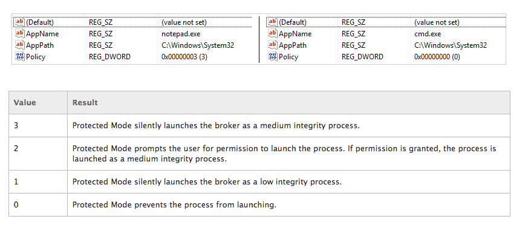
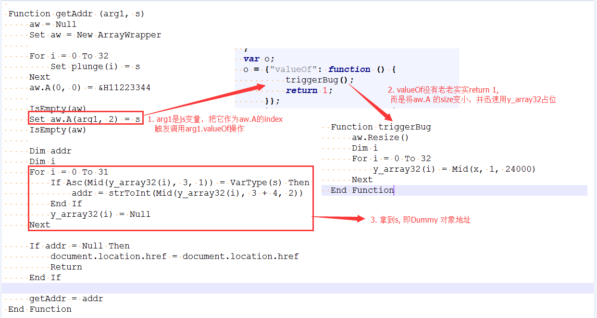
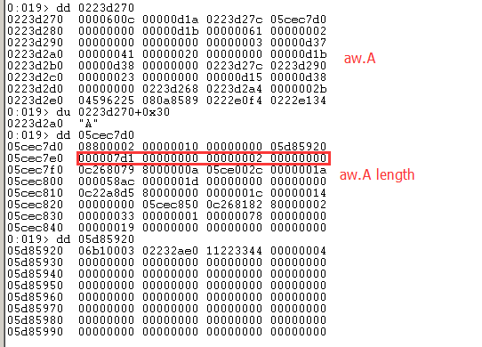
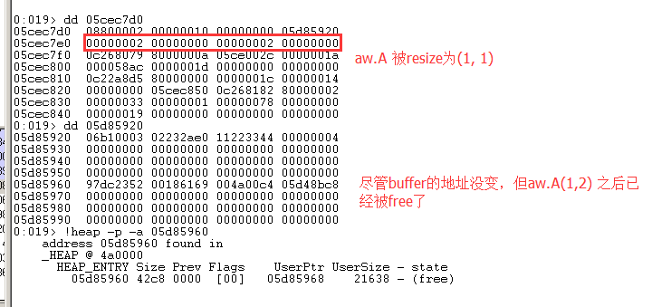
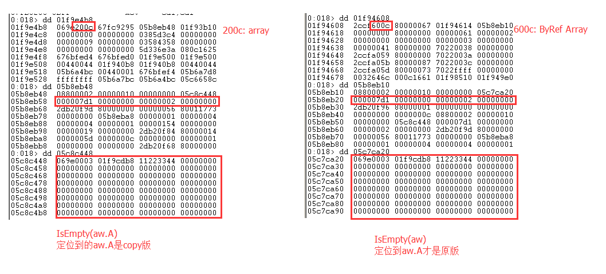
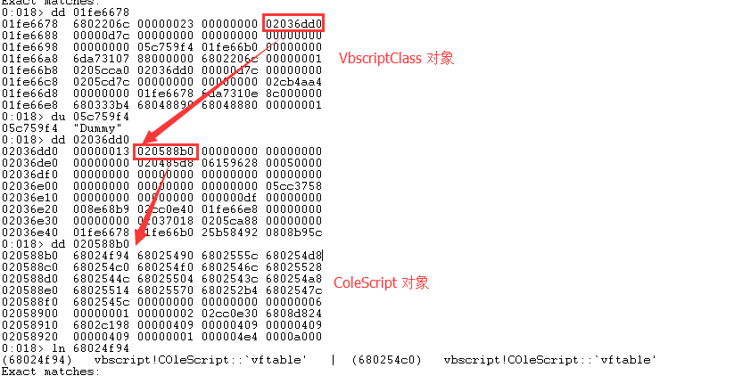
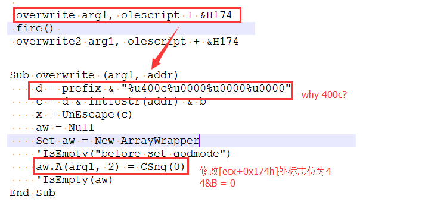
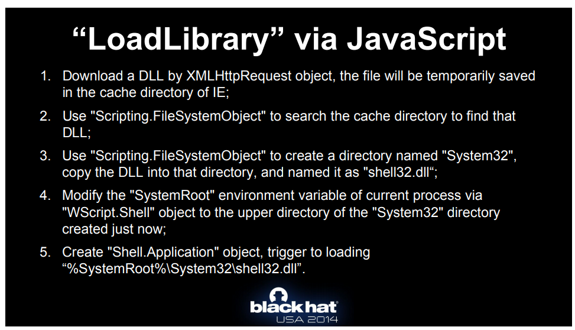

# CVE-2016-0189分析

# About GodMode and EPM
1. 当[ecx+0x174]&0xB时，即可开启GodMode;但GodMode只是控制unsafe extensions (such as “Shell.Application”)能否执行，并不能突破IE的sandbox, 即EPM


2. vista之后默认是开启EPM的，因此pop up notepad没有问题，却无法pop up cmd;pop up calc 则需要用户允许，这都是由于ElevationPolicy控制的。 如果可以pop up calc/cmd, 可能是由于你是Administrator 用户登录，从而IE是high Integrity Level


3. 既然不能突破sandbox，如何执行shellcode

- DLL劫持攻擊
    ```
    download一个fake shell32.dll和PE到temp目录
    设置temp 目录为系统目录
    new 一个shellShell.Application时，会调用fake shell32.dll，从而执行PE
    ```

- local server(Further Reading1)

# 1. 泄漏VBScriptClass对象地址


调试过程如下：
最初aw.A的size



Resize()



使用y_array32占位


Set aw.A(arg1, 2) = s，造成越界读写，与y_array32内容交错


遍历y_array32, 即可得到VBScriptClass对象地址


这里有必要解释下为什么是IsEmpty(aw)，而不是IsEmpty(aw.A)



# 2. Leak ColeScript对象地址




# 3. 修改SafeMode标识




4. 执行shell code

- 简单弹出notepad.exe


- 执行PE （不成功，暂时mark，想知道新启动进程的权限是low还是medium）




## Further Reading
1. https://theori.io/research/cve-2016-0189.
2. https://bbs.pediy.com/thread-228371.htm
3. https://www.freebuf.com/sectool/131766.html
4. https://www.blackhat.com/docs/us-14/materials/us-14-Yu-Write-Once-Pwn-Anywhere.pdf
