# 常用Windbg 命令
* bu vbscript!VbsIsEmpty ".printf \"VbsIsEmpty Output:\\n\"; .if(wo(poi(esp+c))== 8) {du poi((poi(esp+c)+8))} .else {dd poi(esp+c)}"
* bu vbscript!CScriptRuntime::RunNoEH "!py C:\\tools\\kl_vbs_disasm_windbg.py"
* bu jscript9!Js::Math::Atan ".printf \"DEBUG: %mu\\n\", poi(poi(esp+10)+c);g"
* bu jscript9!Js::Math::Atan2 ".printf \"DEBUG: %mu\\n\", poi(poi(esp+14)+c);"
* Flash调试， js 帮助函数
```
<script>
    function debug_stop(text){
        Math.atan2(0xbadc0de, text);
    }
    
    function debug_continue(text){
        Math.atan(text);
    }
</script>
```

* df xxx L1
* dD xxx L1
* !address addr
* !heap -p -a addr
* !heap -flt s 7ffe0  查看大小为7ffe0的内存，在堆喷的时候可以方便的找到payload所在的地址
* s -d 0 L?80000000 fffffffe 5570000 41414141 00000000  (64位寻址空间0x000'00000000 至 0x7FF'FFFFFFFF)
* s -a 0 L?80000000 "tags"
* s -u 


# IE JavaScript
## DOM(IE10)
- https://www.jianshu.com/p/3d8a4ba86bbe
- https://www.jianshu.com/p/8cd37ffe9a98
- https://www.cnblogs.com/Ox9A82/p/5782425.html


```
<html>
  <body>
    <script>
        alert("111");
    </script>
  </body>
  
</html>
```

```
bu MSHTML!CMarkup::CMarkup "gu; .printf \"New CMarkup Object: %p\\n\",eax ;"
bu MSHTML!CMarkup::~CMarkup ".printf \"Release CMarkup Object: %p\\n\",ecx; gu;"
bu MSHTML!CreateElement+0x64 "ln eax; gu; .printf \"Element Address: %p\\n\",poi(ebp-4); "
```

可以看到Dom节点的建立过程，每个tag对应一个Element对象，而CMarkup相当于一个容器，管理着它负责的这个Dom流

```
0:018> g
New CMarkup Object: 0b4bccc0
eax=0b4bccc0 ebx=04acbe68 ecx=0b212fe8 edx=01e2f2ec esi=0b4bccc0 edi=070a0fc0
eip=6afe382b esp=04acbcc0 ebp=04acbe48 iopl=0         nv up ei pl zr na pe nc
cs=001b  ss=0023  ds=0023  es=0023  fs=003b  gs=0000             efl=00000246
MSHTML!CDoc::CreateMarkupFromInfo+0x192:
6afe382b 8bd8            mov     ebx,eax
0:007> g
(6afe98ec)   MSHTML!CHtmlElement::CreateElement   |  (6afe99c0)   MSHTML!CHtmlElement::`vftable'
Exact matches:
    MSHTML!CHtmlElement::CreateElement = <no type information>
Element Address: 0bc1ffc8
eax=00000000 ebx=0bb33f00 ecx=0bb33f00 edx=04acc150 esi=0bb33f00 edi=0bd14cf8
eip=6b032b29 esp=04acc1a4 ebp=04acc1bc iopl=0         nv up ei pl zr na pe nc
cs=001b  ss=0023  ds=0023  es=0023  fs=003b  gs=0000             efl=00000246
MSHTML!CHtml5TreeConstructor::InsertAnHTMLElement+0x48:
6b032b29 8b75fc          mov     esi,dword ptr [ebp-4] ss:0023:04acc1b8=0bc1ffc8
0:007> g
(6b1b497b)   MSHTML!CHeadElement::CreateElement   |  (6b1b4a40)   MSHTML!CHeadElement::`vftable'
Exact matches:
    MSHTML!CHeadElement::CreateElement = <no type information>
Element Address: 0bd2bfc8
eax=00000000 ebx=0bd14d60 ecx=00000036 edx=6af96e25 esi=0bd14d60 edi=0bd14cf8
eip=6b032b29 esp=04acc0d8 ebp=04acc0f0 iopl=0         nv up ei pl zr na pe nc
cs=001b  ss=0023  ds=0023  es=0023  fs=003b  gs=0000             efl=00000246
MSHTML!CHtml5TreeConstructor::InsertAnHTMLElement+0x48:
6b032b29 8b75fc          mov     esi,dword ptr [ebp-4] ss:0023:04acc0ec=0bd2bfc8
0:007> g
(6b1b423d)   MSHTML!CBodyElement::CreateElement   |  (6b1b4320)   MSHTML!CBodyElement::`vftable'
Exact matches:
    MSHTML!CBodyElement::CreateElement = <no type information>
Element Address: 0bd2ffc0
eax=00000000 ebx=0bb33f28 ecx=00000012 edx=6af96e25 esi=0bd14da8 edi=0bd14cf8
eip=6b032b29 esp=04acc1a8 ebp=04acc1c0 iopl=0         nv up ei pl zr na pe nc
cs=001b  ss=0023  ds=0023  es=0023  fs=003b  gs=0000             efl=00000246
MSHTML!CHtml5TreeConstructor::InsertAnHTMLElement+0x48:
6b032b29 8b75fc          mov     esi,dword ptr [ebp-4] ss:0023:04acc1bc=0bd2ffc0
0:007> g
(6b1dcc3d)   MSHTML!CScriptElement::CreateElement   |  (6b1dccb0)   MSHTML!CScriptElement::`vftable'
Exact matches:
    MSHTML!CScriptElement::CreateElement = <no type information>
Element Address: 0bd35f40
eax=00000000 ebx=0bb33f50 ecx=00000065 edx=6af96e25 esi=0bd14d78 edi=0bd14cf8
eip=6b032b29 esp=04acc158 ebp=04acc170 iopl=0         nv up ei pl zr na pe nc
cs=001b  ss=0023  ds=0023  es=0023  fs=003b  gs=0000             efl=00000246
MSHTML!CHtml5TreeConstructor::InsertAnHTMLElement+0x48:
6b032b29 8b75fc          mov     esi,dword ptr [ebp-4] ss:0023:04acc16c=0bd35f40

```

CXXXElement


CTreeNode和CTreePos

CTreePos在逻辑上代表着一个 Element 对应的 tag 的头标签和尾标签, DOM 流即是这些 CTreePos 对象链接而成的双向链表。


# VBScript
## VarType
|Constant|Value|Description|
| :------: | :------: | :------: |
|vbEmpty|0|Empty (uninitialized)|
|vbNull|1|Null (no valid data)|
|vbInteger|2|Integer|
|vbLong|3|Long integer|
|vbSingle|4|Single-precision floating-point number|
|vbDouble|5|Double-precision floating-point number|
|vbCurrency|6|Currency value|
|vbDate|7|Date value|
|vbString|8|String|
|vbObject|9|Object|
|vbError |10|Error value|
|vbBoolean|11|Boolean value|
|vbVariant|12|Variant (used only with arrays of variants)|
|vbDataObject|13|A data access object|
|vbDecimal|14|Decimal value|
|vbByte|17|Byte value|
|vbUserDefinedType|36|Variants that contain user-defined types|
|VT_FUNC|76（0x4c）|
|vbArray|0x2000|Array|
|VT_BYREF|0x4000|
|VT_RESERVED|0x8000|


## VBScriptClass
```
<script LANGUAGE="VBScript">
Dim X
Class TestClass
    Dim a,b
    
    Private Sub Class_Initialize   
        a=&h1122334
        b="test string"
    End Sub
    Private Sub Class_Terminate   
    End Sub
    
    Sub test_fun
        test_fun=1
    End Sub
    
End Class
Set X = New TestClass
IsEmpty(X)

</script>
```

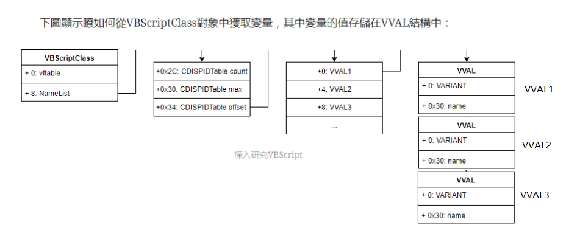

调试过程如下：

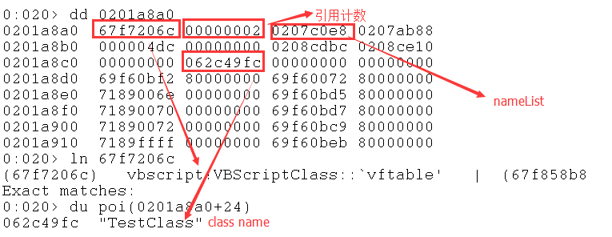
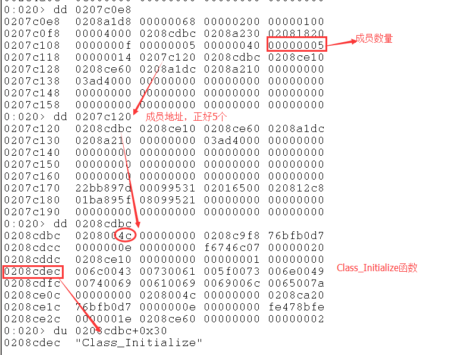


# Adobe Flash


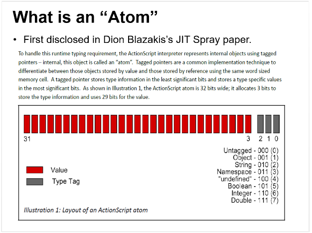


# V8

## 速查
1. D8 参数
* https://github.com/hilongjw/v8-RuntimeFunctions-list
* https://github.com/v8/v8/blob/master/src/runtime/runtime.h
* https://gist.github.com/kevincennis/0cd2138c78a07412ef21 (D8用法)

```
--allow-natives-syntax

--trace-opt 
--trace-deopt
--trace-opt-verbose

--code-comments
--print-opt-code
--print_unopt_code
--trace-elements-transitions

%DebugPrint 
%OptimizeFunctionOnNextCall

```

2. 断点
```
// %DebugPrint 可以打印出变量信息，包括地址、结构； 
// bu v8_libbase!v8::base::ieee754::atan    下断点，可以停下来
// bu v8_libbase!v8::base::ieee754::sin     似乎sin比atan稳定
var a = [0xdeadbee, 0xdeadbee, 0xdeadbee];
%DebugPrint(a);
Math.atan(1);
Math.sin(1);

```
3. Build V8
 * https://medium.com/dailyjs/how-to-build-v8-on-windows-and-not-go-mad-6347c69aacd4
 * http://eternalsakura13.com/2018/06/26/v8_environment/
 * http://blog.gclxry.com/use-depot_tools-to-manage-chromium-source/ (介绍depot_tools)

```
cd ~/v8/v8
git reset --hard a7a350012c05f644f3f373fb48d7ac72f7f60542
gclient sync
tools/dev/v8gen.py x64.debug 
ninja -C out.gn/x64.debug 
```
*** print-opt-code之类的，release版本D8 shell是不支持的 ***

*** print-bytecode也得在支持Ignition的V8里使用啊，之前都不生成bytecode啊。。。似乎Chrome59才支持的 *** 

4. [What Version of V8 My Chromium Browser Is Using ?](http://erossignon.github.io/blog/2014/08/22/how-to-find-the-version-of-the-v8-my-chromium-browser-is-using/)

```
chrome://version/
http://src.chromium.org/viewvc/chrome/releases/
```

5. Metasploit 生成payload
```
msfvenom -p windows/exec cmd=calc.exe  -fc
msfvenom -p windows/x64/exec cmd=calc.exe  -fc
```


## 工具函数

```
// arraybuffer to string
function ab2str(buf) {
  return String.fromCharCode.apply(null, new Uint16Array(buf));
}

// string to arraybuffer
function str2ab(str) {
  var buf = new ArrayBuffer(str.length); // 1 bytes for each char
  var bufView = new Uint8Array(buf);
  for (var i=0, strLen=str.length; i<strLen; i++) {
    bufView[i] = str.charCodeAt(i);
  }
  return buf;
}

// 内存中的双字节表示 -> 实际值
function decode_from_float64(num){
    num1 = num/0x100000000;
    num2 = num&0xffffffff;
    d = new Uint32Array(2);
    d[0] = num2;
    d[1] = num1;
    f = new Float64Array(d.buffer);
    return f[0];
}

// 实际值 -> 内存中双字节表示
function encode_to_float64(num){
    f = new Float64Array(1);
    f[0] = num;
    d = new Uint32Array(f.buffer);
    return d[1] * 0x100000000 + d[0];
}

```


## Object 内存布局
参考：
http://eternalsakura13.com/2018/05/06/v8/

```
<html>
<script>
    var a = [0xdeadbee, 0xdeadbeef, 4.231256, "testtesttestcy", true, false, null, undefined]
    alert("1111");
</script>
</html>

```
1. Small Int
64位： [0x0, 0x7fffffff]


2. HeapNumber (超过Small Int范围的Int、Double)
首先，数组中存放的是HeapObject指针


HeapNumber结构


调试如下：


3. PropertyCell
不知道是啥，先记着


4. String


5. Oddball
没调出来。。。

表示特殊值的对象，例如true，false，undefined, null

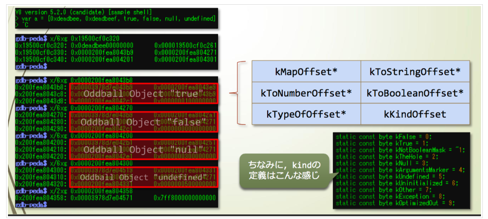

6. JSObject

没调出来


7. JSFunction
如果能控制CodeEntry，则控制了EIP


8. JSArray


9. JSArrayBuffer


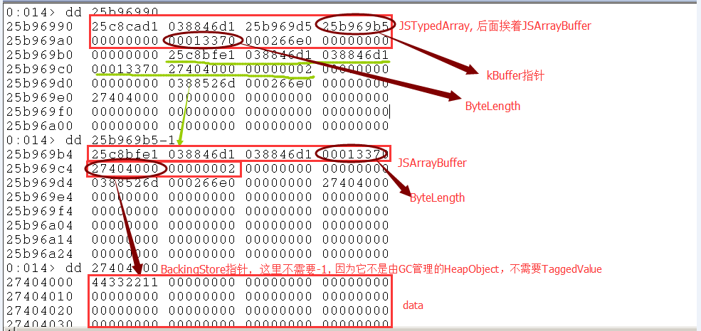


10 Map 
```
map{        //  大小 0x2c(X86)
    +0x00   map
    +0x04   istance_size    // byte
    +0x05   InObjectProperties_or_ConstructorFunctionIndex      //byte
    +0x06   unused
    +0x07   visitorId       //byte
    +0x08   instance_type   //byte
    +0x09   bit_field       //byte
    +0x0a   bit_field2      //byte
    +0x0b   unused
    +0x0c   bit_field3      //byte
    +0x10   prototype   
    +0x14   constructor 
    +0x18   transitor_or_protytypeInfo
    +0x1c   discriptor
    +0x20   CodeCache
    +0x24   DependentCode
    +0x28   WeakCellCache
}
```


## Assembly code

```
var array = [1.1];

function f() {
    %DebugPrint(array);  //调试函数
    Math.sin(1);   // 调试函数
    array[0] = 6.176516726456e-312;
}

f();
%OptimizeFunctionOnNextCall(f);
f();

>> d8.exe --allow-natives-syntax --code_comments --print_opt_code --print_unopt_code test.js
```


优化版本：

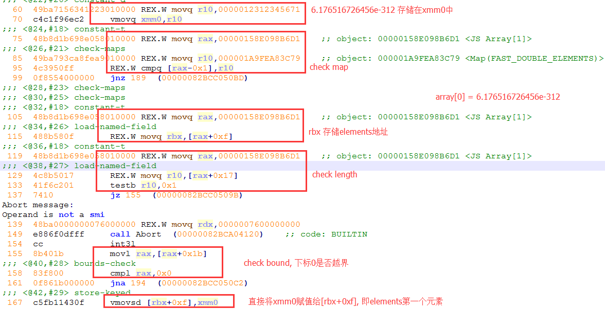

# 汇编

## CMP与test:
   
    test逻辑与运算结果为零,就把ZF(零标志)置1

    cmp 算术减法运算结果为零,就把ZF(零标志)置1

## 汇编跳转指令

标志名|标志 1|标志 0
:------: | :------: | :------:
OF (溢出标志) | OV | NV
DF (方向标志) | UP | DN
IF (中断标志)|DI| EI
SF (符号标志位)|PL| NG
ZF (零标志)|NZ| ZR
AF (辅助进位标志位)|NA| AC
PF (奇偶标志)|PO|PE
CF (进位标志)|NC|CY


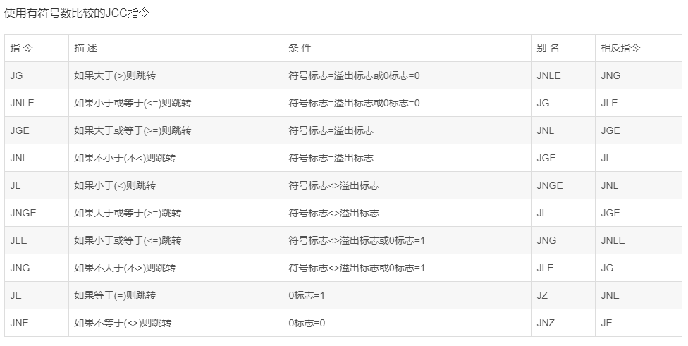

## [x86环境下SHORT Relative Jumps](https://thestarman.pcministry.com/asm/2bytejumps.htm)
The first byte of a SHORT Jump is always EB

The second is a relative offset from 00h to 7Fh for Forward jumps, and from 
80h to FFh for Reverse (or Backward) jumps.

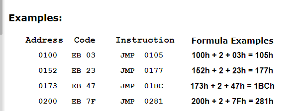

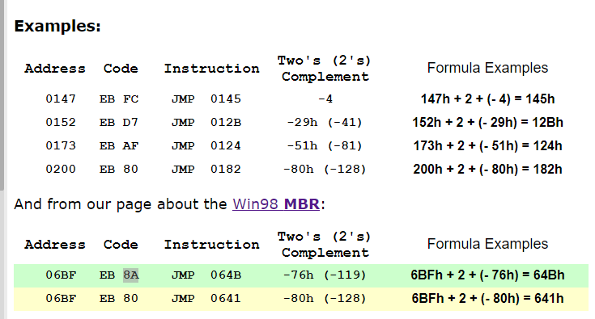

## 寄存器
https://docs.microsoft.com/en-us/windows-hardware/drivers/debugger/r--registers-
```
0:000> r xmm0:16ub
0:000> r xmm1:d
0:000> rX  (Displays the SSE XMM registers)
0:000> rF  (Displays the floating-point registers.)

01004af3 8bec            mov     ebp,esp
0:000> r.
ebp=0006ffc0  esp=0006ff7c
```
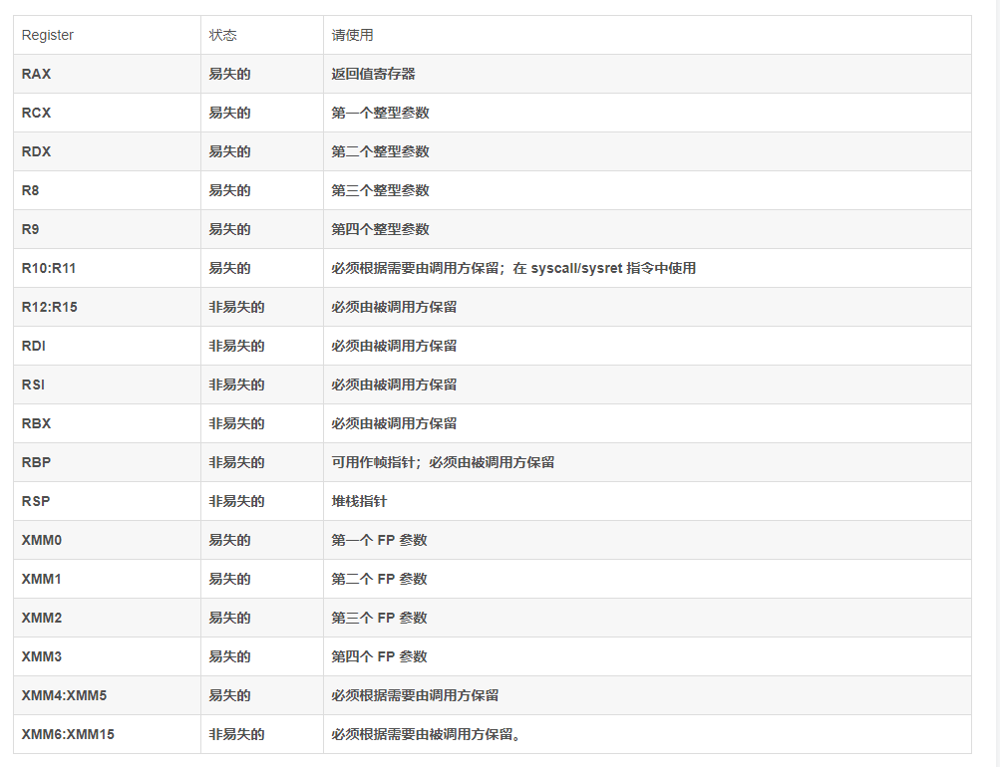
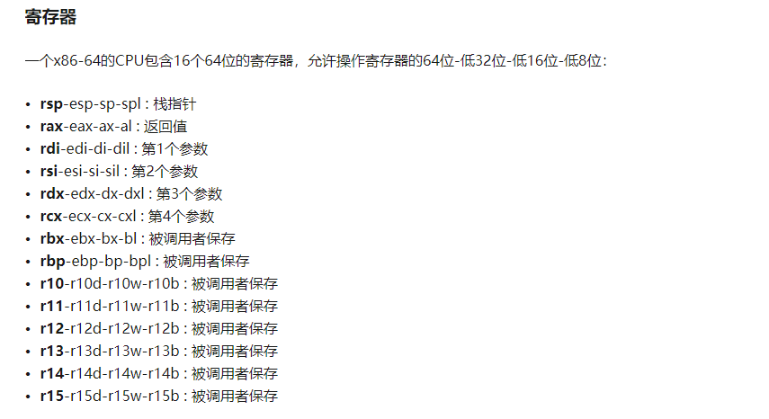